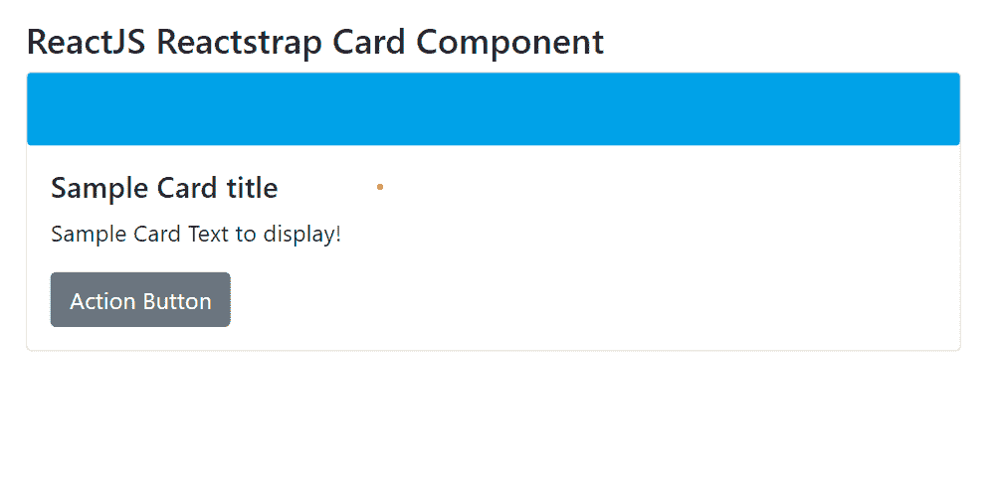

# 反应堆捕捉卡组件

> 原文:[https://www . geeksforgeeks . org/reactjs-reatstrap-card-component/](https://www.geeksforgeeks.org/reactjs-reactstrap-card-component/)

**Reactstrap:** Reactstrap 是一个流行的前端库，很容易使用 React Bootstrap 4 组件。该库包含引导 4 的无状态反应组件。卡组件允许用户显示内容。我们可以在 ReactJS 中使用以下方法来使用 ReactJS Reactstrap 卡组件。

**反应塔道具的属性:**

**卡牌道具:**

*   **标签:**卡片道具标签可以是函数，也可以是字符串，用来表示这个组件的标签。
*   **反转:**reacts trap 中的反转道具用来表示是否反转文字颜色。
*   **颜色:**颜色道具用来改变卡片的颜色。应该是 RGB 格式和颜色的名称。
*   **身体:**身体道具用于指示是否在 reactStrap 组件中应用*卡体*类。
*   **类名:**类名道具用于表示类名称，用于在 reactStrap 中设置组件的样式。

**卡体道具:**

*   **标签:**card body 道具可以是函数，也可以是字符串，用来表示 reactStrap 中这个组件的标签。
*   **类名:**类名道具用于表示 reactStrap 中该组件的类名。

**卡柱道具:**

*   **标签:**标签 CardColumns Props 可以是函数，也可以是字符串，用来表示这个组件的标签。
*   **类名:**类名道具用于表示这个组件的类名，这个组件用于设置 CSS 的样式。

**卡牌道具:**

*   **标签:**标签道具在卡牌道具下。在卡片组上，它可以是一个函数或一个字符串，用于表示这个组件的标签。
*   **类名:**类名道具位于卡牌道具下，用于表示该组件的类名。

**心脏起搏器:t1]**

*   **标签:**标签道具位于卡片页脚道具下。它可以是函数或字符串，用于表示该组件的标记。
*   **类名:**类名道具在卡片页脚道具下。它用来表示这个组件的类名。

**卡组道具:**

*   **标签:**card group 中的标签道具可以是函数，也可以是字符串，用来表示这个组件的标签。
*   **类名:**类名弹出在卡组道具下。它用来表示这个组件的类名。

**cardheader proposs:**

*   **标记:**CardHeader 标记道具可以是函数或字符串，用于表示该组件的标记。
*   **class name:**class name 道具在 CardHeader 道具下。它用来表示这个组件的类名。

**CardImg Props:**

*   **标签:**标签可以是函数，也可以是字符串，用来表示这个组件的标签。
*   **类名:**类名用于表示该组件的类名。
*   **顶:**顶道具通过*卡-img-顶*类定位图像。
*   **底部:**底部道具通过*卡片-img-底部*类进行图像定位。

**心脏复盖命题:**

*   **标签:**标签道具可以是函数，也可以是字符串，用来表示这个组件的标签。
*   **类名:**类名道具用于表示该组件的类名。

**卡丁车道具:**

*   **标签:**这个 cardLink 道具可以是函数，也可以是字符串，用来表示这个组件的标签。
*   **类名:**这个类名属性用来表示这个组件的类名。
*   **内部引用:**这个内部引用属性用来表示内部引用元素。

**卡片字幕道具：**

*   **标签:**这个道具可以是函数，也可以是字符串，用来表示这个组件的标签。
*   **类名:**这些道具可以用来表示这个组件的类名。

**CardText Props:**

*   **标签:**这个道具可以是函数，也可以是字符串，用来表示这个组件的标签。
*   **类名:**这个道具用来表示这个组件的类名。

**CardTitle Props :**

*   **标签:**这个道具可以是函数，也可以是字符串，用来表示这个组件的标签。
*   **类名:**这些道具、类名道具用来表示这个组件的类名。

**创建 React 应用程序和安装模块的语法:**

*   **步骤 1:** 使用以下命令创建一个反应应用程序。

    ```jsx
    npx create-react-app foldername
    ```

*   **步骤 2:** 创建项目文件夹(即文件夹名称)后，使用以下命令移动到该文件夹。

    ```jsx
    cd foldername
    ```

*   **步骤 3:** 在给定的目录中安装 Reactstrap。

```jsx
 npm install --save reactstrap react react-dom
```

**项目结构:**如下图:


**项目结构**

**示例 1:** 现在在 **App.js** 文件中写下以下代码。在这里，应用程序是我们编写代码的默认组件。

## App.js

```jsx
import React from 'react'
import 'bootstrap/dist/css/bootstrap.min.css';
import {
    Card, CardImg, CardBody,
    CardTitle, CardText, Button
} from "reactstrap"

function App() {
    return (
        <div style={{
            display: 'block', width: 700, padding: 30
        }}>
            <h4>ReactJS Reactstrap Card Component</h4>
            <Card>
                <CardImg
                    width="50px"
                    height="50px"
                src="https://media.geeksforgeeks.org/wp-content/
                          uploads/20210425000233/test-300x297.png"
                    alt="GFG Logo" />
                <CardBody>
                    <CardTitle tag="h5">Sample Card title</CardTitle>
                    <CardText>Sample Card Text to display!</CardText>
                    <Button>Action Button</Button>
                </CardBody>
            </Card>
        </div>
    );
}

export default App;
```

**运行应用程序的步骤:**从项目的根目录使用以下命令运行应用程序:

```jsx
npm start
```

**输出:**现在打开浏览器，进入**[***http://localhost:3000/***，](http://localhost:3000/,)会看到如下输出:**

**

**卡片组件**** 

****示例 2:** 这是 ReactStrap 卡组件的另一个示例。**

## **App.js**

```jsx
import React from "react";
import {
  Card,CardBody,CardLink,CardTitle,

} from "reactstrap";

const Example = (props) => {
  return (
    <div>
      <Card>
        <CardBody>
          <CardTitle tag="h5">GFG Practice Portal </CardTitle>
          

         <p>
            The Best Data Structures Course Available Online From Skilled 
            And Experienced Faculty. Learn Data Structures In A Live 
            Classroom With The Best Of Faculty In The Industry. 
            Classroom Experience.
          </p>

        </CardBody>

        <CardBody>

          <CardLink href="https://www.geeksforgeeks.org/html-images/">
             To knbow more about us... 
          </CardLink>

        </CardBody>
      </Card>
    </div>
  );
};

export default Example;
```

**

**卡组件**** 

****参考:**T2】https://reactstrap.github.io/components/card/**