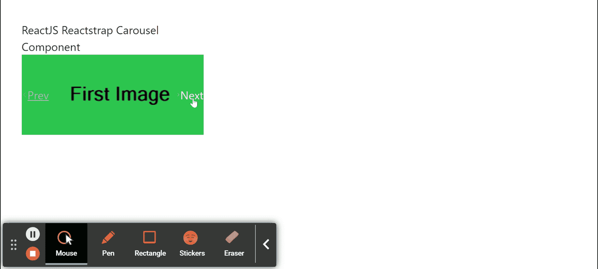

# 反应堆捕集器转盘组件

> 原文:[https://www . geeksforgeeks . org/reactjs-reatstrap-carousel-component/](https://www.geeksforgeeks.org/reactjs-reactstrap-carousel-component/)

Reactstrap 是一个流行的前端库，易于使用 React Bootstrap 4 组件。该库包含引导 4 的无状态反应组件。转盘组件允许用户显示滑动项，当同一层级有一组内容时使用。我们可以在 ReactJS 中使用以下方法来使用 ReactJS Reactstrap 轮播组件。

**转盘道具:**

*   **活动索引:**用于控制当前活动的可见幻灯片。
*   **next:** 是点击下一步按钮时触发的回调函数。
*   **上一个:**是点击上一个按钮时触发的回调函数。
*   **键盘:**用于指示转盘是否应对键盘事件做出反应。
*   **暂停:**用于根据不同的鼠标事件暂停幻灯片。
*   **骑行:**用于用户手动循环第一个项目后自动播放转盘。
*   **间隔:**用于延迟这些物品自动循环运动之间的时间。
*   **children:** 用于将 children 元素传递给这个组件。
*   **鼠标进入:**是鼠标进入转盘时触发的回调函数。
*   **mouseLeave:** 是鼠标退出转盘时触发的回调函数。
*   **幻灯片:**用于启用幻灯片之间的动画。
*   **cssModule:** 用来表示造型用的 CSS 模块。
*   **启用触摸:**用于指示转盘上的触摸手势是否有效。

**旋转木马道具:**

*   **标签:**用于表示该组件的标签。
*   中的**用来表示是否显示一个项目。**
*   **cssModule:** 用来表示造型用的 CSS 模块。
*   **children:** 用于将 children 元素传递给这个组件。
*   **幻灯片:**用于启用幻灯片之间的动画。

**战车控制推进剂:**

*   **方向:**用来表示像下一个或上一个这样的方向。
*   **onClickHandler:** 是一个回调函数，点击时触发。
*   **cssModule:** 用来表示造型用的 CSS 模块。
*   **方向文字:**用于表示方向文字。

**旋转木马指示器道具:**

*   **项:**用于表示项数组。
*   **活动索引:**用于控制当前活动的可见幻灯片。
*   **cssModule:** 用来表示造型用的 CSS 模块。
*   **onClickHandler:** 是一个回调函数，点击时触发。

**旋转木马标题道具:**

*   **字幕标题:**用于表示字幕标题值。
*   **字幕:**用于表示字幕文本值。
*   **cssModule:** 用来表示造型用的 CSS 模块。

**不受控制的转盘道具:**

*   **项:**用于表示项数组。
*   **指示器:**用于显示一组滑块位置指示器。
*   **控件**:表示是否有控件。
*   **自动播放:**表示是否可以自动播放。

**创建反应应用程序并安装模块:**

*   **步骤 1:** 使用以下命令创建一个反应应用程序:

    ```jsx
    npx create-react-app foldername
    ```

*   **步骤 2:** 在创建项目文件夹(即文件夹名**)后，使用以下命令将**移动到该文件夹:

    ```jsx
    cd foldername
    ```

*   **步骤 3:** 创建 ReactJS 应用程序后，使用以下命令安装所需的****模块:****

    ```jsx
    **npm install reactstrap bootstrap**
    ```

******项目结构:**如下图。****

****

项目结构**** 

******示例 1:** 现在在 **App.js** 文件中写下以下代码。这里，我们使用了带有转盘控制按钮的转盘组件。****

## ****App.js****

```jsx
**import React from 'react'
import 'bootstrap/dist/css/bootstrap.min.css';
import {
    CarouselControl,
    Carousel,
    CarouselItem,
    CarouselIndicators,
} from 'reactstrap';

function App() {

    // State for Active index
    const [activeIndex, setActiveIndex] = React.useState(0);

    // State for Animation
    const [animating, setAnimating] = React.useState(false);

    // Sample items for Carousel
    const items = [
        {
            caption: 'Sample Caption One',src: 
'https://media.geeksforgeeks.org/wp-content/uploads/20210425122739/2-300x115.png',
            altText: 'Slide One'
        },
        {
            caption: 'Sample Caption Two',src: 
'https://media.geeksforgeeks.org/wp-content/uploads/20210425122716/1-300x115.png',
            altText: 'Slide Two'
        }
    ];

    // Items array length
    const itemLength = items.length - 1

    // Previous button for Carousel
    const previousButton = () => {
        if (animating) return;
        const nextIndex = activeIndex === 0 ?
            itemLength : activeIndex - 1;
        setActiveIndex(nextIndex);
    }

    // Next button for Carousel
    const nextButton = () => {
        if (animating) return;
        const nextIndex = activeIndex === itemLength ?
            0 : activeIndex + 1;
        setActiveIndex(nextIndex);
    }

    // Carousel Item Data
    const carouselItemData = items.map((item) => {
        return (
            <CarouselItem
                key={item.src}
                onExited={() => setAnimating(false)}
                onExiting={() => setAnimating(true)}
            >
                
            </CarouselItem>
        );
    });

    return (
        <div style={{
            display: 'block', width: 320, padding: 30
        }}>
            <h8>ReactJS Reactstrap Carousel Component</h8>
            <Carousel previous={previousButton} next={nextButton}
                activeIndex={activeIndex}>
                <CarouselIndicators items={items}
                    activeIndex={activeIndex}
                    onClickHandler={(newIndex) => {
                        if (animating) return;
                        setActiveIndex(newIndex);
                    }} />
                {carouselItemData}
                <CarouselControl directionText="Prev"
                    direction="prev" onClickHandler={previousButton} />
                <CarouselControl directionText="Next"
                    direction="next" onClickHandler={nextButton} />
            </Carousel>
        </div >
    );
}

export default App;**
```

******运行应用程序的步骤:**从项目的根目录使用以下命令运行应用程序:****

```jsx
**npm start**
```

******输出:**现在打开浏览器，转到***http://localhost:3000/***，会看到如下输出:****

********

******示例 2:** 现在在 **App.js** 文件中写下以下代码。这里，我们使用了没有转盘控制按钮的转盘组件。****

## ****App.js****

```jsx
**import React from 'react'
import 'bootstrap/dist/css/bootstrap.min.css';
import {
    Carousel,
    CarouselItem,
    CarouselIndicators,
} from 'reactstrap';

function App() {

    // State for Active index
    const [activeIndex, setActiveIndex] = React.useState(0);

    // State for Animation
    const [animating, setAnimating] = React.useState(false);

    // Sample items for Carousel
    const items = [
        {src: 
'https://media.geeksforgeeks.org/wp-content/cdn-uploads/20190603152813/ml_gaming.png',
        },
        {src: 
'https://media.geeksforgeeks.org/wp-content/cdn-uploads/20190528184201/gateexam.png',
        }
    ];

    // Items array length
    const itemLength = items.length - 1

    // Previous button for Carousel
    const previousButton = () => {
        if (animating) return;
        const nextIndex = activeIndex === 0 ?
            itemLength : activeIndex - 1;
        setActiveIndex(nextIndex);
    }

    // Next button for Carousel
    const nextButton = () => {
        if (animating) return;
        const nextIndex = activeIndex === itemLength ?
            0 : activeIndex + 1;
        setActiveIndex(nextIndex);
    }

    // Carousel Item Data
    const carouselItemData = items.map((item) => {
        return (
            <CarouselItem
                key={item.src}
                onExited={() => setAnimating(false)}
                onExiting={() => setAnimating(true)}
            >
                
            </CarouselItem>
        );
    });

    return (
        <div style={{
            display: 'block', padding: 30
        }}>
            <h1>ReactJS Reactstrap Carousel Component</h1>
            <Carousel previous={previousButton} next={nextButton} 
                activeIndex={activeIndex}>
                <CarouselIndicators items={items}
                    activeIndex={activeIndex}
                    onClickHandler={(newIndex) => {
                        if (animating) return;
                        setActiveIndex(newIndex);
                    }} />
                {carouselItemData}
            </Carousel>
        </div >
    );
}

export default App;**
```

******运行应用程序的步骤:**从项目的根目录使用以下命令运行应用程序:****

```jsx
**npm start**
```

******输出:**现在打开浏览器，转到***http://localhost:3000/***，会看到如下输出:****

********

******参考:**https://reactstrap.github.io/components/carousel/****