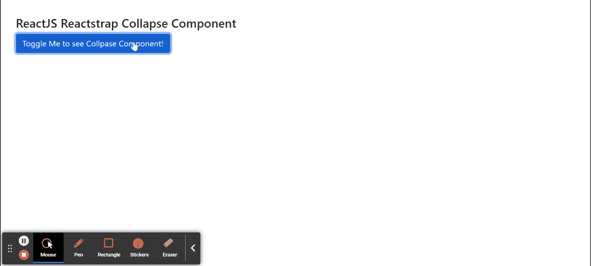

# 反应堆安全壳折叠组件

> 原文:[https://www . geeksforgeeks . org/reactjs-reatstrap-collapse-component/](https://www.geeksforgeeks.org/reactjs-reactstrap-collapse-component/)

Reactstrap 是一个流行的前端库，易于使用 React Bootstrap 4 组件。该库包含引导 4 的无状态反应组件。折叠组件用作可折叠和展开的内容区域。我们可以在反应堆中使用以下方法来使用反应堆反应堆陷阱折叠组件。

**塌陷道具:**

*   **inOpen:** 用于显示部件。
*   **children:** 用于将 children 元素传递给这个组件。
*   **标签:**用来表示我们折叠组件的标签。
*   **类名:**用于表示造型的类名。
*   **navbar:** 用于表示是否与 navbar 组件关联。
*   **cssModule:** 用来表示造型用的 CSS 模块。
*   **innerRef:** 用于表示内部参照元素。
*   **安装器:**用于安装组件，等待第一个*进入*转换被触发。
*   **卸载退出:**用于卸载组件。
*   **出现:**组件挂载时，用于运行收拢动画。**T3】**
*   **输入:**用于启用或禁用输入转换
*   **退出:**用于启用或禁用退出转换
*   **超时:**用于表示折叠动画的持续时间，单位为毫秒。**T3】**
*   **addEndListener:** 用于表示监听结束事件的函数。
*   **onEnter:** 是组件在中折叠之前触发的回调函数。
*   **OneHinded:**它是一个回调函数，在组件收拢后触发。
*   **onent ing:**是组件开始收拢后触发的回调函数。
*   **onExit:** 是组件崩出前触发的回调函数。
*   **onexitted:**是组件折叠出来后触发的回调函数。
*   **onExiting:** 是组件开始崩出后触发的回调函数。
*   **基类:**用于表示始终应用于折叠元素的类。
*   **baseClassActive:** 用于表示处于活动状态时应用于折叠元素的类。

**创建反应应用程序并安装模块:**

**步骤 1:** 使用以下命令创建一个反应应用程序:

```jsx
npx create-react-app foldername
```

**步骤 2:** 创建项目文件夹(即文件夹名**)后，使用以下命令移动到该文件夹中:**

```jsx
cd foldername
```

**步骤 3:** 创建 ReactJS 应用程序后，使用以下命令安装所需的****模块:****

```jsx
**npm install reactstrap bootstrap**
```

******项目结构:**如下图。****

****

项目结构**** 

******示例:**现在在 **App.js** 文件中写下以下代码。在这里，App 是我们编写代码的默认组件。****

## ****java 描述语言****

```jsx
**import React from 'react'
import 'bootstrap/dist/css/bootstrap.min.css';
import { Collapse, Button } from "reactstrap"

function App() {

    // Collapse Open state
    const [isOpen, setIsOpen] = React.useState(false);

    return (
        <div style={{
            display: 'block', width: 900, padding: 30
        }}>
            <h4>ReactJS Reactstrap Collapse Component</h4>
            <Button color="primary" onClick={() => {
                setIsOpen(!isOpen)
            }}>Toggle Me to see Collapse Component!</Button>
            <Collapse isOpen={isOpen}>
                <p>I am sample Text to display</p>
            </Collapse>
        </div >
    );
}

export default App;**
```

******运行应用程序的步骤:**从项目的根目录使用以下命令运行应用程序:****

```jsx
**npm start**
```

******输出:**现在打开浏览器，转到***http://localhost:3000/***，会看到如下输出:****

********

******参考:**T2】https://reactstrap.github.io/components/collapse/****