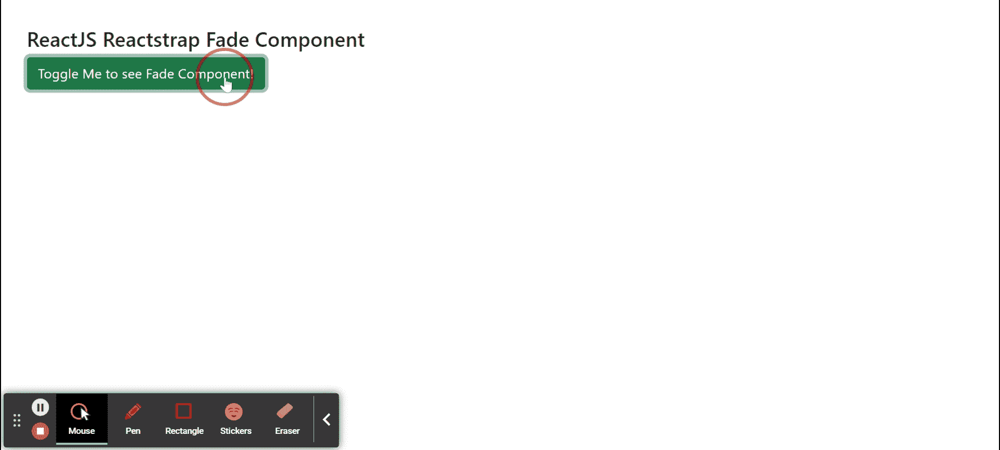
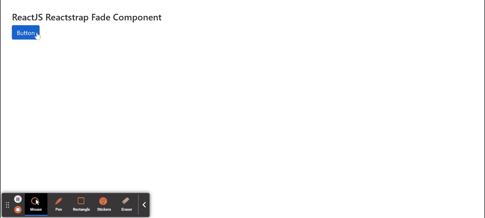

# 反应堆捕捉衰减组件

> 原文:[https://www . geeksforgeeks . org/reactjs-reatstrap-fade-component/](https://www.geeksforgeeks.org/reactjs-reactstrap-fade-component/)

Reactstrap 是一个流行的前端库，易于使用 React Bootstrap 4 组件。该库包含引导 4 的无状态反应组件。渐变组件提供了一种向子组件或元素添加渐变动画的方法。我们可以在 ReactJS 中使用以下方法来使用 ReactJS Reactstrap 淡入淡出组件。

**消退道具:**

*   **in:** 用于表示部件。当我们必须展示组件时使用它。
*   **安装器:**用于安装组件，等待第一个*进入*转换被触发。
*   **卸载退出:**用于在组件关闭时卸载组件。
*   **出现:**组件挂载时，用于运行淡入动画。**T3】**
*   **输入:**用于启用或禁用输入转换
*   **退出:**用于启用或禁用退出转换
*   **超时:**用于表示淡入淡出动画的持续时间，单位为毫秒。**T3】**
*   **addEndListener:** 用于表示监听结束事件的函数。
*   **onEnter:** 是组件淡入之前触发的回调函数。
*   **OneHinded:**是组件淡入后触发的回调函数。
*   **onent ing:**是组件开始淡入后触发的回调函数。
*   **onExit:** 是组件淡出前触发的回调函数。
*   **onexitted:**是组件淡出后触发的回调函数。
*   **onExiting:** 是组件开始淡出后触发的回调函数。
*   **children:** 用于将 children 元素传递给这个组件。
*   **标签:**用来表示我们的 Fade 组件的标签。
*   **基类:**用于表示始终应用于渐变元素的类。
*   **baseClassActive:** 用于表示淡入淡出元素处于活动状态时应用到该元素的类。
*   **类名:**用于表示造型的类名。
*   **cssModule:** 用来表示造型用的 CSS 模块。

**创建反应应用程序并安装模块:**

*   **步骤 1:** 使用以下命令创建一个反应应用程序:

    ```jsx
    npx create-react-app foldername
    ```

*   **步骤 2:** 创建项目文件夹(即文件夹名**)后，使用以下命令移动到该文件夹中:**

    ```jsx
    cd foldername
    ```

*   **步骤 3:** 创建 ReactJS 应用程序后，使用以下命令安装所需的****模块:****

    ```jsx
    **npm install reactstrap bootstrap**
    ```

******项目结构:**如下图。****

****

项目结构**** 

******示例 1:** 现在在 **App.js** 文件中写下以下代码。在这里，我们已经显示了渐变组件，以显示文本，没有任何超时。****

## ****App.js****

```jsx
**import React from 'react'
import 'bootstrap/dist/css/bootstrap.min.css';
import { Fade, Button } from "reactstrap"

function App() {

    // Fade Open state
    const [isOpen, setIsOpen] = React.useState(false);

    return (
        <div style={{
            display: 'block', width: 900, padding: 30
        }}>
            <h4>ReactJS Reactstrap Fade Component</h4>
            <Button color="success" onClick={() => {
                setIsOpen(!isOpen)
            }}>Toggle Me to see Fade Component!</Button>
            <Fade in={isOpen}>
                <p>I am sample Text to display</p>

            </Fade>
        </div >
    );
}

export default App;**
```

******运行应用程序的步骤:**从项目的根目录使用以下命令运行应用程序:****

```jsx
**npm start**
```

******输出:**现在打开浏览器，转到***http://localhost:3000/***，会看到如下输出:****

********

******示例 2:** 现在在 **App.js** 文件中写下以下代码。这里我们已经显示了显示 div 块的渐变组件，超时时间为 2 秒。****

## ****App.js****

```jsx
**import React from 'react'
import 'bootstrap/dist/css/bootstrap.min.css';
import { Fade, Button } from "reactstrap"

function App() {

    // Fade Open state
    const [isOpen, setIsOpen] = React.useState(false);

    return (
        <div style={{
            display: 'block', width: 900, padding: 30
        }}>
            <h4>ReactJS Reactstrap Fade Component</h4>
            <Button color="primary" onClick={() => {
                setIsOpen(!isOpen)
            }}>Button</Button>
            <Fade timeout={2000} in={isOpen}>
                <div style={{ width: 300, height: 50, 
                backgroundColor: 'green' }}>
                    <p>...I am opened after 2 seconds</p>
                </div>
            </Fade>
        </div >
    );
}

export default App;**
```

******运行应用程序的步骤:**从项目的根目录使用以下命令运行应用程序:****

```jsx
**npm start**
```

******输出:**现在打开浏览器，转到***http://localhost:3000/***，会看到如下输出:****

********

******参考:**T2】https://reactstrap.github.io/components/fade/****