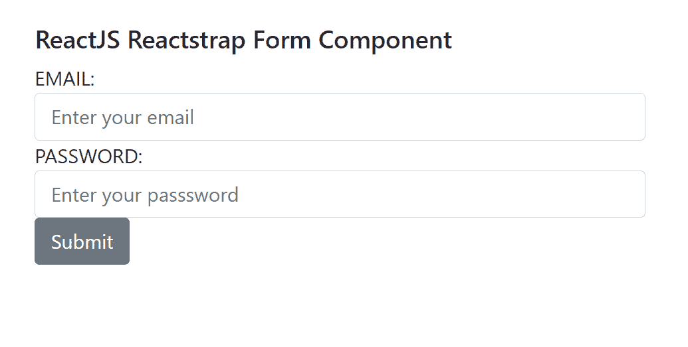
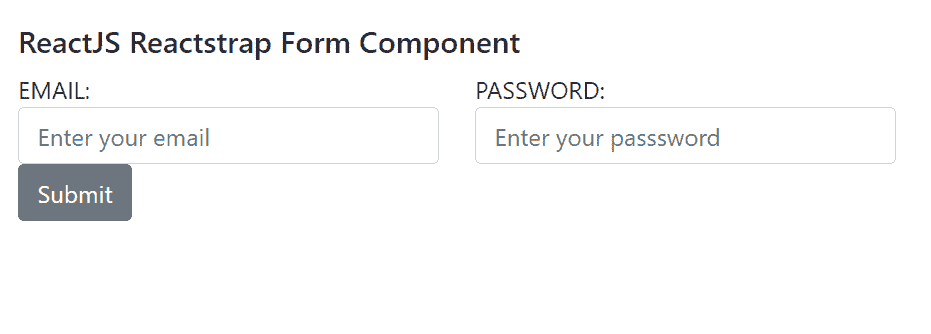

# 反应堆捕集器形式组件

> 原文:[https://www . geeksforgeeks . org/reactjs-reatstrap-form-component/](https://www.geeksforgeeks.org/reactjs-reactstrap-form-component/)

Reactstrap 是一个流行的前端库，易于使用 React Bootstrap 4 组件。该库包含引导 4 的无状态反应组件。当用户需要创建实例或收集信息时，使用表单组件。我们可以在 ReactJS 中使用以下方法来使用 ReactJS Reactstrap 表单组件。

**输入道具:**

*   **children:** 用于将 children 元素传递给这个组件。
*   **类型:**用于表示单选、复选框、选择等类型。
*   **尺寸:**用于表示该部件的尺寸。
*   **bsSize:** 用来表示 bs 大小，如大、小等。
*   **状态:**用于表示该部件的状态。
*   **有效:**设置为真时，用于应用 is-valid 类。
*   **无效:**设置为真时，用于应用 is-invalid 类。
*   **标签:**用于传入自定义元素使用。
*   **innerRef:** 用于获取对 DOM 元素的引用。
*   **static:** 表示是否应用静态类。
*   **明文:**用于表示是否应用明文类。
*   **插件:**用于表示插件是否添加。
*   **类名:**用于表示造型的类名。
*   **cssModule:** 用来表示造型用的 CSS 模块。

**海关输入命题:**

*   **children:** 用于将 children 元素传递给这个组件。
*   **id:** 用于表示唯一标识的 id 属性。
*   **类型:**用于表示单选、复选框、选择等类型。
*   **标签:**用于复选框和收音机。
*   **内联:**设置为真时，用于应用 linline 类。
*   **有效:**设置为真时，用于应用 is-valid 类。
*   **无效:**设置为真时，用于应用 is-invalid 类。
*   **bsSize:** 用来表示 bs 大小，如大、小等。
*   **cssModule:** 用来表示造型用的 CSS 模块。
*   **children:** 用于将 children 元素传递给这个组件。
*   **innerRef:** 用于获取对 DOM 元素的引用。

**形态道具:**

*   **children:** 用于将 children 元素传递给这个组件。
*   **内联:**设置为真时，用于应用 linline 类。
*   **标签:**用于传入自定义元素使用。
*   **innerRef:** 用于获取对 DOM 元素的引用。
*   **类名:**用于表示造型的类名。
*   **cssModule:** 用来表示造型用的 CSS 模块。

**模具后端 Props:**

*   **children:** 用于将 children 元素传递给这个组件。
*   **标签:**用于传入自定义元素使用。
*   **类名:**用于表示造型的类名。
*   **cssModule:** 用来表示造型用的 CSS 模块。
*   **有效:**设置为真时，用于应用 is-valid 类。
*   **工具提示:**用于显示工具提示，但条件是父元素必须包含相对位置样式。

**表单组道具:**

*   **children:** 用于将 children 元素传递给这个组件。
*   **行:**设置为真时，用于应用行类。
*   **检查:**设置为真时，用于套用表单检查类。
*   **内联:**设置为真时，用于应用 linline 类。
*   **禁用:**当检查和禁用道具为真时应用禁用类，当为假时不做任何事情。
*   **标签:**用于传入自定义元素使用。
*   **类名:**用于表示造型的类名。
*   **cssModule:** 用来表示造型用的 CSS 模块。

**形式化 Text Props:**

*   **children:** 用于将 children 元素传递给这个组件。
*   **内联:**设置为真时，用于应用 linline 类。
*   **标签:**用于传入自定义元素使用。
*   **颜色:**用于表示该成分的颜色。
*   **类名:**用于表示造型的类名。
*   **cssModule:** 用来表示造型用的 CSS 模块。

**创建反应应用程序并安装模块:**

*   **步骤 1:** 使用以下命令创建一个反应应用程序:

    ```jsx
    npx create-react-app foldername
    ```

*   **步骤 2:** 创建项目文件夹(即文件夹名**)后，使用以下命令移动到该文件夹中:**

    ```jsx
    cd foldername
    ```

*   **步骤 3:** 创建 ReactJS 应用程序后，使用以下命令安装所需的****模块:****

     ****```jsx
    npm install reactstrap bootstrap
    ```**** 

******项目结构:**如下图。****

****

项目结构**** 

******示例 1:** 现在在 **App.js** 文件中写下以下代码。这里，我们展示了不使用列组件和行道具的表单组件。****

## ****App.js****

```jsx
**import React from 'react'
import 'bootstrap/dist/css/bootstrap.min.css';
import {
    FormGroup, Label, Input,
    Button, Form
} from 'reactstrap';

function App() {

    return (
        <div style={{
            display: 'block', width: 550, padding: 30
        }}>
            <h5>ReactJS Reactstrap Form Component</h5>
            <Form>
                <FormGroup>
                    <Label for="emailField">EMAIL:</Label>
                    <Input type="email" name="email" id="emailField"
                        placeholder="Enter your email" />
                </FormGroup>
                <FormGroup>
                    <Label for="passwordField">PASSWORD:</Label>
                    <Input type="password" name="password" 
                        id="passwordField"
                        placeholder="Enter your password" />
                </FormGroup>
                <Button>Submit</Button>
            </Form>
        </div >
    );
}

export default App;**
```

******运行应用程序的步骤:**从项目的根目录使用以下命令运行应用程序:****

```jsx
**npm start**
```

******输出:**现在打开浏览器，转到***http://localhost:3000/***，会看到如下输出:****

********

******示例 2:** 现在在 **App.js** 文件中写下以下代码。在这里，我们已经展示了表单组件，使用了列组件和行道具。****

## ****App.js****

```jsx
**import React from 'react'
import 'bootstrap/dist/css/bootstrap.min.css';
import {
    FormGroup, Label, Input,
    Button, Form, Col
} from 'reactstrap';

function App() {

    return (
        <div style={{
            display: 'block', width: 950, padding: 30
        }}>
            <h5>ReactJS Reactstrap Form Component</h5>
            <Form inline>
                <FormGroup row className="mb-2 mr-sm-2 mb-sm-0">
                    <Col sm={4}>
                        <Label for="emailField">EMAIL:</Label>
                        <Input type="email" name="email" id="emailField"
                            placeholder="Enter your email" />
                    </Col>
                    <Col sm={4}>
                        <Label for="passwordField">PASSWORD:</Label>
                        <Input type="password" name="password" 
                            id="passwordField"
                            placeholder="Enter your password" />
                    </Col>
                </FormGroup>
                <Button>Submit</Button>
            </Form>
        </div >
    );
}

export default App;**
```

******运行应用程序的步骤:**从项目的根目录使用以下命令运行应用程序:****

```jsx
**npm start**
```

******输出:**现在打开浏览器，转到***http://localhost:3000/***，会看到如下输出:****

********

******参考:**T2】https://reactstrap.github.io/components/form/****