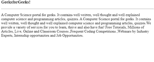
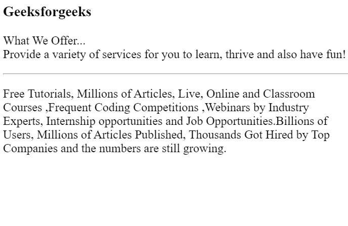

# ReactJS Reactstrap 大屏幕组件

> 原文:[https://www . geeksforgeeks . org/reactjs-reatstrap-jumbo tron-component/](https://www.geeksforgeeks.org/reactjs-reactstrap-jumbotron-component/)

Reactstrap 是一个基于引导的 react UI 库，通过其无缝且易于使用的组件来制作好看的网页。

大屏幕是一个灰色的大盒子，用来显示一些需要特别注意的文字。任何看起来重要的文本都可以写在一个大屏幕里，让它看起来大而引人注目。在本文中，我们将了解如何在 Reactstrap 中使用 Jumbotron 组件。

**属性:**

*   **流体:**reacts trap jumbo tron 中的流体属性用于获取屏幕的全宽。它采用默认值 false，类型为布尔值。
*   **as:** 属性用于查找自定义元素类型。取默认值为< div >，类型为元素类型。
*   **className:**reacts trap 中的 class name 属性用于指定 CSS 属性。它将默认值作为字符串。

**语法:**

```jsx
<Jumbotron>
  content
</Jumbotron>
```

**创建反应应用程序并安装模块:**

*   **步骤 1:** 使用以下命令创建一个反应应用程序。

    ```jsx
    npx create-react-app foldername
    ```

*   **步骤 2:** 创建项目文件夹(即文件夹名称)后，使用以下命令移动到该文件夹。

    ```jsx
    cd foldername
    ```

*   **步骤 3:** 在给定的目录中安装 Reactstrap。

```jsx
 npm install --save reactstrap react react-dom
```

**项目结构**:如下图。


项目结构

**运行应用程序的步骤:**使用以下命令从项目的根目录运行应用程序。

```jsx
npm start
```

**示例 1:** 这是展示如何使用 Jumbotron 组件的基本示例。

## App.js

```jsx
import React from "react";
import { Jumbotron } from "reactstrap";
const gfg = (props) => {
    return (
        <div>
            <br />
            <Jumbotron>
                <h3 className="display-2">
                    GeeksforGeeks!
                </h3>
                <hr />
                <p className="display-3">
                    A Computer Science portal for geeks. 
                    It contains well written, well 
                    thought and well explained computer 
                    science and programming articles, 
                    quizzes. A Computer Science portal 
                    for geeks. It contains well written, 
                    well thought and well explained 
                    computer science and programming
                    articles, quizzes.We provide a variety 
                    of services for you to learn, thrive 
                    and also have fun! Free Tutorials, 
                    Millions of Articles, Live, Online and 
                    Classroom Courses ,Frequent Coding 
                    Competitions ,Webinars by Industry 
                    Experts, Internship opportunities 
                    and Job Opportunities.
                </p>
            </Jumbotron>
        </div>
    );
};

export default gfg;
```

**输出:**



**输出:**

**示例 2:** 这是我们将使用另一个 Jumbotron 组件的示例。

## App.js

```jsx
import React from "react";
import { Jumbotron, Button } from "reactstrap";

const geeksforgeeks = (props) => {
    return (
        <div>
            <Jumbotron>
                <h3 className="display-3">
                    Geeksforgeeks
                </h3>

                <p className="lead">
                    What We Offer... <br></br>
                    Provide a variety of services 
                    for you to learn, thrive and 
                    also have fun!
                </p>

                <hr className="my-2" />

                <p>
                    Free Tutorials, Millions of Articles, 
                    Live, Online and Classroom Courses, 
                    Frequent Coding Competitions, Webinars 
                    by Industry Experts, Internship
                    opportunities and Job Opportunities. 
                    Billions of Users, Millions of Articles 
                    Published, Thousands Got Hired by Top 
                    Companies and the numbers are still growing.
                </p>
            </Jumbotron>
        </div>
    );
};

export default geeksforgeeks;
```

**输出:**



**新的大屏幕组件**

**参考:**T2】https://reactstrap.github.io/components/jumbotron