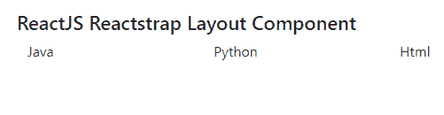
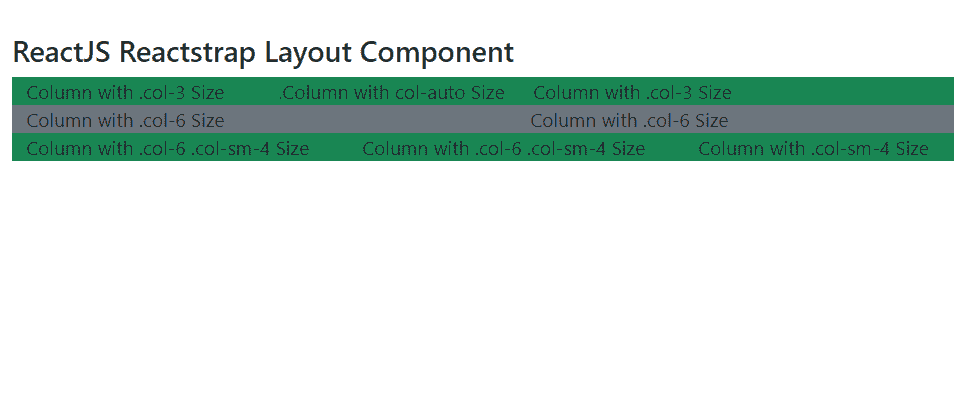
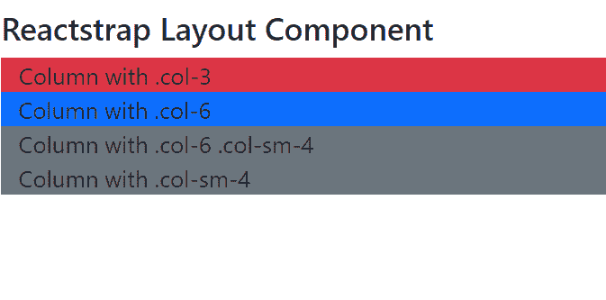

# 反应堆捕集器布局组件

> 原文:[https://www . geeksforgeeks . org/reactjs-reatstrap-layout-component/](https://www.geeksforgeeks.org/reactjs-reactstrap-layout-component/)

Reactstrap 是一个流行的前端库，易于使用 React Bootstrap 4 组件。该库包含引导 4 的无状态反应组件。布局组件用于使用行、列、和容器组件来组织我们的应用程序内容的布局。

**行** 组件提供了一种在网格系统中表示一行的方式。 **Col** 组件提供了一种在网格系统中表示列的方法。容器组件提供了一种对应用程序内容进行居中和水平填充的方法。我们可以在 ReactJS 中使用以下方法来使用 ReactJS Reactstrap 布局组件。

**集装箱道具:**

*   **流体:**如果是 bool，则适用。容器-流体等级，如果是管柱，则适用*。容器-{断点}* 类。
*   **组件:**该组件用于根节点。这个道具是一种在字符串中使用 Html 的方法。这将默认值作为“div ”,类型是元素类型。
*   **固定:**固定道具用于设置屏幕的最大宽度和最小宽度。这些道具的主要用途是设置视口。默认值为 false，类型为 bool。
*   maxWidth:maxWidth 道具用于设置视口中的最大宽度。maxWidth 的类型是 xs，ls，md，false，默认值是 lg。

**排道具:**

*   **noGutters:** 用于表示添加的负边距和列之间的装订线间距。
*   **表单:**用于与表单行形成网格。
*   **xs:** 用于表示在分辨率为< 576 像素的超小型设备上相邻排列的列数。
*   **sm:** 它用于表示在分辨率为 576 像素的小设备上相邻排列的列数。
*   **md:** 用于表示在分辨率为 768 像素的中型设备上相邻排列的列数。
*   **lg:** 用于表示在分辨率为 992 像素的和分辨率≥ 的大型设备上紧挨着的列数。
*   **xl:** 用于表示分辨率≥1200像素的超大型设备上相邻排列的列数。

**Col 道具:**

*   **xs:** 用于表示分辨率为< 576 像素的超小型设备上要跨越的列数。
*   **sm:** 用于表示分辨率为 576 像素的小型设备上要跨越的列数。
*   **md:** 用于表示分辨率≥768像素的中型设备上要跨越的列数。
*   **lg:** 用于表示在分辨率为 992 像素的大型设备上跨越的列数。
*   **xl:** 用于表示分辨率≥1200像素的超大型设备上要跨越的列数。
*   **宽度:**用于表示组件的宽度，以像素为单位。

**创建反应应用程序并安装模块:**

**步骤 1:** 使用以下命令创建一个反应应用程序:

```jsx
npx create-react-app foldername
```

**步骤 2:** 创建项目文件夹后，即文件夹名称**，**使用以下命令移动到项目文件夹:

```jsx
cd foldername
```

**步骤 3:** 创建 ReactJS 应用程序后，使用以下命令安装所需的****模块:****

```jsx
**npm install reactstrap bootstrap**
```

******项目结构:**如下图。****

****

**项目结构****** 

******示例 1:** 在每行组件中显示一列。****

## ****java 描述语言****

```jsx
**import React from "react";
import "bootstrap/dist/css/bootstrap.min.css";
import { Container, Row, Col } from "reactstrap";

function App() {
  return (
    <div
      style={{
        display: "block",
        width: 900,
        padding: 30
      }}
    >
      <h4>ReactJS Reactstrap Layout Component</h4>
      <Container>
        <Row>
          <Col>Java</Col>
          <Col>Python</Col>
          <Col>Html</Col>
          <Col>CSS</Col>
        </Row>

      </Container>
    </div>
  );
}

export default App;**
```

******运行应用程序的步骤:**从项目的根目录使用以下命令运行应用程序:****

```jsx
**npm start**
```

******输出:**现在打开浏览器，转到***http://localhost:3000/***，会看到如下输出:****

****

**输出****** 

******示例 2:** 在每行组件中显示多列。****

## ****java 描述语言****

```jsx
**import React from 'react'
import 'bootstrap/dist/css/bootstrap.min.css';
import {
    Container, Row, Col
} from "reactstrap"

function App() {

    return (
        <div style={{
            display: 'block', width: 900, padding: 30
        }}>
            <h4>ReactJS Reactstrap Layout Component</h4>
            <Container>
                <Row className="bg-success">
                    <Col xs="3">Column with .col-3 Size</Col>
                    <Col xs="auto">.Column with col-auto Size</Col>
                    <Col xs="3">Column with .col-3 Size</Col>
                </Row>
                <Row className="bg-secondary">
                    <Col xs="6">Column with .col-6 Size</Col>
                    <Col xs="6">Column with .col-6 Size</Col>
                </Row>
                <Row className="bg-success">
                    <Col xs="6" sm="4">Column with .col-6 .col-sm-4 Size</Col>
                    <Col xs="6" sm="4">Column with .col-6 .col-sm-4 Size</Col>
                    <Col sm="4"> Column with .col-sm-4 Size</Col>
                </Row>
            </Container>
        </div >
    );
}

export default App;**
```

******运行应用程序的步骤:**从项目的根目录使用以下命令运行应用程序:****

```jsx
**npm start**
```

******输出:**现在打开浏览器，转到***http://localhost:3000/***，会看到如下输出:****

********

******例 3:******

## ****App.js****

```jsx
**import React from "react";
import "bootstrap/dist/css/bootstrap.min.css";
import { Container, Row, Col } from "reactstrap";

function App() {
  return (
    <div
      style={{
        width: 9000,
        padding: 10
      }}
    >
      <h4> Reactstrap Layout Component</h4>
      <Container>
        <Row className="bg-danger">
          <Col xs="3">Column with .col-3 Size</Col>
          <Col xs="auto">.Column with col-auto Size</Col>
          <Col xs="3">Column with .col-3 Size</Col>
        </Row>
        <Row className="bg-primary">
          <Col xs="6">Column with .col-6 Size</Col>
          <Col xs="6">Column with .col-6 Size</Col>
        </Row>
        <Row className="bg-secondary">
          <Col xs="6" sm="4">
            Column with .col-6 .col-sm-4 Size
          </Col>
          <Col xs="6" sm="4">
            Column with .col-6 .col-sm-4 Size
          </Col>
          <Col sm="4"> Column with .col-sm-4 Size</Col>
        </Row>
      </Container>
    </div>
  );
}

export default App;**
```

******运行应用程序的步骤:**从项目的根目录使用以下命令运行应用程序:****

```jsx
**npm start**
```

******输出:**现在打开浏览器，转到***http://localhost:3000/***，会看到如下输出:****

********

******参考:**T2】https://reactstrap.github.io/components/layout/****