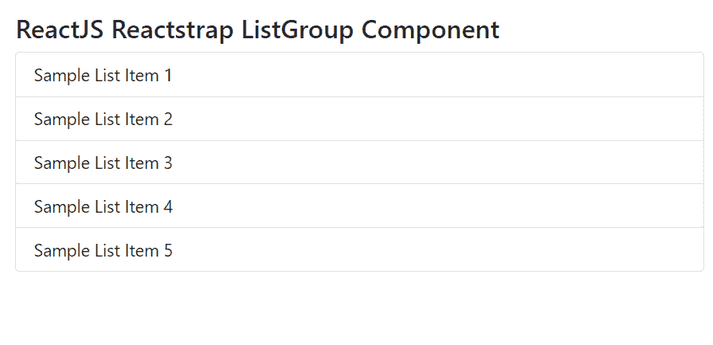
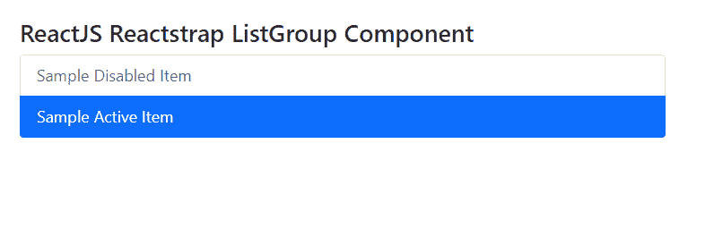

# 反应堆捕捉列表组组件

> 原文:[https://www . geeksforgeeks . org/reactjs-reatstrap-list group-component/](https://www.geeksforgeeks.org/reactjs-reactstrap-listgroup-component/)

Reactstrap 是一个流行的前端库，易于使用 React Bootstrap 4 组件。该库包含引导 4 的无状态反应组件。列表组组件提供了一种显示一系列内容的方式。我们可以在 ReactJS 中使用下面的方法来使用 ReactJS Reactstrap 列表组组件。

**列表组道具:**

*   **标签:**列表组道具中的标签属性用于表示该组件的标签道具。
*   **同花顺:**列表组道具中的同花顺属性。它用于指示是否在父容器中边对边地呈现列表组项。
*   **水平:**列表组属性中的水平属性用于指示是否水平渲染列表组项目。
*   **类名:**类名用于表示组件样式的类名
*   **CSS module:**ListGroup 道具中的 ccsModule 属性用于表示样式化的 CSS 模块。

**创建反应应用程序并安装模块:**

**步骤 1:** 使用以下命令创建一个反应应用程序:

```
npx create-react-app foldername
```

**步骤 2:** 在创建项目文件夹(即文件夹名**)后，使用以下命令将**移动到该文件夹:

```
cd foldername
```

**步骤 3:** 创建 ReactJS 应用程序后，使用以下命令安装所需的****模块:****

```
**npm install reactstrap bootstrap**
```

******项目结构:**如下图。****

****

项目结构**** 

******示例 2:** 现在在 **App.js** 文件中写下以下代码。这里，我们使用了没有禁用和活动道具的列表组组件。****

## ****java 描述语言****

```
**import React from 'react'
import 'bootstrap/dist/css/bootstrap.min.css';
import { ListGroup, ListGroupItem } from "reactstrap"

function App() {
    return (
        <div style={{
            display: 'block', width: 700, padding: 30
        }}>
            <h4>ReactJS Reactstrap ListGroup Component</h4>
            <ListGroup>
                <ListGroupItem>Sample List Item 1</ListGroupItem>
                <ListGroupItem>Sample List Item 2</ListGroupItem>
                <ListGroupItem>Sample List Item 3</ListGroupItem>
                <ListGroupItem>Sample List Item 4</ListGroupItem>
                <ListGroupItem>Sample List Item 5</ListGroupItem>
            </ListGroup>
        </div>
    );
}

export default App;**
```

******运行应用程序的步骤:**从项目的根目录使用以下命令运行应用程序:****

```
**npm start**
```

******输出:**现在打开浏览器，转到***http://localhost:3000/***，会看到如下输出:****

********

******示例 2:** 现在在 **App.js** 文件中写下以下代码。在这里，我们使用了禁用和活动道具的列表组组件。****

## ****java 描述语言****

```
**import React from 'react'
import 'bootstrap/dist/css/bootstrap.min.css';
import { ListGroup, ListGroupItem } from "reactstrap"

function App() {
    return (
        <div style={{
            display: 'block', width: 700, padding: 30
        }}>
            <h4>ReactJS Reactstrap ListGroup Component</h4>
            <ListGroup>
                <ListGroupItem disabled>Sample Disabled Item</ListGroupItem>
                <ListGroupItem active> Sample Active Item</ListGroupItem>
            </ListGroup>
        </div>
    );
}

export default App;**
```

******运行应用程序的步骤:**从项目的根目录使用以下命令运行应用程序:****

```
**npm start**
```

******输出:**现在打开浏览器，转到***http://localhost:3000/***，会看到如下输出:****

********

******参考:**T2】https://reactstrap.github.io/components/listgroup/****