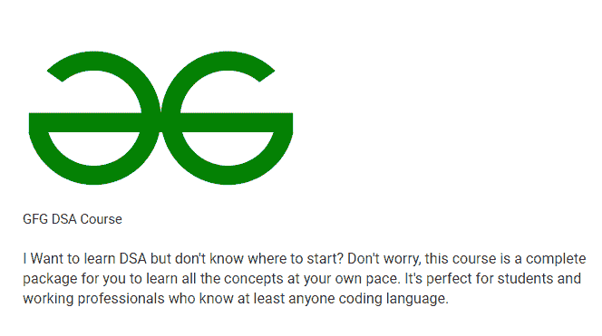
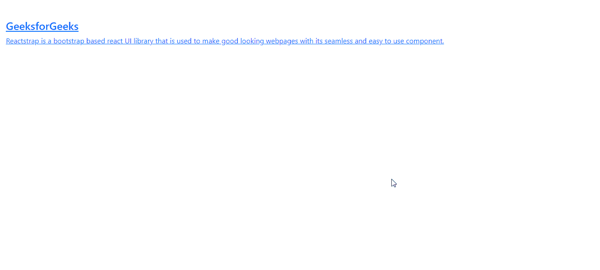

# 反应堆捕获介质组件

> 原文:[https://www . geeksforgeeks . org/reactjs-reatstrap-media-component/](https://www.geeksforgeeks.org/reactjs-reactstrap-media-component/)

**reatstrap**是一个基于 bootstrap 的 reatstrap UI 库，通过其无缝易用的组件来制作好看的网页。

在本文中，我们将看到如何在 Reactstrap 中使用媒体组件。媒体组件用于向我们的项目添加一些媒体。

**属性:**

*   **标签:**在 ReactStrap 媒体组件中，标签是一个属性，用于设置组件中的标签。它接受字符串和函数值。
*   **类名:**在 ReactStrap 媒体组件类名中定义组件的类名。在类名的帮助下，你可以使用 CSS 添加样式。
*   **标题:**在 reatstrap 中，媒体组件标题是 reatstrap 中用于设置文本标题的属性。它采用布尔值作为默认参数。
*   **中间**:在 reactStrap 中，中间属性用于设置两个对象之间的中间对齐。它需要一个布尔值。
*   **流体:**在反应堆中，适用捕集介质成分流体。容器-流体类别，如果是字符串，则适用。容器-{断点}类。
*   **区块:**在 ReactStrap 媒体组件中，区块道具用于指示区块是否应该具有区块样式。
*   **颜色:**reacts trap 中的颜色道具用于设置组件中元素的颜色。
*   **主体:**媒体组件中的主体属性用于设置元素的主体。默认情况下，它采用布尔值。
*   **底部:**底部属性用于固定组件在底部的位置。它应该是真或假，它需要一个布尔值。
*   **子项:**子项属性用于设置组件中元素的子项。它需要一个节点值。
*   **标题:**标题属性用于设置元素的标题，默认情况下它取一个布尔值。
*   **左侧:**左侧属性用于设置组件左侧元素的对齐方式，它取一个布尔值。

```
<Media>
  Content
</media>
```

**创建反应应用程序并安装模块:**

*   **步骤 1:** 使用以下命令创建一个 React 应用程序。

```
npx create-react-app foldername
```

*   **步骤 2:** 创建项目文件夹即文件夹名称后，使用以下命令移动到该文件夹。

```
cd foldername
```

*   **步骤 3:** 在给定的目录中安装 Reactstrap。

```
 npm install --save reactstrap react react-dom
```

*   **步骤 4:** 导入项目中要使用的元素。

```
import {Media} from 'reactstrap'
```

**项目结构:**如下图。


**项目结构:**

**运行应用程序的步骤:**使用以下命令从项目的根目录运行应用程序。

```
npm start
```

**示例 1:** 这是展示如何使用媒体组件的基本示例。

## App.js

```
import React from "react";
import { Media } from "reactstrap";
import "bootstrap/dist/css/bootstrap.min.css";
export default function App() {
    return (
        <div className="App">
            <Media>
                <Media left href="#">
                    <Media
                        object
                        src=
"https://media.geeksforgeeks.org/wp-content/cdn-uploads/20210728124621/geekslogo.png"
                        alt="cat"
                    />
                </Media>
                <Media body>
                    <br></br>
                    <Media heading>GFG DSA Course</Media>
                    <br></br>
                    I Want to learn DSA but don't know where 
                    to start? Don't worry, this course is a 
                    complete package for you to learn all the 
                    concepts at your own pace. It's perfect 
                    for students and working professionals
                    who know at least anyone coding language.
                </Media>
            </Media>
        </div>
    );
}
```

**输出:**



**示例 2:** 在本例中，我们将看到如何在媒体中使用 tag 属性。

*   **App.js**

## java 描述语言

```
import React from 'react';
import { Media } from 'reactstrap';

const gfg = (props) => {

    return (
        <div id='gfg'>
            <br />
            <Media tag='a' href=
            'https://www.geeksforgeeks.org/'>
                <Media body>
                    <Media heading>
                        GeeksforGeeks
                    </Media>
                    Reactstrap is a bootstrap based 
                    react UI library that is used to
                    make good looking webpages with 
                    its seamless and easy to use 
                    component.
                </Media>
            </Media>
        </div>
    );
}

export default gfg;
```

**输出:**



**参考:**T2】https://reactstrap.github.io/components/media