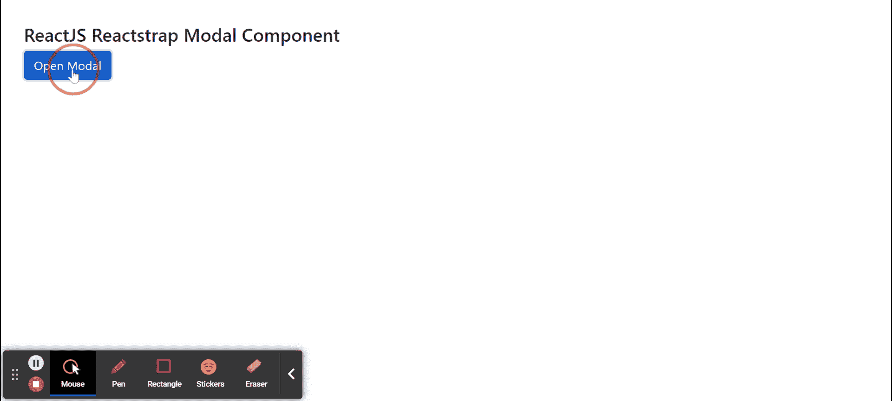
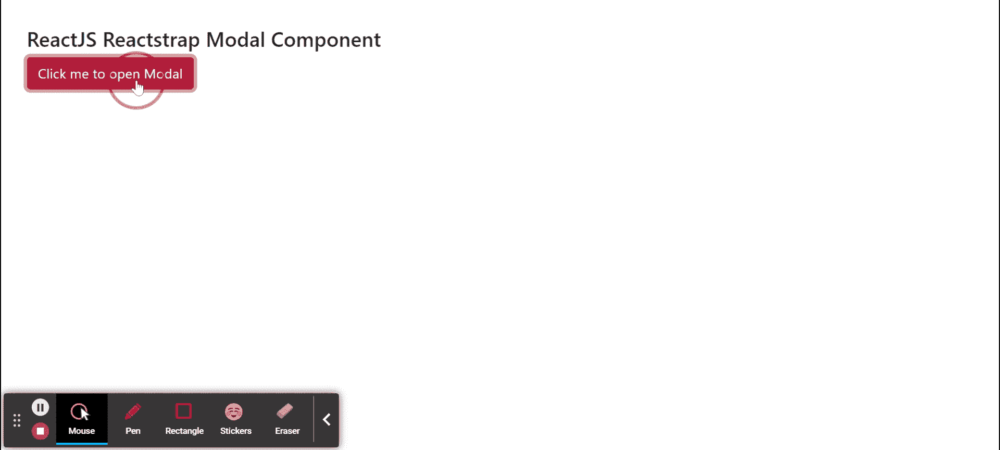

# 反应堆安全壳模态组件

> 原文:[https://www . geeksforgeeks . org/reactjs-reatstrap-modal-component/](https://www.geeksforgeeks.org/reactjs-reactstrap-modal-component/)

Reactstrap 是一个流行的前端库，易于使用 React Bootstrap 4 组件。该库包含引导 4 的无状态反应组件。M节点组件为创建对话框、灯箱、弹出窗口等提供了坚实的基础。我们可以在 ReactJS 中使用以下方法来使用 ReactJS Reactstrap 模态组件。

**模态道具:**

*   **isOpen:** 当设置为真时，模态会显示出来。
*   **自动对焦:**当设置为真时，模式会打开并自动对焦。
*   **居中:**用于制作居中情态。
*   **尺寸:** 用于设置模态尺寸
*   **切换:**是组件切换时触发的回调函数。
*   **角色:**用于表示角色属性，默认值为“对话框”。
*   **labelledBy:** 用于引用模态中标题元素的 ID。
*   **键盘:**用于指示是否支持按 ESC 键关闭。
*   **背景:**当设置为真时，模式将显示处于打开状态的背景。
*   **可滚动:**用于内容较长时允许模态可滚动。
*   **外部:**用于允许模态旁边存在节点或构件。
*   **onenote:**是一个回调函数，在 componentDidMount 事件上调用。
*   **onExit:** 是一个回调函数，在 componentWillUnmount 事件上调用。
*   **onOpened:** 这是一个回调函数，在转换完成时调用。
*   **onClosed:** 这是一个回调函数，在转换完成时调用。
*   **类名:**用于表示造型的类名。
*   **wrapClassName:** 用于传递模态对话框容器的类名。**T3】**
*   **modalClassName:** 用于为 modal 类添加可选的额外类名。
*   **backdropbclassname:**用于为*增加一个可选的额外类名。模态背景*。
*   **contentClassName:** 用于给*增加一个可选的额外类名。模态-内容*
*   **渐变:**用于指示渐变过渡是否发生。
*   **cssModule:** 用来表示造型用的 CSS 模块。
*   **zIndex:** 用于表示情态动词的 z-index。
*   **背景渐变:**用于背景渐变，因为它控制背景渐变。
*   **模态转换:**用于模态转换，因为它控制模态转换。
*   **innerRef:** 用于表示该组件的内部 Ref 元素。
*   **unmountOnClose:** 用于关闭模态后从 DOM 中卸载。
*   **returnFocusAfterClose:** 用于在模态关闭后，将焦点返回到打开模态的元素。
*   **容器:**是容器属性，类型为*任意。*
*   **trapFocus:** 用于管理其子代的焦点。

**创建反应应用程序并安装模块:**

**步骤 1:** 使用以下命令创建一个反应应用程序:

```
npx create-react-app foldername
```

**步骤 2:** 在创建项目文件夹(即文件夹名**)后，使用以下命令将**移动到该文件夹:

```
cd foldername
```

**步骤 3:** 创建 ReactJS 应用程序后，使用以下命令安装所需的****模块:****

```
**npm install reactstrap bootstrap**
```

******项目结构:**如下图。****

****

项目结构**** 

******示例 1:** 现在在 **App.js** 文件中写下以下代码。这里我们展示了延迟为 2 秒的 Modal，我们展示了没有 ModalHeader 和 ModalFooter 的 Modal。****

## ****java 描述语言****

```
**import React from 'react'
import 'bootstrap/dist/css/bootstrap.min.css';
import {
    Button, Modal, ModalFooter,
    ModalHeader, ModalBody
} from "reactstrap"

function App() {

    // Modal open state
    const [modal, setModal] = React.useState(false);

    // Toggle for Modal
    const toggle = () => setModal(!modal);

    return (
        <div style={{
            display: 'block', width: 700, padding: 30
        }}>
            <h4>ReactJS Reactstrap Modal Component</h4>
            <Button color="primary"
                onClick={toggle}>Open Modal</Button>
            <Modal isOpen={modal}
                toggle={toggle}
                modalTransition={{ timeout: 2000 }}>
                <ModalBody>
                    Simple Modal with just ModalBody...
                </ModalBody>
            </Modal>
        </div >
    );
}

export default App;**
```

******运行应用程序的步骤:**从项目的根目录使用以下命令运行应用程序:****

```
**npm start**
```

******输出:**现在打开浏览器，转到***http://localhost:3000/***，会看到如下输出:****

********

******示例 2:** 现在在 **App.js** 文件中写下以下代码。在这里，我们没有任何延迟地展示了 Modal，并且展示了带有 ModalHeader 和 ModalFooter 的 Modal。****

## ****java 描述语言****

```
**import React from 'react'
import 'bootstrap/dist/css/bootstrap.min.css';
import {
    Button, Modal, ModalFooter,
    ModalHeader, ModalBody
} from "reactstrap"

function App() {

    // Modal open state
    const [modal, setModal] = React.useState(false);

    // Toggle for Modal
    const toggle = () => setModal(!modal);

    return (
        <div style={{
            display: 'block', width: 700, padding: 30
        }}>
            <h4>ReactJS Reactstrap Modal Component</h4>
            <Button color="danger"
                onClick={toggle}>Click me to open Modal</Button>
            <Modal isOpen={modal} toggle={toggle}>
                <ModalHeader
                    toggle={toggle}>Sample Modal Title</ModalHeader>
                <ModalBody>
                    Sample Modal Body Text to display...
                </ModalBody>
                <ModalFooter>
                    <Button color="primary" onClick={toggle}>Okay</Button>
                </ModalFooter>
            </Modal>
        </div >
    );
}

export default App;**
```

******运行应用程序的步骤:**从项目的根目录使用以下命令运行应用程序:****

```
**npm start**
```

******输出:**现在打开浏览器，转到***http://localhost:3000/***，会看到如下输出:****

********

******参考:**T2】https://reactstrap.github.io/components/modals/****