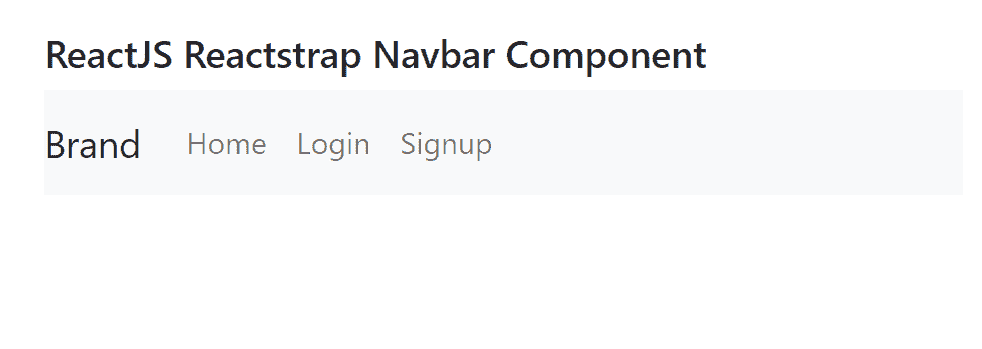
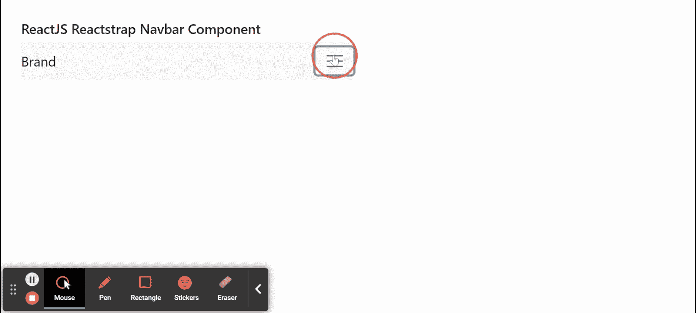

# 反应堆集热器 Navbar 组件

> 原文:[https://www . geeksforgeeks . org/reactjs-reatstrap-nav bar-component/](https://www.geeksforgeeks.org/reactjs-reactstrap-navbar-component/)

Reactstrap 是一个流行的前端库，易于使用 React Bootstrap 4 组件。该库包含引导 4 的无状态反应组件。导航栏组件为用户提供了一种在应用程序顶部为他们提供导航控件的方式。我们可以在 ReactJS 中使用以下方法来使用 ReactJS Reactstrap Navbar 组件。

**Navbar Props:**

*   **光:**用于表示是否对其应用浅色类。
*   **深色:**表示是否对其应用深色类。
*   **固定:**表示是否应用位置固定属性。
*   **颜色:**用于表示该成分的颜色。
*   **角色:**用于表示该组件的角色属性值。
*   **展开:**表示点击时是否展开导航条。
*   **标签:**用于传入自定义元素使用。

**navbarbrand props∶**

*   **标签:**用于传入自定义元素使用。

**navbarttext props:**

*   **标签:**用于传入自定义元素使用。

*   ****类型:**用于表示该部件的类型。**
*   ****标签:**用于传入自定义元素使用。**

****创建反应应用程序并安装模块:****

****步骤 1:** 使用以下命令创建一个反应应用程序:**

```
npx create-react-app foldername
```

****步骤 2:** 创建项目文件夹(即文件夹名**)后，使用以下命令移动到该文件夹中:****

```
cd foldername
```

****步骤 3:** 创建 ReactJS 应用程序后，使用以下命令安装所需的****模块:******

```
****npm install reactstrap bootstrap****
```

********项目结构:**如下图。******

****

项目结构**** 

******示例 1:** 现在在 **App.js** 文件中写下以下代码。这里，我们展示了带有 expand 属性的 Navbar 组件。****

## ****java 描述语言****

```
**import React from 'react'
import 'bootstrap/dist/css/bootstrap.min.css';
import {
    Navbar,
    NavItem,
    NavbarToggler,
    Collapse,
    NavLink,
    Nav,
    NavbarBrand
} from 'reactstrap';

function App() {

    // Collapse isOpen State
    const [isOpen, setIsOpen] = React.useState(false);

    return (
        <div style={{
            display: 'block', width: 550, padding: 30
        }}>
            <h5>ReactJS Reactstrap Navbar Component</h5>
            <Navbar color="light" light expand="md">
                <NavbarBrand href="/">Brand</NavbarBrand>
                <NavbarToggler onClick={() => { setIsOpen(!isOpen) }} />
                <Collapse isOpen={isOpen} navbar>
                    <Nav className="mr-auto" navbar>
                        <NavItem>
                            <NavLink href="#">Home</NavLink>
                        </NavItem>
                        <NavItem>
                            <NavLink href="#">Login</NavLink>
                        </NavItem>
                        <NavItem>
                            <NavLink href="#">Signup</NavLink>
                        </NavItem>
                    </Nav>
                </Collapse>
            </Navbar>
        </div >
    );
}

export default App;**
```

******运行应用程序的步骤:**从项目的根目录使用以下命令运行应用程序:****

```
**npm start**
```

******输出:**现在打开浏览器，转到***http://localhost:3000/***，会看到如下输出:****

********

******示例 2:** 现在在 **App.js** 文件中写下以下代码。在这里，我们展示了不带 expand 属性的 Navbar 组件。****

## ****java 描述语言****

```
**import React from 'react'
import 'bootstrap/dist/css/bootstrap.min.css';
import {
    Navbar,
    NavItem,
    NavbarToggler,
    Collapse,
    NavLink,
    Nav,
    NavbarBrand
} from 'reactstrap';

function App() {

    // Collapse isOpen State
    const [isOpen, setIsOpen] = React.useState(false);

    return (
        <div style={{
            display: 'block', width: 550, padding: 30
        }}>
            <h5>ReactJS Reactstrap Navbar Component</h5>
            <Navbar color="light" light >
                <NavbarBrand href="/">Brand</NavbarBrand>
                <NavbarToggler onClick={() => { setIsOpen(!isOpen) }} />
                <Collapse isOpen={isOpen} navbar>
                    <Nav className="mr-auto" navbar>
                        <NavItem>
                            <NavLink href="#">Home</NavLink>
                        </NavItem>
                        <NavItem>
                            <NavLink href="#">Login</NavLink>
                        </NavItem>
                    </Nav>
                </Collapse>
            </Navbar>
        </div >
    );
}

export default App;**
```

******运行应用程序的步骤:**从项目的根目录使用以下命令运行应用程序:****

```
**npm start**
```

******输出:**现在打开浏览器，转到***http://localhost:3000/***，会看到如下输出:****

********

******参考:**T2】https://reactstrap.github.io/components/navbar/****