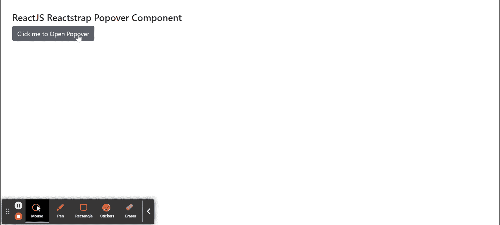
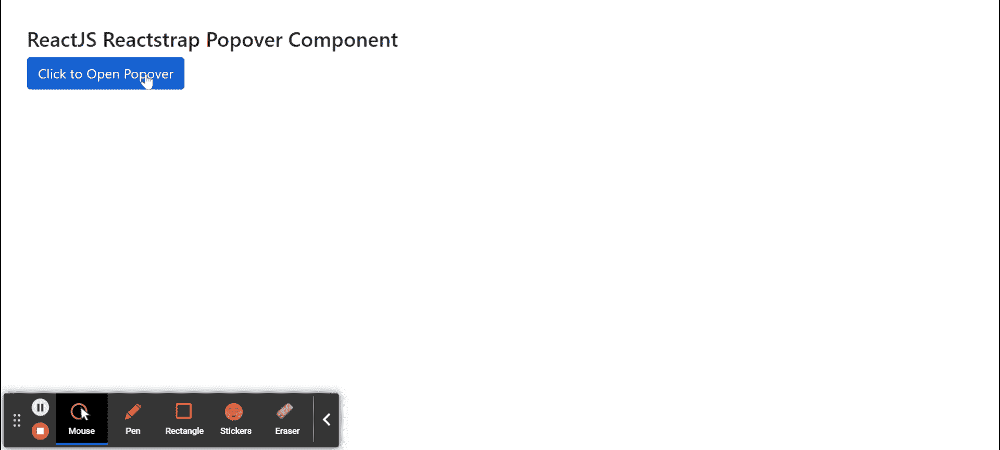

# 反应堆安全壳弹出组件

> 原文:[https://www . geeksforgeeks . org/reactjs-reatstrap-Popo ver-component/](https://www.geeksforgeeks.org/reactjs-reactstrap-popover-component/)

Reactstrap 是一个流行的前端库，易于使用 React Bootstrap 4 组件。该库包含引导 4 的无状态反应组件。弹出组件是悬停在父窗口上的容器类型元素。我们可以在 ReactJS 中使用以下方法来使用 ReactJS Reactstrap Popover 组件。

**Popover 道具:**

*   **children:** 用于将 children 元素传递给这个组件。
*   **触发器:**用于表示用空格分隔的触发器列表。
*   **等音:**表示是否打开 popover。
*   **切换:**是控制组件中切换 isOpen 的回调函数。
*   **边界元素:**用于表示弹出器的边界。
*   **容器:**用于指示弹出器 DOM 节点的注入位置。
*   **类名:**用于表示造型的类名。
*   **popperClassName:** 用于对 popper 组件应用一个类。
*   **内部类名:**用于将类应用于内部 popover。
*   **禁用:**表示组件是否禁用。
*   **隐藏箭头:**表示是否隐藏箭头。**T3】**
*   **放置前缀:**用于表示放置前缀类，如 *bs-popover、*等。
*   **延迟:**用于表示延迟值。
*   **放置:**用于放置 popover。
*   **修改器**:用于表示传递给 Popper.js 的自定义修改器
*   **位置固定:**用于指示波波头指向元素是否有*位置:固定*造型。
*   **偏移:**用于表示偏移元素。
*   **淡入淡出:**表示是否显示/隐藏带有淡入淡出效果的 popover。
*   **翻转:**用于指示如果太靠近容器边缘是否翻转弹弓的方向。

**创建反应应用程序并安装模块:**

**步骤 1:** 使用以下命令创建一个反应应用程序:

```jsx
npx create-react-app foldername
```

**步骤 2:** 创建项目文件夹(即文件夹名**)后，使用以下命令移动到该文件夹中:**

```jsx
cd foldername
```

**步骤 3:** 创建 ReactJS 应用程序后，使用以下命令安装所需的****模块:****

```jsx
**npm install reactstrap bootstrap**
```

******项目结构:**如下图。****

****

项目结构**** 

******示例 1:** 现在在 **App.js** 文件中写下以下代码。这里我们展示了带有头部组件的 popover，Popover 的位置在底部。****

## ****java 描述语言****

```jsx
**import React from 'react'
import 'bootstrap/dist/css/bootstrap.min.css';
import { Button, Popover, PopoverHeader, PopoverBody } from "reactstrap"

function App() {

    // Popover open state
    const [popoverOpen, setPopoverOpen] = React.useState(false);

    return (
        <div style={{
            display: 'block', width: 700, padding: 30
        }}>
            <h4>ReactJS Reactstrap Popover Component</h4>
            <Button id="Popover1" type="button">
                Click me to Open Popover
            </Button> <br></br>
            <Popover
                placement="bottom" isOpen={popoverOpen}
                target="Popover1" toggle=
                    {() => { setPopoverOpen(!popoverOpen) }}>
                <PopoverHeader>Sample Popover Title</PopoverHeader>
                <PopoverBody>Sample Body Text to display...</PopoverBody>
            </Popover>
        </div >
    );
}

export default App;**
```

******运行应用程序的步骤:**从项目的根目录使用以下命令运行应用程序:****

```jsx
**npm start**
```

******输出:**现在打开浏览器，转到***http://localhost:3000/***，会看到如下输出:****

********

******示例 2:** 现在在 **App.js** 文件中写下以下代码。这里我们展示了没有头部组件的 popover，Popover 的位置是正确的。****

## ****java 描述语言****

```jsx
**import React from 'react'
import 'bootstrap/dist/css/bootstrap.min.css';
import { Button, Popover, PopoverBody } from "reactstrap"

function App() {

    // Popover open state
    const [popoverOpen, setPopoverOpen] = React.useState(false);

    return (
        <div style={{
            display: 'block', width: 700, padding: 30
        }}>
            <h4>ReactJS Reactstrap Popover Component</h4>
            <Button id="Popover" color="primary">
                Click to Open Popover
            </Button> <br></br>
            <Popover
                placement="right" isOpen={popoverOpen}
                target="Popover" toggle=
                    {() => { setPopoverOpen(!popoverOpen) }}>
                <PopoverBody>Sample Body Text to display...</PopoverBody>
            </Popover>
        </div >
    );
}

export default App;**
```

******运行应用程序的步骤:**从项目的根目录使用以下命令运行应用程序:****

```jsx
**npm start**
```

******输出:**现在打开浏览器，转到***http://localhost:3000/***，会看到如下输出:****

********

******参考:**T2】https://reactstrap.github.io/components/popovers/****