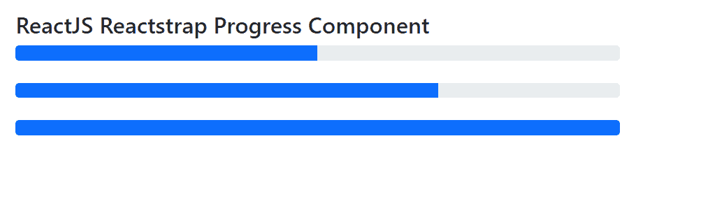

# 反应堆捕获进度组件

> 原文:[https://www . geeksforgeeks . org/reactjs-reatstrap-progress-component/](https://www.geeksforgeeks.org/reactjs-reactstrap-progress-component/)

Reactstrap 是一个流行的前端库，易于使用 React Bootstrap 4 组件。该库包含引导 4 的无状态反应组件。进度组件允许用户显示操作流程的当前进度。我们可以在 reatjs 中使用以下方法来使用 ReactJS Reactstrap 进度组件。

**进度道具:**

*   **multi:** 表示是否显示多个进度。
*   **杠:**与多道具组合使用。
*   **标签:**用于表示该组件的标签。**T3】**
*   **值:**用于表示进度的值。
*   **max:** 是进度可以达到的最大值。
*   **min:** 是进度可以开始的最小值。
*   **动画:**表示是否显示动画。
*   **条纹:**表示是否显示条纹风格。
*   **颜色:**用于表示进度组件的颜色。
*   **类名:**用于表示造型的类名。
*   **进度条样式:**用于为内部进度条元素添加样式
*   **barClassName:** 用于向内部进度条元素添加类
*   **barariavalutext:**用于表示小节咏叹调值的文本值。
*   **barariarabledby:**用于表示标有值的小节

**创建反应应用程序并安装模块:**

*   **步骤 1:** 使用以下命令创建一个反应应用程序:

    ```jsx
    npx create-react-app foldername
    ```

*   **步骤 2:** 在创建项目文件夹(即文件夹名**)后，使用以下命令将**移动到该文件夹:

    ```jsx
    cd foldername
    ```

*   **步骤 3:** 创建 ReactJS 应用程序后，使用以下命令安装所需的****模块:****

    ```jsx
    **npm install reactstrap bootstrap**
    ```

******项目结构:**如下图。****

****

项目结构**** 

******示例 1:** 现在在 **App.js** 文件中写下以下代码。这里我们展示了多道具的进展。****

## ****App.js****

```jsx
**import React from 'react'
import 'bootstrap/dist/css/bootstrap.min.css';
import { Progress } from "reactstrap"

function App() {
    return (
        <div style={{
            display: 'block', width: 700, padding: 30
        }}>
            <h4>ReactJS Reactstrap Progress Component</h4>
            <Progress multi>
                <Progress bar color="success" value="30" />
                <Progress bar color="danger" value="40" />
                <Progress bar color="warning" value="30" />
            </Progress>
        </div>
    );
}

export default App;**
```

******运行应用程序的步骤:**从项目的根目录使用以下命令运行应用程序:****

```jsx
**npm start**
```

******输出:**现在打开浏览器，转到***http://localhost:3000/***，会看到如下输出:****

********

******示例 2:** 现在在 **App.js** 文件中写下以下代码。这里我们展示了没有多道具的进步。****

## ****App.js****

```jsx
**import React from 'react'
import 'bootstrap/dist/css/bootstrap.min.css';
import { Progress } from "reactstrap"

function App() {
    return (
        <div style={{
            display: 'block', width: 700, padding: 30
        }}>
            <h4>ReactJS Reactstrap Progress Component</h4>
            <Progress value={50} /> <br></br>
            <Progress value={70} /> <br></br>
            <Progress value={100} />
        </div>
    );
}

export default App;**
```

******运行应用程序的步骤:**从项目的根目录使用以下命令运行应用程序:****

```jsx
**npm start**
```

******输出:**现在打开浏览器，转到***http://localhost:3000/***，会看到如下输出:****

********

******参考:**T2】https://reactstrap.github.io/components/progress/****