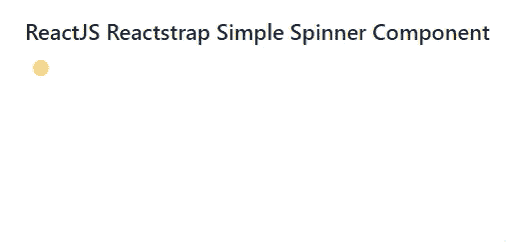
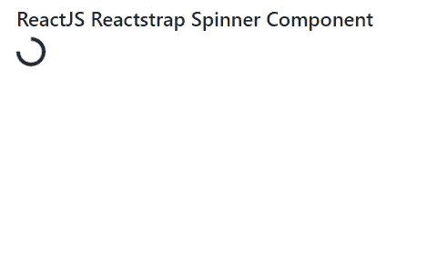

# 反应器捕集器纺丝组件

> 原文:[https://www . geeksforgeeks . org/reactjs-reatstrap-spinners-component/](https://www.geeksforgeeks.org/reactjs-reactstrap-spinners-component/)

Reactstrap 是一个流行的前端库，易于使用 React Bootstrap 4 组件。该库包含引导 4 的无状态反应组件。微调组件允许用户显示加载效果。它用于指示加载状态。我们可以在 ReactJS 中使用以下方法来使用 ReactJS Reactstrap 微调器组件。

**旋转道具:**

*   **bsPrefix:** 这个道具用来表示 css 中组件的变化。它用于自定义引导 css。默认值为微调器，类型为字符串。
*   **大小:道具的**大小用来演示旋转器的大小。道具的大小用于组件大小的变化。尺码的类型是 sm。
*   **颜色:颜色道具**用于表示旋转器的颜色。
*   **类名:**类名道具用于表示 css 中组件样式的类名。
*   **children:** 用于在 React JS 中将 children 元素传递给这个组件。子类型是元素。

**创建反应应用程序并安装模块:**

**步骤 1:** 使用以下命令创建一个反应应用程序:

```
npx create-react-app foldername
```

**步骤 2:** 在创建项目文件夹(即文件夹名**)后，使用以下命令将**移动到该文件夹:

```
cd foldername
```

**步骤 3:** 创建 ReactJS 应用程序后，使用以下命令安装所需的****模块:****

```
**npm install reactstrap bootstrap**
```

******项目结构:**如下图。****

****

项目结构**** 

******示例 1:** 现在在 **App.js** 文件中写下以下代码。这里，我们展示了一个生长型的旋转器。****

## ****App.js****

```
**import React from 'react'
import 'bootstrap/dist/css/bootstrap.min.css';
import { Spinner } from "reactstrap"

function App() {
    return (
        <div style={{
            display: 'block', width: 700, padding: 30
        }}>
            <h4>ReactJS Reactstrap Simple  Spinner Component</h4>
            <Spinner type="grow" color="warning"
                children={false} /> 
        </div>
    );
}

export default App;**
```

******运行应用程序的步骤:**从项目的根目录使用以下命令运行应用程序:****

```
**npm start**
```

******输出:**现在打开浏览器，转到***http://localhost:3000/***，会看到如下输出:****

********

******示例 2:** 现在在 **App.js** 文件中写下以下代码。这里，我们展示了一个没有生长类型的旋转器。****

## ****App.js****

```
**import React from 'react'
import 'bootstrap/dist/css/bootstrap.min.css';
import { Spinner } from "reactstrap"

function App() {
    return (
        <div style={{
            display: 'block', width: 700, padding: 30
        }}>
            <h4>ReactJS Reactstrap Spinner Component</h4>
            <Spinner style={{ width: '2rem', height: '2rem' }}
                children={false} />
        </div>
    );
}

export default App;**
```

******运行应用程序的步骤:**从项目的根目录使用以下命令运行应用程序:****

```
**npm start**
```

******输出:**现在打开浏览器，转到***http://localhost:3000/***，会看到如下输出:****

********

******参考:**T2】https://reactstrap.github.io/components/spinners/****