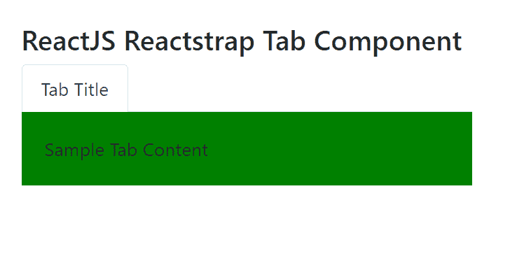
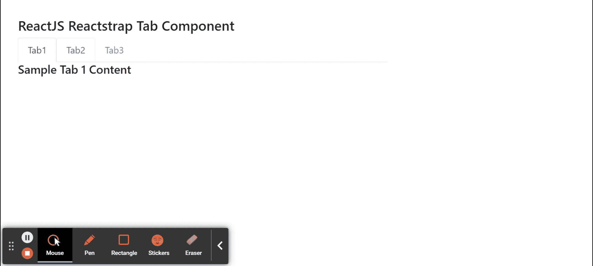

# 反应堆捕集器选项卡组件

> 原文:[https://www . geeksforgeeks . org/reactjs-reatstrap-tab-component/](https://www.geeksforgeeks.org/reactjs-reactstrap-tab-component/)

Reactstrap 是一个流行的前端库，易于使用 React Bootstrap 4 组件。该库包含引导 4 的无状态反应组件。选项卡组件允许用户在给定的不同选项卡中的组件之间切换。我们可以在 ReactJS 中使用以下方法来使用 ReactJS Reactstrap 选项卡组件。

**禁忌内容命题:**

*   **活动标签:**用于表示处于活动状态的标签的标识。

**TabPane Props:**

*   **标签号:**用于表示每个标签的唯一标识的标签号。

**创建反应应用程序并安装模块:**

*   **步骤 1:** 使用以下命令创建一个反应应用程序:

    ```jsx
    npx create-react-app foldername
    ```

*   **步骤 2:** 创建项目文件夹(即文件夹名**)后，使用以下命令移动到该文件夹中:**

    ```jsx
    cd foldername
    ```

*   **步骤 3:** 创建 ReactJS 应用程序后，使用以下命令安装所需的****模块:****

    ```jsx
    **npm install reactstrap bootstrap**
    ```

******项目结构:**如下图。****

****

项目结构**** 

******示例 1:** 现在在 **App.js** 文件中写下以下代码。这里，我们为用户显示了一个选项卡。****

## ****App.js****

```jsx
**import React from 'react'
import 'bootstrap/dist/css/bootstrap.min.css';
import {
    TabContent, TabPane, Nav,
    NavItem, NavLink
} from 'reactstrap';
import classnames from 'classnames';

function App() {

    return (
        <div style={{
            display: 'block', width: 450, padding: 30
        }}>
            <h4>ReactJS Reactstrap Tab Component</h4>
            <Nav tabs>
                <NavItem>
                    <NavLink className={classnames({ active: true })}>
                        Tab Title
                    </NavLink>
                </NavItem>
            </Nav>
            <TabContent activeTab={'1'}>
                <TabPane tabId="1">
                    <div style={{backgroundColor:'green', padding:20}}>
                        Sample Tab Content
                    </div>
                </TabPane>
            </TabContent>
        </div >
    );
}

export default App;**
```

******运行应用程序的步骤:**从项目的根目录使用以下命令运行应用程序:****

```jsx
**npm start**
```

******输出:**现在打开浏览器，转到***http://localhost:3000/***，会看到如下输出:****

********

******示例 2:** 现在在 **App.js** 文件中写下以下代码。这里，我们为用户显示了多个选项卡。****

## ****App.js****

```jsx
**import React, { useState } from 'react'
import 'bootstrap/dist/css/bootstrap.min.css';
import {
    TabContent, TabPane, Nav,
    NavItem, NavLink, Row, Col
} from 'reactstrap';
import classnames from 'classnames';

function App() {

    // State for current active Tab
    const [currentActiveTab, setCurrentActiveTab] = useState('1');

    // Toggle active state for Tab
    const toggle = tab => {
        if (currentActiveTab !== tab) setCurrentActiveTab(tab);
    }

    return (
        <div style={{
            display: 'block', width: 700, padding: 30
        }}>
            <h4>ReactJS Reactstrap Tab Component</h4>
            <Nav tabs>
                <NavItem>
                    <NavLink
                        className={classnames({
                            active:
                                currentActiveTab === '1'
                        })}
                        onClick={() => { toggle('1'); }}
                    >
                        Tab1
                    </NavLink>
                </NavItem>
                <NavItem>
                    <NavLink
                        className={classnames({
                            active:
                                currentActiveTab === '2'
                        })}
                        onClick={() => { toggle('2'); }}
                    >
                        Tab2
                    </NavLink>
                </NavItem>
                <NavItem>
                    <NavLink
                        className={classnames({
                            active:
                                currentActiveTab === '3'
                        })}
                        onClick={() => { toggle('3'); }}
                    >
                        Tab3
                    </NavLink>
                </NavItem>
            </Nav>
            <TabContent activeTab={currentActiveTab}>
                <TabPane tabId="1">
                    <Row>
                        <Col sm="12">
                            <h5>Sample Tab 1 Content</h5>
                        </Col>
                    </Row>
                </TabPane>
                <TabPane tabId="2">
                    <Row>
                        <Col sm="12">
                            <h5>Sample Tab 2 Content</h5>
                        </Col>
                    </Row>
                </TabPane>
                <TabPane tabId="3">
                    <Row>
                        <Col sm="12">
                            <h5>Sample Tab 3 Content</h5>
                        </Col>
                    </Row>
                </TabPane>
            </TabContent>
        </div >
    );
}

export default App;**
```

******运行应用程序的步骤:**从项目的根目录使用以下命令运行应用程序:****

```jsx
**npm start**
```

******输出:**现在打开浏览器，转到***http://localhost:3000/***，会看到如下输出:****

********

******参考:**T2】https://reactstrap.github.io/components/tabs/****