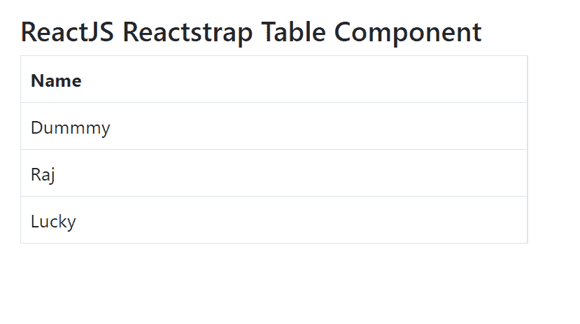
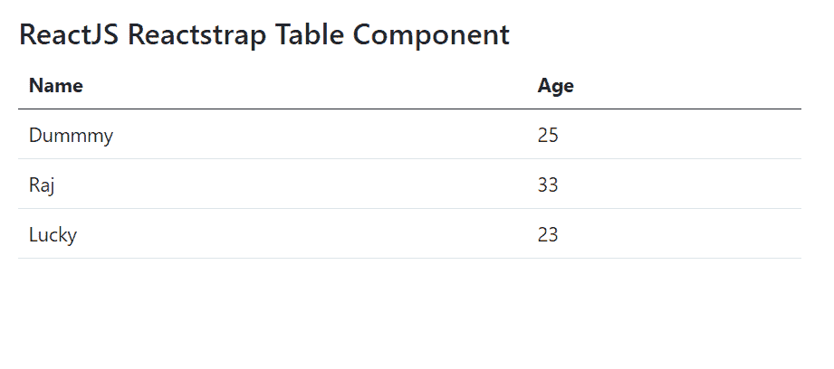

# 反应堆捕捉台组件

> 原文:[https://www . geeksforgeeks . org/reactjs-reatstrap-table-component/](https://www.geeksforgeeks.org/reactjs-reactstrap-table-component/)

Reactstrap 是一个流行的前端库，易于使用 React Bootstrap 4 组件。该库包含引导 4 的无状态反应组件。表格组件允许用户显示数据行。我们可以在 ReactJS 中使用以下方法来使用 ReactJS Reactstrap 表组件。

**桌面道具:**

*   **标签:**用于表示该组件的标签。
*   **大小:**用于表示表格的大小。
*   **加边框:**表示表格是否有加边框样式。
*   **无边框:**表示表格是否有无边框样式。
*   **条纹:**用于表示表格是否有条纹样式。
*   **深色:**表示桌子是否有深色风格。
*   **悬停:**用于表示表格的行有鼠标悬停效果。
*   **响应:**用于表示表是否响应。
*   **内部引用:**用于表示<表>元素的自定义引用处理程序。

**创建反应应用程序并安装模块:**

*   **步骤 1:** 使用以下命令创建一个反应应用程序:

    ```jsx
    npx create-react-app foldername
    ```

*   **步骤 2:** 在创建项目文件夹(即文件夹名**)后，使用以下命令将**移动到该文件夹:

    ```jsx
    cd foldername
    ```

*   **步骤 3:** 创建 ReactJS 应用程序后，使用以下命令安装所需的****模块:****

    ```jsx
    **npm install reactstrap bootstrap**
    ```

******项目结构:**如下图。****

****

项目结构**** 

******示例 1:** 现在在 **App.js** 文件中写下以下代码。在这里，我们显示了一个没有多列的带边框的表格。****

## ****App.js****

```jsx
**import React from 'react'
import 'bootstrap/dist/css/bootstrap.min.css';
import { Table } from "reactstrap"

function App() {
    return (
        <div style={{
            display: 'block', width: 500, padding: 30
        }}>
            <h4>ReactJS Reactstrap Table Component</h4>
            <Table bordered={true}>
                <thead>
                    <tr>
                        <th>Name</th>
                    </tr>
                </thead>
                <tbody>
                    <tr>
                        <td>Dummmy</td>
                    </tr>
                    <tr>
                        <td>Raj</td>
                    </tr>
                    <tr>
                        <td>Lucky</td>
                    </tr>
                </tbody>
            </Table>
        </div>
    );
}

export default App;**
```

******运行应用程序的步骤:**从项目的根目录使用以下命令运行应用程序:****

```jsx
**npm start**
```

******输出:**现在打开浏览器，转到***http://localhost:3000/***，会看到如下输出:****

********

******示例 2:** 现在在 **App.js** 文件中写下以下代码。在这里，我们显示了一个多列且不带边框样式的表格。****

## ****App.js****

```jsx
**import React from 'react'
import 'bootstrap/dist/css/bootstrap.min.css';
import { Table } from "reactstrap"

function App() {
    return (
        <div style={{
            display: 'block', width: 700, padding: 30
        }}>
            <h4>ReactJS Reactstrap Table Component</h4>
            <Table>
                <thead>
                    <tr>
                        <th>Name</th>
                        <th>Age</th>
                    </tr>
                </thead>
                <tbody>
                    <tr>
                        <td>Dummmy</td>
                        <td>25</td>
                    </tr>
                    <tr>
                        <td>Raj</td>
                        <td>33</td>
                    </tr>
                    <tr>
                        <td>Lucky</td>
                        <td>23</td>
                    </tr>
                </tbody>
            </Table>
        </div>
    );
}

export default App;**
```

******运行应用程序的步骤:**从项目的根目录使用以下命令运行应用程序:****

```jsx
**npm start**
```

******输出:**现在打开浏览器，转到***http://localhost:3000/***，会看到如下输出:****

********

******参考:**T2】https://reactstrap.github.io/components/tables/****