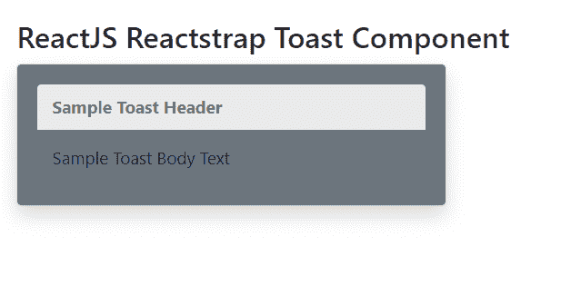
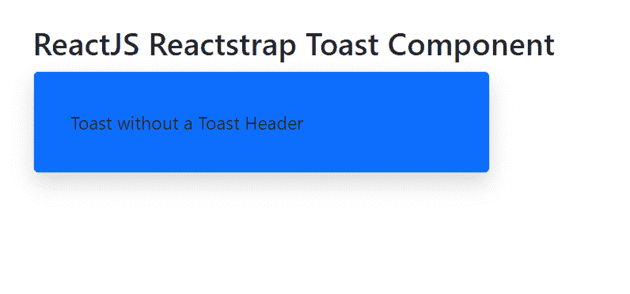

# 反应堆捕集器烘烤组件

> 原文:[https://www . geeksforgeeks . org/reactjs-reatstrap-toast-component/](https://www.geeksforgeeks.org/reactjs-reactstrap-toast-component/)

Reactstrap 是一个流行的前端库，易于使用 React Bootstrap 4 组件。该库包含引导 4 的无状态反应组件。吐司组件允许用户在页面底部显示可取消的信息或简单的操作。我们可以在 reatjs 中使用以下方法来使用 ReactJS Reactstrap Toast 组件。

**吐司道具:**

*   **类名:**用于表示造型的类名。
*   **颜色:**用于表示部件的颜色。
*   **isOpen:** 用于表示 Toast 是否打开。
*   **标签:**用于表示该组件的标签。
*   **过渡:**用于在单个水平行上显示一系列标签、按钮等。

**创建反应应用程序并安装模块:**

*   **步骤 1:** 使用以下命令创建一个反应应用程序:

    ```jsx
    npx create-react-app foldername
    ```

*   **步骤 2:** 创建项目文件夹(即文件夹名**)后，使用以下命令移动到该文件夹中:**

    ```jsx
    cd foldername
    ```

*   **步骤 3:** 创建 ReactJS 应用程序后，使用以下命令安装所需的****模块:****

    ```jsx
    **npm install reactstrap bootstrap**
    ```

******项目结构:**如下图。****

****

项目结构**** 

******示例 1:** 现在在 **App.js** 文件中写下以下代码。在这里，我们展示了吐司组件和吐司组件。****

## ****App.js****

```jsx
**import React from 'react'
import 'bootstrap/dist/css/bootstrap.min.css';
import { Toast, ToastBody, ToastHeader } from "reactstrap"

function App() {
    return (
        <div style={{
            display: 'block', width: 700, padding: 30
        }}>
            <h4>ReactJS Reactstrap Toast Component</h4>
            <Toast className="p-3 bg-secondary my-2">
                <ToastHeader>
                    Sample Toast Header
                </ToastHeader>
                <ToastBody>
                    Sample Toast Body Text
                </ToastBody>
            </Toast>
        </div>
    );
}

export default App;**
```

******运行应用程序的步骤:**从项目的根目录使用以下命令运行应用程序:****

```jsx
**npm start**
```

******输出:**现在打开浏览器，转到***http://localhost:3000/***，会看到如下输出:****

********

******示例 2:** 现在在 **App.js** 文件中写下以下代码。在这里，我们展示了没有 ToastHeader 组件的 Toast 组件。****

## ****App.js****

```jsx
**import React from 'react'
import 'bootstrap/dist/css/bootstrap.min.css';
import { Toast, ToastBody } from "reactstrap"

function App() {
    return (
        <div style={{
            display: 'block', width: 700, padding: 30
        }}>
            <h4>ReactJS Reactstrap Toast Component</h4>
            <Toast className="p-3 bg-primary my-2">
                <ToastBody>
                    Toast without a Toast Header
                </ToastBody>
            </Toast>
        </div>
    );
}

export default App;**
```

******运行应用程序的步骤:**从项目的根目录使用以下命令运行应用程序:****

```jsx
**npm start**
```

******输出:**现在打开浏览器，转到***http://localhost:3000/***，会看到如下输出:****

********

******参考:**T2】https://reactstrap.github.io/components/toasts/****