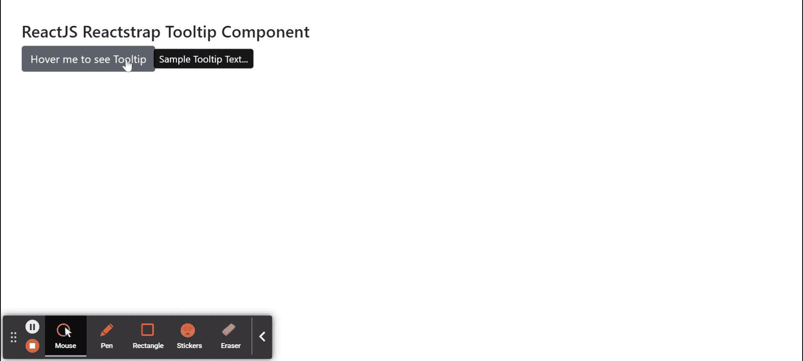
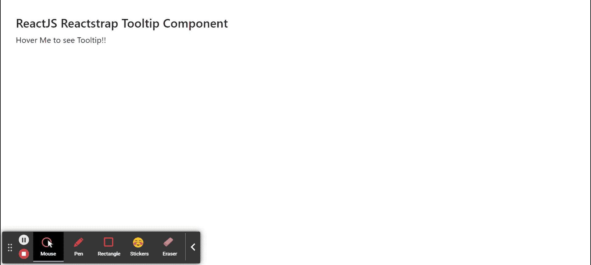

# 反应捕捉工具提示组件

> 原文:[https://www . geeksforgeeks . org/reactjs-reatstrap-tooltip-component/](https://www.geeksforgeeks.org/reactjs-reactstrap-tooltip-component/)

Reactstrap 是一个流行的前端库，易于使用 React Bootstrap 4 组件。该库包含引导 4 的无状态反应组件。当用户将鼠标悬停、聚焦或点击某个元素时，工具提示组件有助于显示信息性文本。我们可以在 reatjs 中使用以下方法来使用 ReactJS Reactstrap 工具提示组件。

**工具提示道具：**

*   **children:** 用于将 children 元素传递给这个组件。
*   **触发器:**用于表示用空格分隔的触发器列表。
*   **边界元素:**用于表示弹出器的边界。
*   **isOpen:** 用于指示是否打开工具提示。
*   **隐藏箭头:**表示是否隐藏箭头。
*   **切换:**是控制组件中切换 isOpen 的回调函数。
*   **目标:**用于表示目标元素或元素 ID。
*   **容器:**用于指示弹出器 DOM 节点的注入位置。
*   **延迟:**用于表示延迟值。
*   **类名:**用于表示造型的类名。
*   **popperClassName:** 用于对 popper 组件应用一个类。
*   **内部类名:**用于将类应用于内部工具提示。
*   **箭头类名:**用于将一个类应用于箭头工具提示。
*   **自动隐藏:**用于指示悬停在工具提示内容上时是否隐藏工具提示。
*   **放置:**用于放置工具提示。
*   **修改器**:用于表示传递给 Popper.js 的自定义修改器
*   **位置固定:**用于指示工具提示指向元素是否有*位置:固定*样式。
*   **偏移:**用于表示偏移元素。
*   **innerRef:** 用于表示内部参照元素。
*   **淡入淡出:**用于指示是否显示/隐藏带有淡入淡出效果的工具提示。
*   **翻转:**用于指示工具提示方向过于靠近容器边缘是否翻转。

**创建反应应用程序并安装模块:**

*   **步骤 1:** 使用以下命令创建一个反应应用程序:

    ```
    npx create-react-app foldername
    ```

*   **步骤 2:** 创建项目文件夹(即文件夹名**)后，使用以下命令移动到该文件夹中:**

    ```
    cd foldername
    ```

*   **步骤 3:** 创建 ReactJS 应用程序后，使用以下命令安装所需的****模块:****

    ```
    **npm install reactstrap bootstrap**
    ```

******项目结构:**如下图。****

****

项目结构**** 

******示例 1:** 现在在 **App.js** 文件中写下以下代码。在这里，我们已经在正确的位置显示了工具提示，没有延迟道具。****

## ****App.js****

```
**import React from 'react'
import 'bootstrap/dist/css/bootstrap.min.css';
import { Tooltip, Button } from "reactstrap"

function App() {

    // Tooltip Open state
    const [tooltipOpen, setTooltipOpen] = React.useState(false);

    return (
        <div style={{
            display: 'block', width: 900, padding: 30
        }}>
            <h4>ReactJS Reactstrap Tooltip Component</h4>
            <Button id="TooltipExample">Hover me to see Tooltip</Button>
            <Tooltip
                isOpen={tooltipOpen}
                placement="right"
                target="TooltipExample"
                toggle={() => { setTooltipOpen(!tooltipOpen) }}>
                Sample Tooltip Text...
            </Tooltip>
        </div >
    );
}

export default App;**
```

******运行应用程序的步骤:**从项目的根目录使用以下命令运行应用程序:****

```
**npm start**
```

******输出:**现在打开浏览器，转到***http://localhost:3000/***，会看到如下输出:****

********

******示例 2:** 现在在 **App.js** 文件中写下以下代码。在这里，我们已经在底部位置显示了一个工具提示，没有延迟道具设置为 1 秒后显示工具提示，2 秒后隐藏。****

## ****App.js****

```
**import React from 'react'
import 'bootstrap/dist/css/bootstrap.min.css';
import { Tooltip } from "reactstrap"

function App() {

    // Tooltip Open state
    const [tooltipOpen, setTooltipOpen] = React.useState(false);

    return (
        <div style={{
            display: 'block', width: 900, padding: 30
        }}>
            <h4>ReactJS Reactstrap Tooltip Component</h4>
            <span id="testID">Hover Me to see Tooltip!!</span>
            <Tooltip isOpen={tooltipOpen}
                delay={{ show:1000, hide: 2000 }}
                target="testID"
                placement="bottom"
                toggle={() => setTooltipOpen(!tooltipOpen)}>
                Sample ToolTip Information...
            </Tooltip>
        </div >
    );
}

export default App;**
```

******运行应用程序的步骤:**从项目的根目录使用以下命令运行应用程序:****

```
**npm start**
```

******输出:**现在打开浏览器，转到***http://localhost:3000/***，会看到如下输出:****

********

******参考:**T2https://reactstrap.github.io/components/tooltips/****