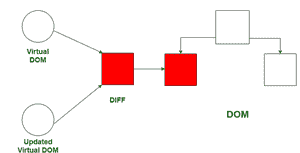
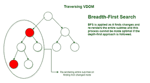

# 重新调整

> 原文:[https://www.geeksforgeeks.org/reactjs-reconciliation/](https://www.geeksforgeeks.org/reactjs-reconciliation/)

协调过程使反应工作更快。**调和**是 React 更新浏览器 DOM 的过程。

协调流程的**工作背后的重要概念是:**

1.  **虚拟 DOM**
2.  **差分算法**

React 中的**渲染这个术语可以很好的识别为 ***使*** 或者 ***变成*** 。在传统渲染中，浏览器执行以下任务:**

*   创建由树结构表示的文档对象模型。
*   将任何新数据呈现到 DOM 中，即使数据与以前的数据相似。

浏览器的这种渲染有一系列步骤，而且成本相当高。React 使用的虚拟 DOM 的概念使得渲染速度更快。

**虚拟 DOM:** React 将 JSX 组件渲染到浏览器 DOM，但保留了实际 DOM 的副本。这个**副本**就是**虚**T6】DOM。我们可以认为它是真实的或浏览器 DOM 的孪生兄弟。以下操作发生在“反应”中:

*   React **存储浏览器 DOM** 的副本，称为**虚拟 DOM。**
*   当我们**进行更改或添加数据**时，React 会创建一个新的**虚拟 DOM** ，**会将其与之前的**进行比较。
*   **比较**由**差分算法**完成。酷的事实是所有这些比较**都发生在记忆**中，在浏览器中没有任何改变。
*   在比较之后，React 继续并创建一个具有变化的**新的虚拟 DOM**。需要注意的是，一秒钟可以产生多达 20 万个虚拟 DOM 节点。
*   然后它**用**最少的变化**可能的**更新浏览器 DOM** ，而不需要再次渲染整个 DOM** 。 ***(参考:图 1)*** 这极大地改变了应用程序的效率

图 1:计算差异和更新浏览器 DOM

假设我们有类似于前一个的新数据，虚拟 DOM 比较了前一个和新的结构，发现它没有变化，所以没有任何东西呈现给浏览器。这就是虚拟 DOM 如何帮助提高浏览器性能的。

**这个虚拟 DOM 和之前的版本相比如何？**

这就是**差分算法**发挥作用的地方。该算法使用的一些概念是:

1.  两种元素的**不同类型**会产生**不同的树**。
2.  **应用广度优先搜索(BFS)** 是因为如果发现一个节点发生了变化，它将**重新渲染整个子树**，因此深度优先方法并不完全是最优的。 ***(参考:图 2)***
3.  比较**两个相同类型**的元素时，保持**底层节点与**相同，只更新属性或样式的变化。
4.  React 使用优化，以便使用该算法在 O(N) 中有效地计算出**最小差异。**

图 2:遍历虚拟 DOM 的 BFS

**参考:**

*   [https://reactjs.org/docs/reconciliation.html](https://reactjs.org/docs/reconciliation.html)T2
*   [https://reactjs.org/docs/faq-internals.html](https://reactjs.org/docs/faq-internals.html)