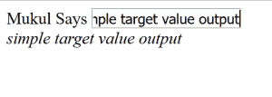
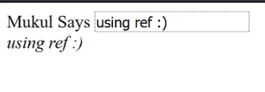
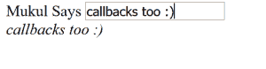

# 反应堆|参考文献

> 原文:[https://www.geeksforgeeks.org/reactjs-refs/](https://www.geeksforgeeks.org/reactjs-refs/)

Refs 是 React 提供的一个函数，用于访问 DOM 元素和您自己可能创建的 React 元素。它们用于我们想要更改子组件的值的情况，而不使用道具和所有东西。它们还为我们提供了良好的功能，因为我们可以对它们使用回调。

**示例:**

## java 描述语言

```
// without refs
class App extends React.Component {
  constructor(){
   super();
   this.state = { sayings: ""};
   }
  update(e){
   this.setState({ sayings: e.target.value});
  }
  render(){
   return (
    <div>
     Mukul Says <input type="text" onChange = {this.update.bind(this)}/>
    <br/>
    <em>{this.state.sayings}</em>
   </div>
  );
 }
}
ReactDOM.render(< App />, document.getElementById('root'));
```

**输出:**



在上面的例子中，我们利用事件 e 的目标值，来得到 Mukul 所说的值。上述输出也可以通过使用参考文献来实现。

**示例:**

## java 描述语言

```
// using refs
class App extends React.Component {
 constructor(){
  super();
  this.state = { sayings: ""};
 }
 update(e){
  this.setState({ sayings: this.refs.anything.value});
 }
 render(){
  return (
   <div>
    Mukul Says <input type="text" ref="anything"
      onChange = {this.update.bind(this)}/>
   <br/>
   <em>{this.state.sayings}</em>
  </div>
  );
 }
}
 ReactDOM.render(< App />, document.getElementById('root'));
```

**输出:**



在上面我们利用了 React 提供的 refs，它们也可以用来在内部添加回调函数，这在很多情况下是有帮助的。

**示例:**

## java 描述语言

```
// callback used inside ref
class App extends React.Component {
  constructor(){
   super();
   this.state = { sayings: ""};
  }
  update(e){
   this.setState({ sayings: this.a.value});
  }
  render(){
   return (
    <div>
     Mukul Says <input type="text"
     ref={(call_back) => {this.a = call_back}} onChange =
     {this.update.bind(this)}/>
   <br/>
   <em>{this.state.sayings}</em>
   </div>
  );
 }
}
ReactDOM.render(< App />, document.getElementById('root'));
```

**输出:**



**何时使用参考文献**

*   使用第三方库时很有帮助。
*   对动画很有帮助。

**何时不使用参考文献**

*   不应与功能组件一起使用，因为它们没有实例。
*   不要用在可以声明的事情上。