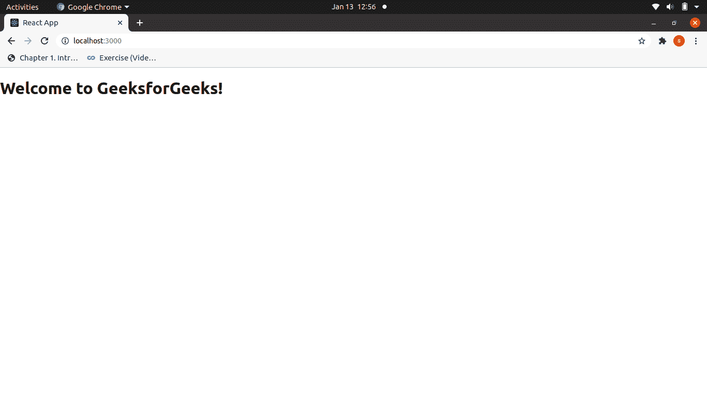

# 反应|渲染元素

> 原文:[https://www.geeksforgeeks.org/reactjs-rendering-elements/](https://www.geeksforgeeks.org/reactjs-rendering-elements/)

在上一篇关于[介绍 JSX](https://www.geeksforgeeks.org/reactjs-introduction-jsx/) 的文章中，我们看到了如何创建一个 React 元素。“反应”元素是“反应”中可用的最小可渲染单位。我们可以使用上一篇文章中描述的 [ReactDOM](https://www.geeksforgeeks.org/reactjs-reactdom/) 来渲染这些元素。React 元素不同于 DOM 元素，因为 React 元素是简单的 javascript 对象，创建起来很高效。React 元素是任何 React 应用程序的构建模块，不应与 React 组件混淆，后者将在后续文章中讨论。
**在 React 中渲染元素:**为了将任何元素渲染到 Browser DOM 中，我们需要一个容器或根 DOM 元素。使用 id="root "或 id="app "的 div 元素作为根 DOM 元素几乎是一种惯例。假设我们的 index.html 文件中包含以下语句。

```jsx
<div id="root"></div>
```

**Filename App.js:** 现在，为了将一个简单的 React Element 渲染到根节点，我们必须在 **App.js** 文件中编写以下内容。

## java 描述语言

```jsx
import React,{ Component }  from 'react';

class App extends Component {

  render() {
    return (    
       <div>
         <h1>Welcome to GeeksforGeeks!</h1>
       </div>

    );
  }
}

export default App;
```

**输出:**



现在，您已经创建了有史以来第一个 React Element，并对其进行了适当的渲染，但是 React 并不是为了创建静态页面而开发的，使用 React 的目的是为了创建一个更加逻辑和活跃的网页。为此，我们需要更新元素。下一部分将指导我们完成同样的工作。
**在 React 中更新元素:** React 元素是不可变的，即一旦创建了元素，就不可能更新其子元素或属性。因此，为了更新一个元素，我们必须多次使用 render()方法来随时间更新该值。让我们看一个例子。

## java 描述语言

```jsx
import React from 'react';
import ReactDOM from 'react-dom';

function showTime()
{
const myElement = (
                   <div>
                        <h1>Welcome to GeeksforGeeks!</h1>
                        <h2>{new Date().toLocaleTimeString()}</h2>
                   </div>
                  );

ReactDOM.render(
      myElement,
      document.getElementById("root")
);                   
}

setInterval(showTime, 1000);
```

**输出:**

[](https://media.geeksforgeeks.org/wp-content/uploads/Renderingclock_ReactJS.gif)

在上面的例子中，我们创建了一个显示当前时间的函数 showTime()，我们设置了 1000 毫秒或 1 秒的时间间隔，每秒调用一次函数，从而更新每次调用的时间。为了简单起见，我们只显示了给定图像中一秒钟的时间跨度。

**反应渲染效率:**选择反应是因为它的效率提高了，而不是 DOM 更新的遗留问题。React 通过使用虚拟 DOM 和高效的区分算法来实现这一效率。在显示当前时间的示例中，在每一秒钟，我们调用 render 方法，虚拟 DOM 得到更新，然后区分器检查 Browser DOM 和 virtual DOM 中的特定差异，然后只更新所需的内容，例如在给定的示例中，时间是每次唯一被更改的东西，而不是标题“欢迎来到 GeeksforGeeks！”因此，React 只更新时间本身，这比传统的 DOM 操作要高效得多。

**注意要点:**

*   多次调用 render()方法可能有助于我们实现本例的目的，但是一般来说，它从未使用过，而是使用了有状态组件，我们将在后续文章中介绍。
*   一个反应元素几乎从不孤立使用，我们可以使用元素作为在反应中创建组件的构建块。组件也将在后续文章中讨论。