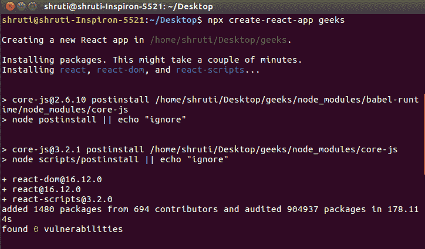
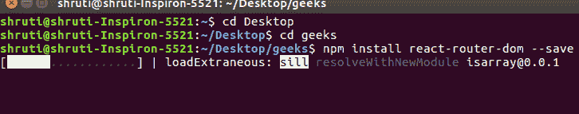
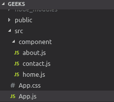
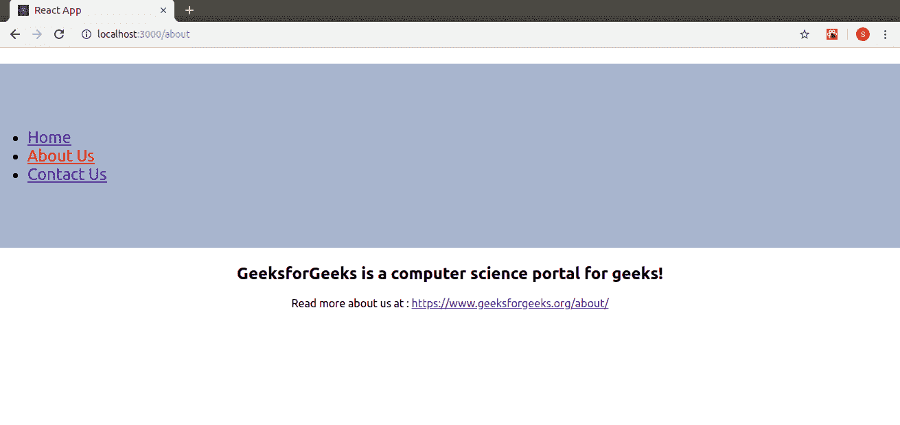
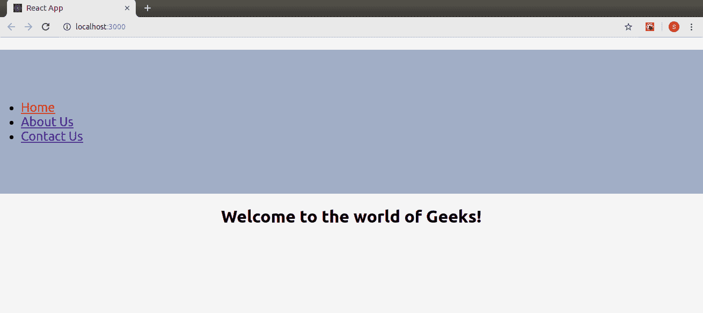
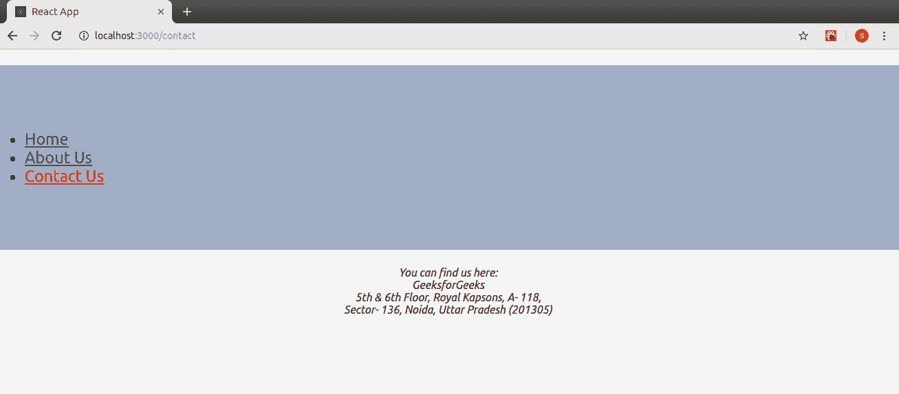

# 反应堆|路由器

> 原文:[https://www.geeksforgeeks.org/reactjs-router/](https://www.geeksforgeeks.org/reactjs-router/)

**React 路由器**是 React 中路由的标准库。它支持在一个反应应用程序的不同组件的视图之间导航，允许改变浏览器的网址，并保持用户界面与网址同步。
让我们创建一个简单的应用程序来了解 React 路由器的工作原理。该应用程序将包含三个组件:主页组件、关于组件和联系人组件。我们将使用 React Router 在这些组件之间导航。

**设置反应应用程序:**使用[创建-反应-应用程序](https://www.geeksforgeeks.org/reactjs-setting-development-environment/)创建一个反应应用程序，让我们称之为**极客**。

**注意:**如果您之前已经通过 npm 全局安装了 create-react-app，请直接使用下面的命令:

> **npx 创建-反应-应用极客**


你的开发环境已经准备好了。现在让我们在应用程序中安装反应路由器。

**安装反应路由器:**反应路由器可以通过 [npm](https://www.geeksforgeeks.org/node-js-npm-node-package-manager/) 在您的反应应用程序中安装。按照下面给出的步骤在您的 React 应用程序中安装路由器:

*   **第一步:** [cd](https://www.geeksforgeeks.org/cd-command-in-linux-with-examples/) 进入你的项目目录即**极客**。
*   **步骤 2:** 要安装反应路由器，请使用以下命令:

> **npm 安装-保存反应-路由器-dom**


安装 react-router-dom 后，将其组件添加到您的 react 应用程序中。

**添加反应路由器组件:**反应路由器的主要组件有:

*   **browser router:**browser router 是一个路由器实现，它使用 HTML5 历史 API(pushState、replaceState 和 popstate 事件)来保持你的 UI 与 URL 同步。它是用于存储所有其他组件的父组件。
*   **路线:**这是 v6 中引入的新组件，也是<switch>组件的升级版。路由相对于交换机的主要优势是:

    *   相对 <route>s 和<link> s</route>
    *   路由是根据最佳匹配选择的，而不是按顺序遍历的。</switch> 
*   **Route:**Route 是有条件显示的组件，当其路径与当前 URL 匹配时，会呈现一些 UI。
*   **链接:**链接组件用于创建不同路线的链接，并围绕应用程序实现导航。它的工作原理就像 HTML [锚定标签](https://www.geeksforgeeks.org/html-a-tag/)。

要在应用程序中添加 React Router 组件，请在您使用的编辑器中打开您的项目目录，然后转到 **app.js** 文件。现在，在 app.js 中添加下面给出的代码。

```
import {
    BrowserRouter as Router,
    Routes,
    Route,
    Link
} from 'react-router-dom';
```

**注意:**浏览器别名为路由器。

**使用 React Router:** 要使用 React Router，让我们首先在 React 应用程序中创建几个组件。在项目目录中，在 src 文件夹中创建一个名为**组件**的文件夹，现在将名为 **home.js** 、 **about.js** 和 **contact.js** 的 3 个文件添加到组件文件夹中。

让我们给我们的 3 个组件添加一些代码:

*   **主场:**

    ```
    import React from 'react';

    function Home (){
        return <h1>Welcome to the world of Geeks!</h1>
    }

    export default Home;
    ```

*   **```
    import React from 'react';

    function About () {
        return <div>
            <h2>GeeksforGeeks is a computer science portal for geeks!</h2>

            Read more about us at :
            <a href="https://www.geeksforgeeks.org/about/">
                https://www.geeksforgeeks.org/about/
            </a>
        </div>
    }
    export default About;
    ```** 
*   ****联系方式:**

    ```
    import React from 'react';

    function Contact (){
     return <address>
                You can find us here:<br />
                GeeksforGeeks<br />
                5th & 6th Floor, Royal Kapsons, A- 118, <br />
                Sector- 136, Noida, Uttar Pradesh (201305)
            </address>
    }

    export default Contact;
    ```** 

**现在，让我们将 React Router 组件包含到应用程序中:**

*   ****浏览器浏览器:**将别名为路由器的浏览器添加到 app.js 文件中，以便包装所有其他组件。浏览器是一个父组件，只能有一个子组件。

    ```
    class App extends Component {
      render() {
        return (
           <Router>
               <div className="App">
               </div>
           </Router>
       );
      }
    }
    ```** 
*   ****Link:** Let us now create links to our components. Link component uses the **to** prop to describe the location where the links should navigate to.

    ```
    <div className="App">
        <ul>
          <li>
            <Link to="/">Home</Link>
          </li>
          <li>
            <Link to="/about">About Us</Link>
          </li>
          <li>
            <Link to="/contact">Contact Us</Link>
          </li>
        </ul>
    </div>
    ```

    现在，在本地主机上运行您的应用程序，并单击您创建的链接。你会注意到链接组件的**到**道具中的值会改变网址。
    T3】** 
*   ****Route:** Route component will now help us to establish the link between component’s UI and the URL. To include routes to the application, add the code give below to your app.js.

    ```
    <Route exact path='/' element={< Home />}></Route>
    <Route exact path='/about' element={< About />}></Route>
    <Route exact path='/contact' element={< Contact />}></Route>
    ```

    组件现在已链接，单击任何链接都将呈现与之关联的组件。
    
    现在让我们试着了解一下与 Route 组件相关的道具。

    *   **1 .精确:**用于将精确值与网址进行匹配。例如，精确路径='/about '将仅在组件与路径完全匹配时才呈现组件，但是如果我们从语法中移除精确，则即使结构类似/about/10，用户界面仍将呈现。
        T3】
    *   **2。路径:**路径指定我们分配给组件的路径名。
    *   **3。组件:**它指的是将在匹配路径时呈现的组件。

    **注意:**默认情况下，路由是包含的，这意味着多个 Route 组件可以匹配 URL 路径并同时渲染。如果我们想要渲染单个组件，我们需要使用**路线**。** 
*   ****Routes:** To render a single component, wrap all the routes inside the Routes Component.

    ```
    <Routes>
        <Route exact path='/' element={< Home />}></Route>
        <Route exact path='/about' element={< About />}></Route>
        <Route exact path='/contact' element={< Contact />}></Route>
    </Routes>
    ```

    Switch 将几条路由组合在一起，遍历它们并找到与路径匹配的第一条路由。由此，呈现路径的对应组件。** 

**添加所有组件后，这里是我们完整的源代码:**

```
import React, { Component } from 'react';
import { BrowserRouter as Router,Routes, Route, Link } from 'react-router-dom';
import Home from './component/home';
import About from './component/about';
import Contact from './component/contact';
import './App.css';

class App extends Component {
  render() {
    return (
       <Router>
           <div className="App">
            <ul className="App-header">
              <li>
                <Link to="/">Home</Link>
              </li>
              <li>
                <Link to="/about">About Us</Link>
              </li>
              <li>
                <Link to="/contact">Contact Us</Link>
              </li>
            </ul>
           <Routes>
                 <Route exact path='/' element={< Home />}></Route>
                 <Route exact path='/about' element={< About />}></Route>
                 <Route exact path='/contact' element={< Contact />}></Route>
          </Routes>
          </div>
       </Router>
   );
  }
}

export default App;
```

**现在，我们您可以点击链接并导航到不同的组件。反应路由器保持您的应用程序界面与网址同步。



最后，我们使用 React Router 在 React 应用中成功实现了导航。**