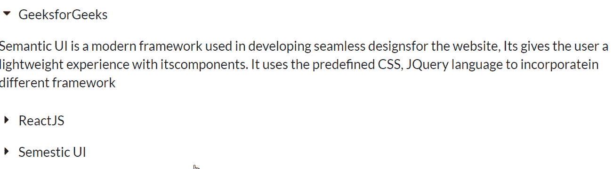
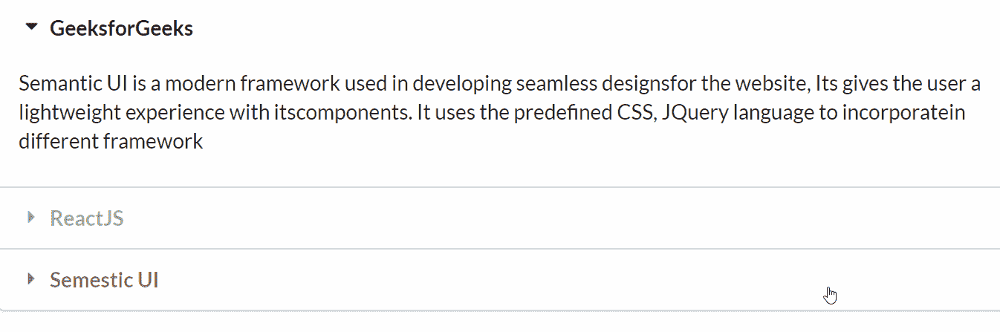

# ReactJS 语义 UI 折叠模块

> 原文:[https://www . geeksforgeeks . org/reactjs-semantic-ui-accordo-module/](https://www.geeksforgeeks.org/reactjs-semantic-ui-accordion-module/)

语义用户界面是一个现代框架，用于为网站开发无缝设计，它给用户一个轻量级的组件体验。它使用预定义的 CSS、JQuery 语言来整合到不同的框架中。

在本文中，我们将了解如何在 ReactJS 语义用户界面中使用手风琴模块。折叠模块用于显示自定义内容的一部分。

**属性:**

*   **风格化:**我们可以根据需要制作一台风格的手风琴。

**语法:**

```jsx
<Accordion>
        <Accordion.Title>
          Accordion Title
        </Accordion.Title>
        <Accordion.Content>
          Some content
        </Accordion.Content>
</Accordion>
```

**创建反应应用程序并安装模块:**

*   **步骤 1:** 使用以下命令创建一个反应应用程序。

    ```jsx
    npx create-react-app foldername
    ```

*   **步骤 2:** 创建项目文件夹(即文件夹名)后，使用以下命令移动到该文件夹。

    ```jsx
    cd foldername
    ```

*   **第三步:**在给定的目录下安装语义 UI。

    ```jsx
    npm install semantic-ui-react semantic-ui-css
    ```

**项目结构**:如下图。


**运行应用程序的步骤:**使用以下命令从项目的根目录运行应用程序。

```jsx
npm start
```

**示例 1:** 这是展示如何使用 ReactJS 语义 UI 手风琴模块使用手风琴元素的基本示例。

## App.js

```jsx
import React from 'react'
import { Accordion} from 'semantic-ui-react'

const styleLink = document.createElement("link");
styleLink.rel = "stylesheet";
styleLink.href = 
"https://cdn.jsdelivr.net/npm/semantic-ui/dist/semantic.min.css";
document.head.appendChild(styleLink);

const btt = [
  {
    title: 'GeeksforGeeks',
    content: [
      'Semantic UI is a modern framework used in developing seamless designs',
      'for the website, Its gives the user a lightweight experience with its',
      'components. It uses the predefined CSS, JQuery language to incorporate',
      'in different framework',
    ]
  },
  {
    title: 'ReactJS',
    content: [
      'Semantic UI is a modern framework used in developing seamless designs',
      'for the website, Its gives the user a lightweight experience with its',
      'components. It uses the predefined CSS, JQuery language to incorporate',
      'in different framework',
    ]
  },
  {
    title: 'Semestic UI',
    content: [
      'Semantic UI is a modern framework used in developing seamless designs',
      'for the website, Its gives the user a lightweight experience with its',
      'components. It uses the predefined CSS, JQuery language to incorporate',
      'in different framework',
    ]
  },
]

const gfg = () => (
  <Accordion defaultActiveIndex={0} panels={btt} />
)

export default gfg
```

**输出:**



**示例 2:** 在本例中，我们通过使用 ReactJS 语义 UI 折叠模块，在折叠元素中使用了样式属性和流体变化。

## App.js

```jsx
import React from 'react'
import { Accordion} from 'semantic-ui-react'

const styleLink = document.createElement("link");
styleLink.rel = "stylesheet";
styleLink.href = 
"https://cdn.jsdelivr.net/npm/semantic-ui/dist/semantic.min.css";
document.head.appendChild(styleLink);

const btt = [
  {
    title: 'GeeksforGeeks',
    content: [
      'Semantic UI is a modern framework used in developing seamless designs',
      'for the website, Its gives the user a lightweight experience with its',
      'components. It uses the predefined CSS, JQuery language to incorporate',
      'in different framework',
    ]
  },
  {
    title: 'ReactJS',
    content: [
      'Semantic UI is a modern framework used in developing seamless designs',
      'for the website, Its gives the user a lightweight experience with its',
      'components. It uses the predefined CSS, JQuery language to incorporate',
      'in different framework',
    ]
  },
  {
    title: 'Semestic UI',
    content: [
      'Semantic UI is a modern framework used in developing seamless designs',
      'for the website, Its gives the user a lightweight experience with its',
      'components. It uses the predefined CSS, JQuery language to incorporate',
      'in different framework',
    ]
  },
]

const gfg = () => (
  <Accordion fluid styled defaultActiveIndex={0} panels={btt} />
)

export default gfg
```

**输出:**



**参考:**T2】https://react.semantic-ui.com/modules/accordion