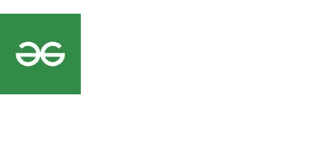

# 反应语义用户界面广告视图

> 原文:[https://www . geeksforgeeks . org/reactjs-semantic-ui-advertising-view/](https://www.geeksforgeeks.org/reactjs-semantic-ui-advertisement-views/)

语义用户界面是一个现代框架，用于为网站开发无缝设计，它给用户一个轻量级的组件体验。它使用预定义的 CSS、JQuery 语言来整合到不同的框架中。

在本文中，我们将了解如何在 ReactJS 语义用户界面中使用广告视图。

广告用于展示第三方促销内容。

**类型:**

*   **常用单位:**根据用户的  要求，一个广告可以出现在常用广告单位大小中。
*   **移动:**广告可以以不同的移动广告单元大小出现。
*   **矩形:**广告可以以矩形广告单位大小出现。
*   **按钮:**一个广告可以出现在按钮广告单元尺寸中。
*   **摩天大楼:**广告可以出现在摩天大楼广告单元大小中。
*   **横幅:**广告可以以横幅广告单位大小出现。
*   **排行榜:**广告可以出现在排行榜广告单元大小中。
*   **全景:**广告可以以常见的广告单位大小出现。
*   **网板:**一个广告可以出现在不同的网板广告单元大小中。
*   **正方形:**一个广告可以出现在 常见的正方形广告单元尺寸中。

**语法:**

```jsx
<advertisement>
  
</advertisment>
```

**创建反应应用程序并安装模块:**

*   **步骤 1:** 使用以下命令创建一个反应应用程序。

    ```jsx
    npx create-react-app foldername
    ```

*   **步骤 2:** 创建项目文件夹(即文件夹名)后，使用以下命令移动到该文件夹。

    ```jsx
    cd foldername
    ```

*   **第三步:**在给定的目录下安装语义 UI。

    ```jsx
     npm install semantic-ui-react semantic-ui-css
    ```

**项目结构**:如下图。


**运行应用程序的步骤:**使用以下命令从项目的根目录运行应用程序。

```jsx
npm start
```

**示例 1:** 在本例中，我们使用了广告元素，通过使用 ReactJS 语义 UI 广告视图来显示标准广告

## App.js

```jsx
import React from 'react'
import { Advertisement } from 'semantic-ui-react'

const styleLink = document.createElement("link");
styleLink.rel = "stylesheet";
styleLink.href = 
"https://cdn.jsdelivr.net/npm/semantic-ui/dist/semantic.min.css";
document.head.appendChild(styleLink);

const btt = () => (
<div>
  <br/>
    <Advertisement unit='medium rectangle'>
    
    </Advertisement>    
</div>
)

export default btt
```

**输出:**



**示例 2:** 在本例中，我们通过使用 ReactJS 语义 UI 广告视图，使用了带有单元类型横幅的广告元素。

## App.js

```jsx
import React from 'react'
import { Advertisement } from 'semantic-ui-react'

const styleLink = document.createElement("link");
styleLink.rel = "stylesheet";
styleLink.href = 
"https://cdn.jsdelivr.net/npm/semantic-ui/dist/semantic.min.css";
document.head.appendChild(styleLink);

const btt = () => (
<div>
  <br/>
    <Advertisement unit='banner' test='GeeksforGeeks' />
</div>
)

export default btt
```

**输出:**


**参考:**T2】https://react.semantic-ui.com/views/advertisement