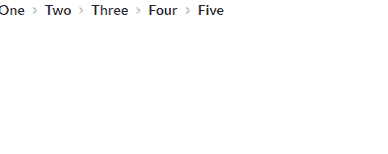
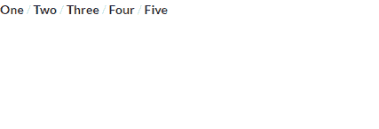

# 重新获取语义用户界面面包屑集合

> 原文:[https://www . geesforgeks . org/reactjs-semantic-ui-bread-collections/](https://www.geeksforgeeks.org/reactjs-semantic-ui-breadcrumb-collections/)

语义用户界面是一个现代框架，用于为网站开发无缝设计，它给用户一个轻量级的组件体验。它使用预定义的 CSS、JQuery 语言来整合到不同的框架中。

在本文中，我们将了解如何在 ReactJS Semantic UI 中使用面包屑集合。

面包屑用于显示内容之间的层次结构。

**语法:**

```
<Breadcrumb>
  <Breadcrumb.divider/>
</Breadcrumb>
```

**创建反应应用程序并安装模块:**

*   **步骤 1:** 使用以下命令创建一个反应应用程序。

    ```
    npx create-react-app foldername
    ```

*   **步骤 2:** 创建项目文件夹(即文件夹名)后，使用以下命令移动到该文件夹。

    ```
    cd foldername
    ```

*   **第三步:**在给定的目录下安装语义 UI。

    ```
     npm install semantic-ui-react semantic-ui-css
    ```

**项目结构**:如下图。


**运行应用程序的步骤:**使用以下命令从项目的根目录运行应用程序。

```
npm start
```

**示例 1:** 在本例中，我们将使用一个基本的面包屑元素，通过使用 ReactJS Semantic UI 面包屑集合来显示内容之间的层次结构。

## App.js

```
import React from 'react'
import {Breadcrumb} from 'semantic-ui-react'

const styleLink = document.createElement("link");
styleLink.rel = "stylesheet";
styleLink.href = 
"https://cdn.jsdelivr.net/npm/semantic-ui/dist/semantic.min.css";
document.head.appendChild(styleLink);

const Btt = () =>( 
  <Breadcrumb>
    <Breadcrumb.Section active>One</Breadcrumb.Section>
    <Breadcrumb.Divider icon='angle right'/>
    <Breadcrumb.Section active>Two</Breadcrumb.Section>
    <Breadcrumb.Divider icon='angle right' />
    <Breadcrumb.Section active>Three</Breadcrumb.Section>
    <Breadcrumb.Divider icon='angle right' />
    <Breadcrumb.Section active>Four</Breadcrumb.Section>
    <Breadcrumb.Divider icon='angle right' />
    <Breadcrumb.Section active>Five</Breadcrumb.Section>
  </Breadcrumb>
)

export default Btt    
```

**输出:**



**示例 2:** 在本例中，我们将使用包含分割线的面包屑元素，通过使用 ReactJS Semantic UI 面包屑集合来显示各部分之间的关系。

## App.js

```
import React from 'react'
import {Breadcrumb} from 'semantic-ui-react'

const styleLink = document.createElement("link");
styleLink.rel = "stylesheet";
styleLink.href = 
"https://cdn.jsdelivr.net/npm/semantic-ui/dist/semantic.min.css";
document.head.appendChild(styleLink);

const Btt = () =>( 
  <Breadcrumb>
    <Breadcrumb.Section active>One</Breadcrumb.Section>
    <Breadcrumb.Divider>/</Breadcrumb.Divider>
    <Breadcrumb.Section active>Two</Breadcrumb.Section>
    <Breadcrumb.Divider>/</Breadcrumb.Divider>
    <Breadcrumb.Section active>Three</Breadcrumb.Section>
    <Breadcrumb.Divider>/</Breadcrumb.Divider>
    <Breadcrumb.Section active>Four</Breadcrumb.Section>
    <Breadcrumb.Divider>/</Breadcrumb.Divider>
    <Breadcrumb.Section active>Five</Breadcrumb.Section>
  </Breadcrumb>
)

export default Btt    
```

**输出:**



**参考:**T2】https://react.semantic-ui.com/collections/breadcrumb