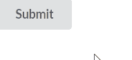

# 反应语义用户界面按钮元素

> 原文:[https://www . geeksforgeeks . org/reactjs-semantic-ui-button-element/](https://www.geeksforgeeks.org/reactjs-semantic-ui-button-element/)

语义用户界面是一个现代框架，用于为网站开发无缝设计，它给用户一个轻量级的组件体验。它使用预定义的 CSS 和 jQuery 来合并到不同的框架中。

在本文中，我们将了解如何在 ReactJS 语义 UI 中使用按钮元素。**按钮**元素用于制作一个按钮，指示可能的用户操作。

**语法:**

```jsx
<Button content='Content'/>
```

**按钮类型:**

*   **按钮:**用于标准按钮。
*   **强调:**我们可以格式化按钮来显示不同的强调级别。
*   **动画:**用于按钮动画。
*   **标签:**用于给我们的按钮添加标签。
*   **图标:**用于制作一个按钮作为图标。
*   **标签图标:**用于使按钮成为标签图标
*   **反转:**用来做一个可以出现在深色背景上的按钮。

**创建反应应用程序并安装模块:**

*   **步骤 1:** 使用以下命令创建一个 React 应用程序。

    ```jsx
    npx create-react-app foldername
    ```

*   **步骤 2:** 创建项目文件夹(即文件夹名)后，使用以下命令移动到该文件夹。

    ```jsx
    cd foldername
    ```

*   **步骤 3:** 创建 ReactJS 应用程序后，使用以下命令安装所需的****模块:****

    ```jsx
    **npm install semantic-ui-react**
    ```

******项目结构**:如下图。****

********

******运行应用程序的步骤:**使用以下命令从项目的根目录运行应用程序。****

```jsx
**npm start**
```

******例 1:******

## ****App.js****

```jsx
**import React from 'react'
import { Button } from 'semantic-ui-react'

const styleLink = document.createElement("link");
styleLink.rel = "stylesheet";
styleLink.href = 
"https://cdn.jsdelivr.net/npm/semantic-ui/dist/semantic.min.css";
document.head.appendChild(styleLink);

const App = () => <Button>Submit</Button>

export default App    **
```

******输出:******

********

******例 2:** 用速记制作按钮。****

## ****App.js****

```jsx
**import React from 'react'
import { Button } from 'semantic-ui-react'

const styleLink = document.createElement("link");
styleLink.rel = "stylesheet";
styleLink.href = 
"https://cdn.jsdelivr.net/npm/semantic-ui/dist/semantic.min.css";
document.head.appendChild(styleLink);

const App = () => <Button content='Submit' />

export default App    **
```

******输出:******

********

******参考:**T2】https://react.semantic-ui.com/elements/button****