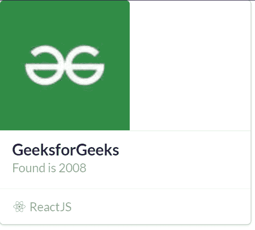
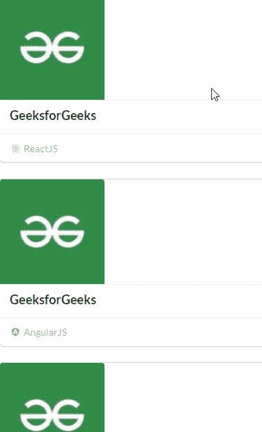

# 反应语义用户界面卡片视图

> 原文:[https://www . geeksforgeeks . org/reactjs-semantic-ui-card-view/](https://www.geeksforgeeks.org/reactjs-semantic-ui-card-views/)

语义用户界面是一个现代框架，用于为网站开发无缝设计，它给用户一个轻量级的组件体验。它使用预定义的 CSS、JQuery 语言来整合到不同的框架中。

在本文中，我们将看到如何在 ReactJS 语义用户界面中使用卡片视图。

**属性:**

*   **牌:**此属性用于制作一组牌。

**语法:**

```
<card>
  <card.content>
  </card.content>
</card>
```

**创建反应应用程序并安装模块:**

*   **步骤 1:** 使用以下命令创建一个反应应用程序。

    ```
    npx create-react-app foldername
    ```

*   **步骤 2:** 创建项目文件夹(即文件夹名)后，使用以下命令移动到该文件夹。

    ```
    cd foldername
    ```

*   **第三步:**在给定的目录下安装语义 UI。

    ```
    npm install semantic-ui-react semantic-ui-css
    ```

**项目结构**:如下图。


**运行应用程序的步骤:**使用以下命令从项目的根目录运行应用程序。

```
npm start
```

**示例 1:** 在本例中，我们将使用 ReactJS 语义 UI 卡片视图，使用卡片、图像和图标元素来显示带有图像、元和图标的基本卡片内容。

## App.js

```
import React from 'react'
import { Card, Image, Icon } from 'semantic-ui-react'

const styleLink = document.createElement("link");
styleLink.rel = "stylesheet";
styleLink.href = 
"https://cdn.jsdelivr.net/npm/semantic-ui/dist/semantic.min.css";
document.head.appendChild(styleLink);

const btt = () => (
<Card>
    <Image src=
'https://media.geeksforgeeks.org/wp-content/uploads/20210604014825/QNHrwL2q-100x100.jpg' size='small' />
    <Card.Content>
      <Card.Header>GeeksforGeeks</Card.Header>
      <Card.Meta>
        <span>Found is 2008</span>
      </Card.Meta>
    </Card.Content>
    <Card.Content extra>
        <Icon name='react' />
        ReactJS
    </Card.Content>
  </Card>
)

export default btt
```

**输出:**



**示例 2:** 在本例中，我们将使用 ReactJS 语义 UI 卡片视图，使用卡片、图像和图标元素来显示一组具有额外内容属性的卡片。

## App.js

```
import React from 'react'
import { Card, Image, Icon } from 'semantic-ui-react'

const styleLink = document.createElement("link");
styleLink.rel = "stylesheet";
styleLink.href = 
"https://cdn.jsdelivr.net/npm/semantic-ui/dist/semantic.min.css";
document.head.appendChild(styleLink);

const btt = () => (
<Card.Group>
  <Card fluid>
    <Image src=
'https://media.geeksforgeeks.org/wp-content/uploads/20210604014825/QNHrwL2q-100x100.jpg' size='small' />
    <Card.Content>
      <Card.Header>GeeksforGeeks</Card.Header>
    </Card.Content>
    <Card.Content extra>
        <Icon name='react' />
        ReactJS
    </Card.Content>
  </Card>
  <Card fluid>
    <Image src=
'https://media.geeksforgeeks.org/wp-content/uploads/20210604014825/QNHrwL2q-100x100.jpg' size='small' />
    <Card.Content>
      <Card.Header>GeeksforGeeks</Card.Header>
    </Card.Content>
    <Card.Content extra>
        <Icon name='angular' />
        AngularJS
    </Card.Content>
  </Card>
  <Card fluid>
    <Image src=
'https://media.geeksforgeeks.org/wp-content/uploads/20210604014825/QNHrwL2q-100x100.jpg' size='small' />
    <Card.Content>
      <Card.Header>GeeksforGeeks</Card.Header>
    </Card.Content>
    <Card.Content extra>
        <Icon name='html5' />
        HTML5
    </Card.Content>
  </Card>
  <Card fluid>
    <Image src=
'https://media.geeksforgeeks.org/wp-content/uploads/20210604014825/QNHrwL2q-100x100.jpg' size='small' />
    <Card.Content>
      <Card.Header>GeeksforGeeks</Card.Header>
    </Card.Content>
    <Card.Content extra>
        <Icon name='js' />
        JavaScript
    </Card.Content>
  </Card>
</Card.Group>
)

export default btt
```

**输出:**



**参考:**T2】https://react.semantic-ui.com/views/card