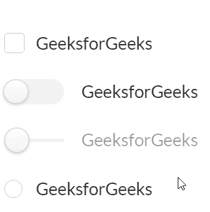
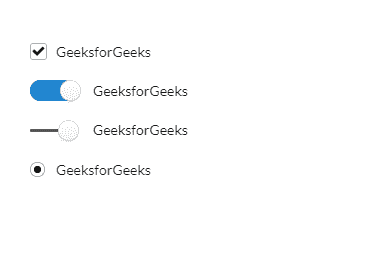

# 重新获取语义用户界面复选框模块

> 原文:[https://www . geeksforgeeks . org/reactjs-semantic-ui-checkbox-module/](https://www.geeksforgeeks.org/reactjs-semantic-ui-checkbox-module/)

语义用户界面是一个现代框架，用于为网站开发无缝设计，它给用户一个轻量级的组件体验。它使用预定义的 CSS、JQuery 语言来整合到不同的框架中。

在本文中，我们将了解如何在 ReactJS 语义用户界面中使用 Checkbox 模块。复选框模块允许用户从一小组选项中选择一个值。

**属性:**

*   **切换:**我们可以使用复选框作为切换。
*   **滑块:**我们可以使用复选框作为滑块。
*   **无线电:**我们可以使用复选框作为无线电元素。
*   **广播组:**我们可以使用复选框作为广播组。

**状态:**

*   **只读:**我们可以使用此状态将复选框设为只读元素。
*   **选中:**我们可以使用此状态将复选框设为预先选中。
*   **不确定:**我们可以使用 make 复选框来确定哪个状态不确定。
*   **禁用:**我们可以使用禁用状态将复选框设为禁用。

**语法:**

```jsx
<Checkbox />
```

**创建反应应用程序并安装模块:**

*   **步骤 1:** 使用以下命令创建一个 React 应用程序。

```jsx
npx create-react-app foldername
```

*   **步骤 2:** 创建项目文件夹(即文件夹名)后，使用以下命令移动到该文件夹。

```jsx
cd foldername
```

*   **第三步:**在给定的目录下安装语义 UI。

```jsx
 npm install semantic-ui-react semantic-ui-css
```

**项目结构**:如下图。


**运行应用程序的步骤:**使用以下命令从项目的根目录运行应用程序。

```jsx
npm start
```

**示例 1:** 在这个示例中，我们使用了一个使用 ReactJS 语义 UI checkbox 模块的基本 Checkbox 元素。

## App.js

```jsx
import React from 'react'
import { Checkbox } from 'semantic-ui-react'

const styleLink = document.createElement("link");
styleLink.rel = "stylesheet";
styleLink.href = 
"https://cdn.jsdelivr.net/npm/semantic-ui/dist/semantic.min.css";

document.head.appendChild(styleLink);

const btt = () => (
    <div>
        <div style={{
            display: 'block', width: 700, padding: 30
        }}>
            <br />
            <br />
            <Checkbox label='GeeksforGeeks' />
            <br />
            <br />
            <Checkbox toggle label='GeeksforGeeks' />
            <br />
            <br />
            <Checkbox slider label='GeeksforGeeks' />
            <br />
            <br />
            <Checkbox radio label='GeeksforGeeks' />
        </div>
    </div>
)

export default btt
```

**输出:**



**示例 2:** 在本例中，我们使用 ReactJS 语义 UI 复选框模块显示了默认选中的复选框。

## App.js

```jsx
import React from 'react'
import { Checkbox } from 'semantic-ui-react'

const styleLink = document.createElement("link");
styleLink.rel = "stylesheet";
styleLink.href = 
"https://cdn.jsdelivr.net/npm/semantic-ui/dist/semantic.min.css";

document.head.appendChild(styleLink);

const btt = () => (
    <div>
        <div style={{
            display: 'block', width: 700, padding: 30
        }}>
            <br />
            <br />
            <Checkbox label='GeeksforGeeks' defaultChecked />
            <br />
            <br />
            <Checkbox toggle label='GeeksforGeeks' defaultChecked />
            <br />
            <br />
            <Checkbox slider label='GeeksforGeeks' defaultChecked />
            <br />
            <br />
            <Checkbox radio label='GeeksforGeeks' defaultChecked />
        </div>
    </div>
)

export default btt
```

**输出:**



**参考:**T2】https://react.semantic-ui.com/modules/checkbox