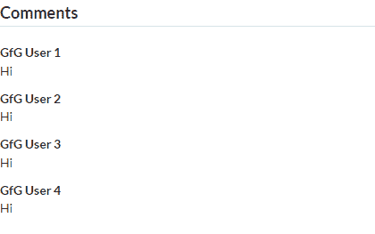
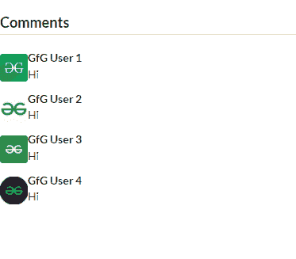

# 反应语义用户界面评论视图

> 原文:[https://www . geeksforgeeks . org/reactjs-semantic-ui-comment-view/](https://www.geeksforgeeks.org/reactjs-semantic-ui-comment-view/)

语义用户界面是一个现代框架，用于为网站开发无缝设计，它给用户一个轻量级的组件体验。它使用预定义的 CSS、JQuery 语言来整合到不同的框架中。

在本文中，我们将了解如何在 ReactJS 语义用户界面中使用注释视图。

**状态:**

*   **折叠:**这种状态会让评论从视图中隐藏或折叠，并且不可见。

**语法:**

```jsx
<Comment  content='content' />
```

**创建反应应用程序并安装模块:**

*   **步骤 1:** 使用以下命令创建一个反应应用程序。

    ```jsx
    npx create-react-app foldername
    ```

*   **步骤 2:** 创建项目文件夹(即文件夹名)后，使用以下命令移动到该文件夹。

    ```jsx
    cd foldername
    ```

*   **Step 3:** Install semantic UI in your given directory.

    ```jsx
    npm install semantic-ui-react semantic-ui-css
    ```

    。

**项目结构**:如下图。


**运行应用程序的步骤:**使用以下命令从项目的根目录运行应用程序。

```jsx
npm start
```

**示例 1:** 在本例中，我们将使用 ReactJS 语义 UI Comment 视图，使用注释、按钮、表单和标题组件来显示基本的注释列表。

## App.js

```jsx
import React from 'react'
import { Button, Comment, Form, Header } from 'semantic-ui-react'

const styleLink = document.createElement("link");
styleLink.rel = "stylesheet";
styleLink.href = 
"https://cdn.jsdelivr.net/npm/semantic-ui/dist/semantic.min.css";
document.head.appendChild(styleLink);

const btt = () => (
<div>
    <br/>
    <Comment.Group>
        <Header as='h3' dividing>
            Comments
        </Header>

        <Comment>
            <Comment.Content>
                <Comment.Author>GfG User 1</Comment.Author>
                <Comment.Text>Hi</Comment.Text>
            </Comment.Content>
        </Comment>

        <Comment>
            <Comment.Content>
                <Comment.Author>GfG User 2</Comment.Author>
                <Comment.Text>Hi</Comment.Text>
            </Comment.Content>
        </Comment>

        <Comment>
            <Comment.Content>
                <Comment.Author>GfG User 3</Comment.Author>
                <Comment.Text>Hi</Comment.Text>
            </Comment.Content>
        </Comment>

        <Comment>
            <Comment.Content>
                <Comment.Author>GfG User 4</Comment.Author>
                <Comment.Text>Hi</Comment.Text>
            </Comment.Content>
        </Comment>
    </Comment.Group>
</div>
)

export default btt
```

**输出:**



**示例 2:** 在本例中，我们将使用 ReactJS 语义 UI Comment 视图，使用注释、按钮、表单和标题组件来显示包含图像或头像的注释。

## App.js

```jsx
import React from 'react'
import { Button, Comment, Form, Header } from 'semantic-ui-react'

const styleLink = document.createElement("link");
styleLink.rel = "stylesheet";
styleLink.href = 
"https://cdn.jsdelivr.net/npm/semantic-ui/dist/semantic.min.css";
document.head.appendChild(styleLink);

const btt = () => (
<div>
    <br/>
    <Comment.Group>
        <Header as='h3' dividing>
            Comments
        </Header>

        <Comment>
            <Comment.Content>
                <Comment.Avatar src=
'https://media.geeksforgeeks.org/wp-content/uploads/20210618110311/img1.png' />
                <Comment.Author>GfG User 1</Comment.Author>
                <Comment.Text>Hi</Comment.Text>
            </Comment.Content>
        </Comment>

        <Comment>
            <Comment.Content>
                <Comment.Avatar src=
'https://media.geeksforgeeks.org/wp-content/uploads/20210618110601/img2.png' />
                <Comment.Author>GfG User 2</Comment.Author>
                <Comment.Text>Hi</Comment.Text>
            </Comment.Content>
        </Comment>

        <Comment>
            <Comment.Content>
                <Comment.Avatar src=
'https://media.geeksforgeeks.org/wp-content/uploads/20210618110640/img3.jpg' />
                <Comment.Author>GfG User 3</Comment.Author>
                <Comment.Text>Hi</Comment.Text>
            </Comment.Content>
        </Comment>

        <Comment>
            <Comment.Content>
                <Comment.Avatar src=
'https://media.geeksforgeeks.org/wp-content/uploads/20210618110720/img4.jpg' />
                <Comment.Author>GfG User 4</Comment.Author>
                <Comment.Text>Hi</Comment.Text>
            </Comment.Content>
        </Comment>
    </Comment.Group>
</div>
)

export default btt
```

**输出:**



**参考:**T2】https://react.semantic-ui.com/views/comment