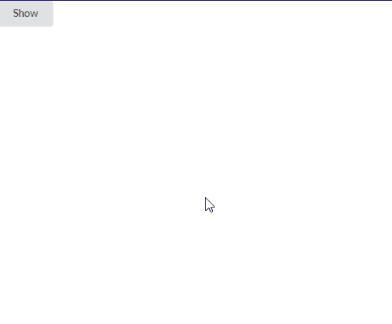
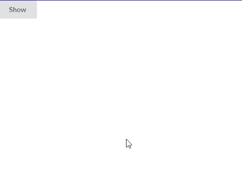

# 反应语义用户界面确认插件

> 原文:[https://www . geeksforgeeks . org/reactjs-semantic-ui-confirm-addons/](https://www.geeksforgeeks.org/reactjs-semantic-ui-confirm-addons/)

语义用户界面是一个现代框架，用于为网站开发无缝设计，它给用户一个轻量级的组件体验。它使用预定义的 CSS、JQuery 语言来整合到不同的框架中。

在本文中，我们将了解如何在 ReactJS 语义 UI 中使用确认插件确认插件用于确认或取消用户采取的操作。

**属性:**

*   **回调:** 确认有取消和确认动作的回调。

**变化:**

*   **表头:**我们可以在确认中定义一个表头。
*   **内容:**我们可以在确认中定义内容。
*   **按钮文本:**我们可以使用确认来更改按钮文本。
*   **确认尺寸:**我们可以使用确认来定义尺寸

**语法:**

```jsx
<Confirm header='header' content='content'/>
```

**创建反应应用程序并安装模块:**

*   **步骤 1:** 使用以下命令创建一个反应应用程序。

    ```jsx
    npx create-react-app foldername
    ```

*   **步骤 2:** 创建项目文件夹(即文件夹名)后，使用以下命令移动到该文件夹。

    ```jsx
    cd foldername
    ```

*   **第三步:**在给定的目录下安装语义 UI。

    ```jsx
     npm install semantic-ui-react semantic-ui-css
    ```

**项目结构**:如下图。


**运行应用程序的步骤:**使用以下命令从项目的根目录运行应用程序。

```jsx
npm start
```

**示例 1:** 在本例中，我们使用 ReactJS 语义 UI 确认插件显示了确认插件中的标题和内容变化。

## App.js

```jsx
import React, {Component}from 'react'
import { Button, Confirm } from 'semantic-ui-react'

const styleLink = document.createElement("link");
styleLink.rel = "stylesheet";
styleLink.href = 
"https://cdn.jsdelivr.net/npm/semantic-ui/dist/semantic.min.css";
document.head.appendChild(styleLink);

<br/>

export default class gfg extends Component {
  state = { gfg1: false }

  gfg1 = () => this.setState({ gfg1: true })
  close = () => this.setState({ gfg1: false })

  render() {
    return (
      <div>
        <Button onClick={this.gfg1}>Show</Button>
        <Confirm
          open={this.state.gfg1}
          header='GeeksforGeeks'
          content='Semantic UI Confirm Addons'
          onCancel={this.close}
          onConfirm={this.close}
        />
      </div>
    )
  }
}
```

**输出:**



**示例 2:** 在本例中，我们使用 ReactJS 语义 UI 确认插件显示了确认插件中的按钮文本变体。

## App.js

```jsx
import React, {Component}from 'react'
import { Button, Confirm } from 'semantic-ui-react'

const styleLink = document.createElement("link");
styleLink.rel = "stylesheet";
styleLink.href = 
"https://cdn.jsdelivr.net/npm/semantic-ui/dist/semantic.min.css";
document.head.appendChild(styleLink);

<br/>

export default class gfg extends Component {
  state = { gfg1: false }

  gfg1 = () => this.setState({ gfg1: true })
  close = () => this.setState({ gfg1: false })

  render() {
    return (
      <div>
        <Button onClick={this.gfg1}>Show</Button>
        <Confirm
          open={this.state.gfg1}
          cancelButton='GeeksforGeeks'
          confirmButton='Semantic UI Confirm Addons'
          onCancel={this.close}
          onConfirm={this.close}
          size='large'
        />

      </div>
    )
  }
}
```

**输出:**



**参考:**T2】https://react.semantic-ui.com/modules/transition