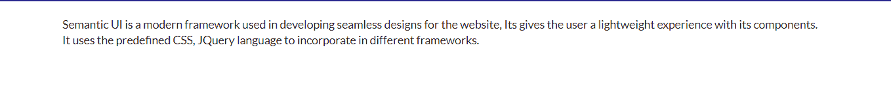
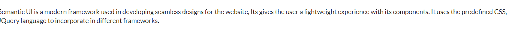
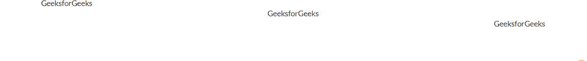

# 反应语义用户界面容器元素

> 原文:[https://www . geeksforgeeks . org/reactjs-semantic-ui-container-element/](https://www.geeksforgeeks.org/reactjs-semantic-ui-container-element/)

语义用户界面是一个现代框架，用于为网站开发无缝设计，它给用户一个轻量级的组件体验。它使用预定义的 CSS、JQuery 语言来整合到不同的框架中。

在本文中，我们将了解如何在 ReactJS 语义 UI 中使用容器元素。 **Container** 元素用来制作一个容器，我们可以在里面输入一些文字。

**语法:**

```
<Container>
    <p>Text</p>
</Container>
```

**集装箱类型:**

*   **集装箱:**用作标准集装箱。
*   **文本容器:**它可以让减少它的最大宽度，以便容纳一列文本。

**集装箱变型:**

*   **文字对齐:**到 指定文字对齐。
*   **流体:**它没有最大宽度。

**创建反应应用程序并安装模块:**

*   **步骤 1:** 使用以下命令创建一个 React 应用程序。

    ```
    npx create-react-app foldername
    ```

*   **步骤 2:** 创建项目文件夹(即文件夹名)后，使用以下命令移动到该文件夹。

    ```
    cd foldername
    ```

*   **步骤 3:** 创建 ReactJS 应用程序后，使用以下命令安装所需的****模块:****

    ```
    **npm install semantic-ui-react**
    ```

******项目结构:**如下图。****

********

******运行应用程序的步骤:**使用以下命令从项目的根目录运行应用程序。****

```
**npm start**
```

******例 1:******

## ****App.js****

```
**import React from 'react'
import { Container } from 'semantic-ui-react'

const styleLink = document.createElement("link");
styleLink.rel = "stylesheet";
styleLink.href = 
"https://cdn.jsdelivr.net/npm/semantic-ui/dist/semantic.min.css";
document.head.appendChild(styleLink);

const App = () =>(
    <Container>
        <p>
            Semantic UI is a modern framework used 
            in developing seamless designs for the
            website, Its gives the user a lightweight
            experience with its components. It uses
            the predefined CSS, JQuery language to 
            incorporate in different frameworks.
        </p>

    </Container>
)

export default App**
```

******输出:******

********

******例 2:******

******文件名:App.js******

## ****App.js****

```
**import React from 'react'
import { Container } from 'semantic-ui-react'

const styleLink = document.createElement("link");
styleLink.rel = "stylesheet";
styleLink.href = 
"https://cdn.jsdelivr.net/npm/semantic-ui/dist/semantic.min.css";
document.head.appendChild(styleLink);

const App = () =>(
    <Container fluid>
        <p>
            Semantic UI is a modern framework used 
            in developing seamless designs for the
            website, Its gives the user a lightweight
            experience with its components. It uses
            the predefined CSS, JQuery language to 
            incorporate in different frameworks.
        </p>

    </Container>
)

export default App**
```

******输出:******

********

******例 3:******

## ****App.js****

```
**import React from 'react'
import { Container } from 'semantic-ui-react'

const styleLink = document.createElement("link");
styleLink.rel = "stylesheet";
styleLink.href = 
"https://cdn.jsdelivr.net/npm/semantic-ui/dist/semantic.min.css";
document.head.appendChild(styleLink);

const App = () => (
  <Container textAlign='right'>
    <Container textAlign='center'>
      <Container textAlign='left'>GeeksforGeeks</Container>
        GeeksforGeeks
      </Container>
        GeeksforGeeks
  </Container>
)

export default App**
```

******输出:******

********

******参考:**T2】https://react.semantic-ui.com/elements/container****