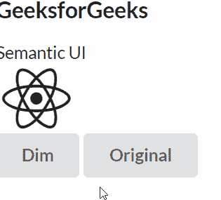
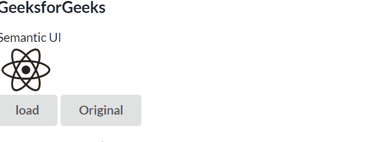

# 反应语义用户界面调光模块

> 原文:[https://www . geeksforgeeks . org/reactjs-semantic-ui-dimer-module/](https://www.geeksforgeeks.org/reactjs-semantic-ui-dimmer-module/)

语义用户界面是一个现代框架，用于为网站开发无缝设计。它为用户提供了轻量级的组件体验。它使用预定义的 CSS、JQuery 语言来整合到不同的框架中。

在本文中，我们将了解如何在 ReactJS 语义用户界面中使用调光器模块。**调光器**模块用于将用户的注意力集中在页面的特定部分或某个片段上。

**属性:**

*   **内容调光器:** 调光器可以显示内容。
*   **页面调光器:** 调光器可以格式化为固定在页面上。

**状态:**

*   **激活:**用于调暗其父容器。

**语法:**

```jsx
<Dimmer/>
```

**创建反应应用程序并安装模块:**

*   **步骤 1:** 使用以下命令创建一个反应应用程序。

    ```jsx
    npx create-react-app foldername
    ```

*   **步骤 2:** 创建项目文件夹(即文件夹名)后，使用以下命令移动到该文件夹。

    ```jsx
    cd foldername
    ```

*   **第三步:**在给定的目录下安装语义 UI。

    ```jsx
     npm install semantic-ui-react semantic-ui-css
    ```

**项目结构:**如下图。


**运行应用程序的步骤:**使用以下命令从项目的根目录运行应用程序。

```jsx
npm start
```

**例子 1:** 在这个例子中，我们展示了一个暗淡的效果来集中用户的注意力。当用户单击“调光”按钮时，会显示这种调光效果。原来的按钮也要呈现才能回到正常状态。

## App.js

```jsx
import React, { Component } from 'react'
import { Button, Dimmer, Header, Icon } from 'semantic-ui-react'

const styleLink = document.createElement("link");
styleLink.rel = "stylesheet";
styleLink.href = 
"https://cdn.jsdelivr.net/npm/semantic-ui/dist/semantic.min.css";
document.head.appendChild(styleLink);

export default class App extends Component {
  state = {}

  GetDIM = () => this.setState({ dim: true })
  HideDIM = () => this.setState({ dim: false })

  render() {
    const { dim } = this.state

    return (
      <div>
        <Dimmer.Dimmable dimmed={dim}>
          <Header as='h3'>GeeksforGeeks </Header>
          Semantic UI
          <Dimmer active={dim} />
          <br />
          <Icon name='react' size='huge' />
        </Dimmer.Dimmable>

        <Button onClick={this.GetDIM} content='Dim' />
        <Button onClick={this.HideDIM} content='Original' />
      </div>
    )
  }
}
```

**输出:**



**示例 2:** 在这个示例中，我们展示了一个加载效果来集中用户的注意力。当用户点击加载按钮时，显示这种加载效果。原来的按钮也要呈现才能回到正常状态。

## App.js

```jsx
import React, { Component } from 'react'
import { Button, Dimmer, Header, Icon, Loader } from 'semantic-ui-react'

const styleLink = document.createElement("link");
styleLink.rel = "stylesheet";
styleLink.href = 
"https://cdn.jsdelivr.net/npm/semantic-ui/dist/semantic.min.css";
document.head.appendChild(styleLink);

export default class App extends Component {
  state = {}

  GetDIM = () => this.setState({ dim: true })
  HideDIM = () => this.setState({ dim: false })

  render() {
    const { dim } = this.state

    return (
      <div>
        <Dimmer.Dimmable dimmed={dim}>
          <Header as='h3'>GeeksforGeeks </Header>
          Semantic UI
          <Dimmer active={dim} inverted >
            <Loader>Loading</Loader>
          </Dimmer>
          <br />
          <Icon name='react' size='huge' />
        </Dimmer.Dimmable>

        <Button onClick={this.GetDIM} content='load' />
        <Button onClick={this.HideDIM} content='Original' />
      </div>
    )
  }
}
```

**输出:**



**参考:**T2】https://react.semantic-ui.com/modules/dimmer/