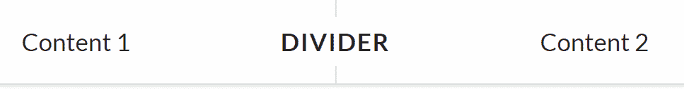
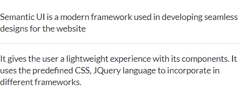

# 反应语义用户界面分隔元素

> 原文:[https://www . geeksforgeeks . org/reactjs-semantic-ui-divider-element/](https://www.geeksforgeeks.org/reactjs-semantic-ui-divider-element/)

语义用户界面是一个现代框架，用于为网站开发无缝设计，它给用户一个轻量级的组件体验。它使用预定义的 CSS、JQuery 语言来整合到不同的框架中。

在本文中，我们将了解如何在 ReactJS Semantic UI 中使用分隔符元素。分隔线元素用于制作分隔文本的分隔线。

**属性:**

*   **垂直分割线:**用于垂直分割文字。
*   **水平分割线:**用于水平分割文字。

**语法:**

```jsx
<divider />
```

**创建反应应用程序并安装模块:**

*   **步骤 1:** 使用以下命令创建一个 React 应用程序。

    ```jsx
    npx create-react-app foldername
    ```

*   **步骤 2:** 创建项目文件夹(即文件夹名)后，使用以下命令移动到该文件夹。

    ```jsx
    cd foldername
    ```

*   **第三步:**在给定的目录下安装语义 UI。

    ```jsx
     npm install semantic-ui-react semantic-ui-css
    ```

**项目结构**:如下图。


**运行应用程序的步骤:**使用以下命令从项目的根目录运行应用程序。

```jsx
npm start
```

**示例 1:** 在本例中，我们将使用分割线、网格和线段元素，通过使用 ReactJS 语义 UI 分割线元素在网格的各个部分之间添加垂直分割线。

## App.js

```jsx
import React from 'react'
import { Divider, Grid, Segment} from 'semantic-ui-react'

const styleLink = document.createElement("link");
styleLink.rel = "stylesheet";
styleLink.href = 
"https://cdn.jsdelivr.net/npm/semantic-ui/dist/semantic.min.css";
document.head.appendChild(styleLink);

const Btt = () =>
<Segment>
    <Divider vertical>Divider</Divider>
    <Grid columns={2} relaxed='very'>
        <Grid.Column textAlign = 'center'>
            Content 1
        </Grid.Column> 
        <Grid.Column textAlign = 'center'>
            Content 2
        </Grid.Column>
    </Grid>

</Segment>

export default Btt    
```

**输出:**



**示例 2:** 在本例中，我们将使用一个简单的分割线元素，通过使用 ReactJS Semantic UI 分割线元素来划分两个 div。

## App.js

```jsx
import React from 'react'
import { Divider} from 'semantic-ui-react'

const styleLink = document.createElement("link");
styleLink.rel = "stylesheet";
styleLink.href = 
"https://cdn.jsdelivr.net/npm/semantic-ui/dist/semantic.min.css";
document.head.appendChild(styleLink);

const Btt = () => 
        <div>
            <br></br>
            Semantic UI is a modern framework used 
            in developing seamless designs for the
            website <Divider />
            It gives the user a lightweight
            experience with its components. It uses
            the predefined CSS, JQuery language to 
            incorporate in different frameworks.
        </div>

export default Btt    
```

**输出:**



**参考:**T2】https://react.semantic-ui.com/elements/divider