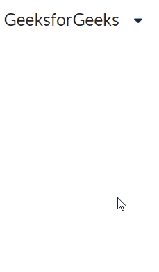
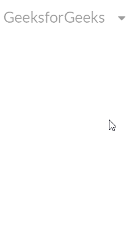

# 反应语义用户界面下拉模块

> 原文:[https://www . geesforgeks . org/reactjs-semantic-ui-drop down-module/](https://www.geeksforgeeks.org/reactjs-semantic-ui-dropdown-module/)

语义用户界面是一个现代框架，用于为网站开发无缝设计，它给用户一个轻量级的组件体验。它使用预定义的 CSS、JQuery 语言来整合到不同的框架中。

在本文中，我们看到了如何在 ReactJS 语义用户界面中使用下拉模块。下拉模块允许用户从一系列选项中选择一个值

**属性:**

*   **选择:**我们可以通过一系列的品种进行选择。
*   **搜索选择:**我们可以通过搜索在一系列品种中进行选择。
*   **多选:**我们可以通过多选进行选择。
*   **多重搜索选择:**我们可以通过搜索进行多重选择。
*   **可清除:**我们可以做一个可以清除的下拉列表。
*   **搜索下拉菜单:**我们可以做一个下拉菜单，可以搜索。
*   **搜索菜单:**我们可以制作一个下拉菜单，可以通过菜单进行搜索。
*   **内联:**我们可以做一个下拉列表，可以一行出现。
*   **指向:**我们可以做一个下拉菜单，可以显示为指向。
*   **浮动:**我们可以做一个下拉菜单，可以显示为浮动。
*   **简单:**我们可以做一个简单的下拉。

**状态:**

*   **加载:**用于进行加载下拉。
*   **错误:**用于下拉出错。
*   **活动:**用于进行活动下拉。
*   **禁用:**用于进行禁用下拉，

**语法:**

```
<Dropdown text='content'/>
```

**创建反应应用程序并安装模块:**

*   **步骤 1:** 使用以下命令创建一个反应应用程序。

    ```
    npx create-react-app foldername
    ```

*   **步骤 2:** 创建项目文件夹(即文件夹名)后，使用以下命令移动到该文件夹。

    ```
    cd foldername
    ```

*   **第三步:**在给定的目录下安装语义 UI。

    ```
     npm install semantic-ui-react semantic-ui-css
    ```

**项目结构**:如下图。


**运行应用程序的步骤:**使用以下命令从项目的根目录运行应用程序。

```
npm start
```

**示例 1:** 这是展示如何使用 ReactJS 语义 UI 下拉模块使用下拉模块的基本示例。

## App.js

```
import React from 'react'
import { Dropdown, Icon } from 'semantic-ui-react'

const styleLink = document.createElement("link");
styleLink.rel = "stylesheet";
styleLink.href = 
"https://cdn.jsdelivr.net/npm/semantic-ui/dist/semantic.min.css";
document.head.appendChild(styleLink);

const btt = () => (
<div>
    <div style={{
            display: 'block', width: 700, padding: 30
    }}>
    <br/>
    <Dropdown text='GeeksforGeeks'>
    <Dropdown.Menu>
      <Dropdown.Item text='ReactJS' icon='react' />
      <Dropdown.Item text='AngularJS' icon='angular'/>
      <Dropdown.Item text='HTML5' icon='html5' />
      <Dropdown.Item text='JavaScript' icon='js' />
      <Dropdown.Item text='NodeJS' icon='node'/>
    </Dropdown.Menu>
  </Dropdown>
</div>
</div>
)

export default btt
```

**输出:**



**示例 2:** 在本例中，我们使用 ReactJS 语义 UI 下拉模块在下拉列表中显示禁用状态。

## App.js

```
import React from 'react'
import { Dropdown, Icon } from 'semantic-ui-react'

const styleLink = document.createElement("link");
styleLink.rel = "stylesheet";
styleLink.href = 
"https://cdn.jsdelivr.net/npm/semantic-ui/dist/semantic.min.css";
document.head.appendChild(styleLink);

const btt = () => (
<div>
    <div style={{
            display: 'block', width: 700, padding: 30
    }}>
    <br/>
    <Dropdown text='GeeksforGeeks' disabled>
    <Dropdown.Menu>
      <Dropdown.Item text='ReactJS' icon='react' />
      <Dropdown.Item text='AngularJS' icon='angular'/>
      <Dropdown.Item text='HTML5' icon='html5' />
      <Dropdown.Item text='JavaScript' icon='js' />
      <Dropdown.Item text='NodeJS' icon='node'/>
    </Dropdown.Menu>
  </Dropdown>
</div>
</div>
)

export default btt
```

**输出:**



**参考:**T2】https://react.semantic-ui.com/modules/dropdown