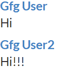

# 重新获取语义用户界面提要视图

> 原文:[https://www . geeksforgeeks . org/reactjs-semantic-ui-feed-view/](https://www.geeksforgeeks.org/reactjs-semantic-ui-feed-views/)

语义用户界面是一个现代框架，用于为网站开发无缝设计，它给用户一个轻量级的组件体验。它使用预定义的 CSS、JQuery 语言来整合到不同的框架中。

在本文中，我们将了解如何在 ReactJS 语义用户界面中使用提要视图。**提要视图**用于按时间顺序呈现用户活动。

**语法:**

```
<Feed/>
```

**创建反应应用程序并安装模块:**

*   **步骤 1:** 使用以下命令创建一个反应应用程序。

    ```
    npx create-react-app foldername
    ```

*   **步骤 2:** 创建项目文件夹(即文件夹名)后，使用以下命令移动到该文件夹。

    ```
    cd foldername
    ```

*   **第三步:**在给定的目录下安装语义 UI。

    ```
     npm install semantic-ui-react semantic-ui-css
    ```

**项目结构**:如下图。


**运行应用程序的步骤:**使用以下命令从项目的根目录运行应用程序。

```
npm start
```

**示例:** 在本例中，我们将按时间顺序显示用户活动，这里我们使用 ReactJS 语义 UI Feed Views 元素显示了两个名为 *Gfg 用户*和 *Gfg 用户 2* 的活动。

## App.js

```
import React from 'react'
import { Feed } from 'semantic-ui-react'

const styleLink = document.createElement("link");
styleLink.rel = "stylesheet";
styleLink.href = 
"https://cdn.jsdelivr.net/npm/semantic-ui/dist/semantic.min.css";
document.head.appendChild(styleLink);

const App = () => (
  <div>
    <br />
    <Feed>
      <Feed.Event>
        <Feed.Content>
          <Feed.Summary>
            <Feed.User>Gfg User</Feed.User>
          </Feed.Summary>
          <Feed.Content>
            Hi
          </Feed.Content>
        </Feed.Content>
      </Feed.Event>

      <Feed.Event>
        <Feed.Content>
          <Feed.Summary>
            <Feed.User>Gfg User 2</Feed.User>
          </Feed.Summary>
          <Feed.Content>
            Hi!!!
          </Feed.Content>
        </Feed.Content>
      </Feed.Event>
    </Feed>
  </div>
)

export default App
```

**输出:**



**参考:**T2】https://react.semantic-ui.com/views/feed