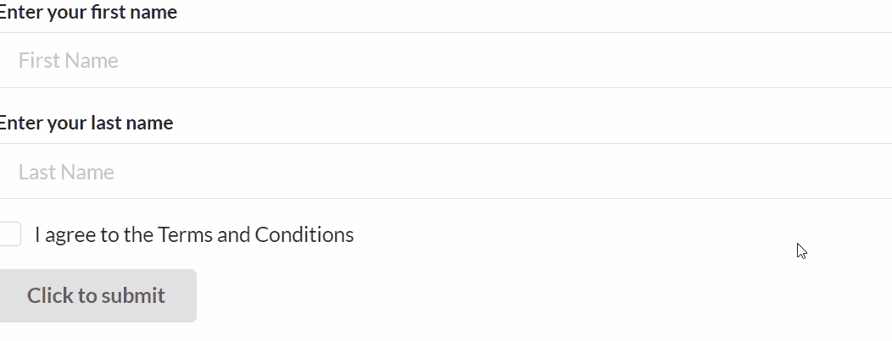
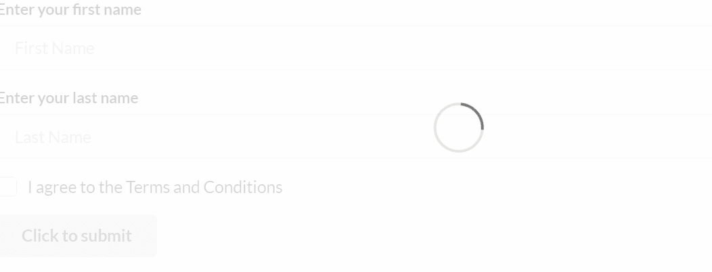

# 反应语义用户界面表单集合

> 原文:[https://www . geeksforgeeks . org/reactjs-semantic-ui-form-collections/](https://www.geeksforgeeks.org/reactjs-semantic-ui-form-collections/)

语义用户界面是一个现代框架，用于为网站开发无缝设计，它给用户一个轻量级的组件体验。它使用预定义的 CSS、JQuery 语言来整合到不同的框架中。

在本文中，我们将了解如何在 ReactJS Semantic UI 中使用表单集合。表单用于显示一组相关的用户输入字段。

**状态:**

*   **加载:**该状态显示表单是否处于加载状态。
*   **成功:**该状态显示表单是否提交成功。
*   **错误:**该状态显示表单是否处于错误状态。
*   **警告:**该状态显示表单是否处于警告状态。
*   **字段错误:** 个别字段可能显示错误状态。
*   **禁用字段:**如果可能禁用了单个字段，则使用该状态。
*   **只读字段:**此状态显示我是否可以只读单个字段。

**语法:**

```jsx
<Form>
    <Form></Form>
</Form>
```

**创建反应应用程序并安装模块:**

*   **步骤 1:** 使用以下命令创建一个 React 应用程序。

```jsx
npx create-react-app foldername
```

*   **步骤 2:** 创建项目文件夹(即文件夹名)后，使用以下命令移动到该文件夹。

```jsx
cd foldername
```

*   **第三步:**在给定的目录下安装语义 UI。

```jsx
 npm install semantic-ui-react semantic-ui-css
```

**项目结构**:如下图。


**运行应用程序的步骤:**使用以下命令从项目的根目录运行应用程序。

```jsx
npm start
```

**示例 1:** 在本例中，我们将看到如何通过使用 ReactJS 语义 UI 表单集合，使用按钮、复选框和表单元素创建基本表单。

## App.js

```jsx
import React from 'react'
import {Button, Checkbox, Form} from 'semantic-ui-react'

const styleLink = document.createElement("link");
styleLink.rel = "stylesheet";
styleLink.href = 
"https://cdn.jsdelivr.net/npm/semantic-ui/dist/semantic.min.css";

document.head.appendChild(styleLink);

const Btt = () =>( 
   <Form>
    <Form.Field>
      <label>Enter your first name</label>
      <input placeholder='First Name' />
    </Form.Field>
    <Form.Field>
      <label>Enter your last name</label>
      <input placeholder='Last Name' />
    </Form.Field>
    <Form.Field>
      <Checkbox label='I agree to the Terms and Conditions' />
    </Form.Field>
    <Button type='submit'>Click to submit</Button>
  </Form>
)

export default Btt    
```

**输出:**



**示例 2:** 在本例中，我们将看到如何使用按钮、复选框和表单元素创建表单，表单状态为加载，以通过使用 ReactJS 语义 UI 表单集合自动显示加载指示器。

## App.js

```jsx
import React from 'react'
import {Button, Checkbox, Form} from 'semantic-ui-react'

const styleLink = document.createElement("link");
styleLink.rel = "stylesheet";
styleLink.href = 
"https://cdn.jsdelivr.net/npm/semantic-ui/dist/semantic.min.css";

document.head.appendChild(styleLink);

const Btt = () =>( 
   <Form loading>
    <Form.Field>
      <label>Enter your first name</label>
      <input placeholder='First Name' />
    </Form.Field>
    <Form.Field>
      <label>Enter your last name</label>
      <input placeholder='Last Name' />
    </Form.Field>
    <Form.Field>
      <Checkbox label='I agree to the Terms and Conditions' />
    </Form.Field>
    <Button type='submit'>Click to submit</Button>
  </Form>
)

export default Btt    
```

**输出:**



**参考:**T2】https://react.semantic-ui.com/collections/form