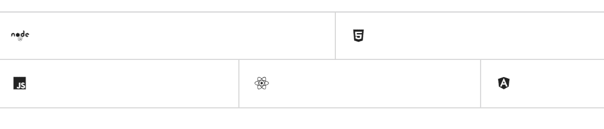
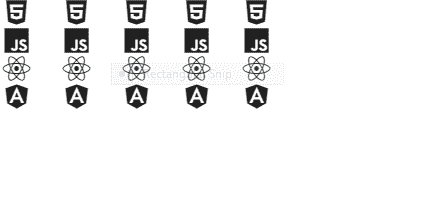

# 反应语义用户界面网格集合

> 原文:[https://www . geeksforgeeks . org/reactjs-semantic-ui-grid-collections/](https://www.geeksforgeeks.org/reactjs-semantic-ui-grid-collections/)

语义用户界面是一个现代框架，用于为网站开发无缝设计，它给用户一个轻量级的组件体验。它使用预定义的 CSS、JQuery 语言来整合到不同的框架中。

在本文中，我们将了解如何在 ReactJS 语义 UI 中使用网格集合。

**类型:**

*   **分割:** G rid 可以在它的列之间有分割器来将它们彼此分开。
*   **垂直分割:** G rid 也可以垂直使用行与行之间的垂直分割器进行分割。
*   **Celled:** G rid 也可以包含的行被划分为细胞。
*   **内部划分:** G rid 只能在内部行之间有行划分。

**语法:**

```jsx
<Grid.Column />
```

**创建反应应用程序并安装模块:**

*   **步骤 1:** 使用以下命令创建一个反应应用程序。

    ```jsx
    npx create-react-app foldername
    ```

*   **步骤 2:** 创建项目文件夹(即文件夹名)后，使用以下命令移动到该文件夹。

    ```jsx
    cd foldername
    ```

*   **第三步:**在给定的目录下安装语义 UI。

    ```jsx
     npm install semantic-ui-react semantic-ui-css
    ```

**项目结构**:如下图。


**运行应用程序的步骤:**使用以下命令从项目的根目录运行应用程序。

```jsx
npm start
```

**示例 1:** 在本例中，我们将使用 ReactJS 语义 UI Grid 集合，使用网格和图标元素来显示基本网格。

## App.js

```jsx
import React from 'react'
import {Grid, Icon} from 'semantic-ui-react'

const styleLink = document.createElement("link");
styleLink.rel = "stylesheet";
styleLink.href = 
"https://cdn.jsdelivr.net/npm/semantic-ui/dist/semantic.min.css";
document.head.appendChild(styleLink);

const btt = () => (
    <Grid celled>
      <Grid.Row>
        <Grid.Column width={7}>
          <Icon name='node'/>
        </Grid.Column>
        <Grid.Column width={8}>
          <Icon name='html5'/>
        </Grid.Column>
      </Grid.Row>

      <Grid.Row>
        <Grid.Column width={5}>
          <Icon name='js'/>
        </Grid.Column>
        <Grid.Column width={5}>
          <Icon name='react'/>
        </Grid.Column>
        <Grid.Column width={5}>
          <Icon name='angular'/>
        </Grid.Column>
      </Grid.Row>
    </Grid>
)

export default btt
```

**输出:**



**示例 2:** 在本例中，我们将使用网格和图标元素，但我们使用的是 Importing _ from lodash。

## App.js

```jsx
import _ from 'lodash'
import React from 'react'
import {Grid, Icon} from 'semantic-ui-react'

const styleLink = document.createElement("link");
styleLink.rel = "stylesheet";
styleLink.href = 
"https://cdn.jsdelivr.net/npm/semantic-ui/dist/semantic.min.css";
document.head.appendChild(styleLink);

const btt = _.times(5, (i) => (
  <Grid.Column key={i}>
    <Icon name='html5' size='big' />
    <Icon name='js' size='big' />
    <Icon name='react' size='big' />
    <Icon name='angular' size='big' />
  </Grid.Column>
))

const gfg = () => <Grid>{btt}</Grid>

export default gfg    
```

**输出:**



**参考:**T2】https://react.semantic-ui.com/collections/grid