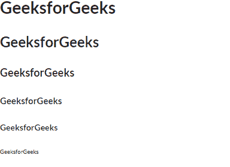
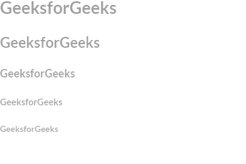

# 反应语义用户界面标题元素

> 原文:[https://www . geeksforgeeks . org/reactjs-semantic-ui-header-element/](https://www.geeksforgeeks.org/reactjs-semantic-ui-header-element/)

语义用户界面是一个现代框架，用于为网站开发无缝设计，它给用户一个轻量级的组件体验。它使用预定义的 CSS、JQuery 语言来整合到不同的框架中。

在本文中，我们将了解如何在 ReactJS Semantic UI 中使用头元素。标头元素用于制作标头。

**属性:**

*   **页首:**用于设置页面的章节层次。
*   **内容标题:**用于指定特定部分的的重要性。
*   **图标标题:**用于强调特定的图标。
*   **副标题:**用于较小的内容。

**状态:**

*   **禁用:**该状态用于禁用表头。

**语法:**

```
<header size='size'>Header</Header>
```

**创建反应应用程序并安装模块:**

*   **步骤 1:** 使用以下命令创建一个反应应用程序。

    ```
    npx create-react-app foldername
    ```

*   **步骤 2:** 创建项目文件夹(即文件夹名)后，使用以下命令移动到该文件夹。

    ```
    cd foldername
    ```

*   **第三步:**在给定的目录下安装语义 UI。

    ```
     npm install semantic-ui-react semantic-ui-css
    ```

**项目结构**:如下图。


**示例 1:** 在本例中，我们将通过使用 ReactJS Semantic UI 头元素来使用基本的头元素。

## App.js

```
import React from 'react'
import {Header} from 'semantic-ui-react'

const styleLink = document.createElement("link");
styleLink.rel = "stylesheet";
styleLink.href = 
"https://cdn.jsdelivr.net/npm/semantic-ui/dist/semantic.min.css";
document.head.appendChild(styleLink);

<br></br>
const Btt = () =>
<div>
    <Header as='h1'>GeeksforGeeks</Header>
    <Header as='h2'>GeeksforGeeks</Header>
    <Header as='h3'>GeeksforGeeks</Header>
    <Header as='h4'>GeeksforGeeks</Header>
    <Header as='h5'>GeeksforGeeks</Header>
    <Header as='h6'>GeeksforGeeks</Header>
  </div>

export default Btt    
```

**运行应用程序的步骤:**使用以下命令从项目的根目录运行应用程序。

```
npm start
```

**输出:**



**示例 2:** 在本例中，我们将通过使用 ReactJS Semantic UI 头元素来使用具有大小属性和禁用状态的头元素。

## App.js

```
import React from 'react'
import {Header} from 'semantic-ui-react'

const styleLink = document.createElement("link");
styleLink.rel = "stylesheet";
styleLink.href = 
"https://cdn.jsdelivr.net/npm/semantic-ui/dist/semantic.min.css";
document.head.appendChild(styleLink);

<br></br>
const Btt = () =>
<div>
    <Header size='huge'>GeeksforGeeks</Header>
    <Header size='large'>GeeksforGeeks</Header>
    <Header size='medium'>GeeksforGeeks</Header>
    <Header size='small'>GeeksforGeeks</Header>
    <Header size='tiny'>GeeksforGeeks</Header>
  </div>

export default Btt    
```

**运行应用程序的步骤:**使用以下命令从项目的根目录运行应用程序。

```
npm start
```

**输出:**



**参考:**T2】https://react.semantic-ui.com/elements/header