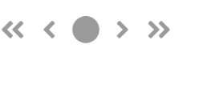
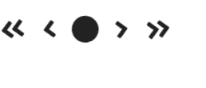

# 反应语义用户界面图标元素

> 原文:[https://www . geeksforgeeks . org/reactjs-semantic-ui-icon-element/](https://www.geeksforgeeks.org/reactjs-semantic-ui-icon-element/)

语义用户界面是一个现代框架，用于为网站开发无缝设计，它给用户一个轻量级的组件体验。它使用预定义的 CSS、JQuery 语言来整合到不同的框架中。

在本文中，我们将了解如何在 ReactJS 语义用户界面中使用图标元素。图标元素是任何元素的可视表示，可以是链接或某种表示。

**状态:**

*   **禁用:**我们可以作为禁用图标使用。
*   **加载:**我们可以作为加载图标使用

**创建反应应用程序并安装模块:**

*   **步骤 1:** 使用以下命令创建一个 React 应用程序。

    ```
    npx create-react-app foldername
    ```

*   **步骤 2:** 创建项目文件夹(即文件夹名)后，使用以下命令移动到该文件夹。

    ```
    cd foldername
    ```

*   **第三步:**在给定的目录下安装语义 UI。

    ```
     npm install semantic-ui-react semantic-ui-css
    ```

**项目结构**:如下图。


**示例 1:** 在本例中，我们将使用一个图标组件，通过使用 ReactJS 语义 UI Icon 元素来启用图标的状态。

## App.js

```
import React from 'react'
import {Icon} from 'semantic-ui-react'

const styleLink = document.createElement("link");
styleLink.rel = "stylesheet";
styleLink.href = 
"https://cdn.jsdelivr.net/npm/semantic-ui/dist/semantic.min.css";
document.head.appendChild(styleLink);

const Btt = () =>( 
<div>
    <br/>
    <Icon enabled name='angle double left' size='big' />
    <Icon enabled name='angle left' size='big' />
    <Icon enabled name='circle' size='big' />
    <Icon enabled name='angle right' size='big' />
    <Icon enabled name='angle double right' size='big' />

</div>
)

export default Btt    
```

**运行应用程序的步骤:**使用以下命令从项目的根目录运行应用程序。

```
npm start
```

**输出:**


**示例 2:** 在本例中，我们将使用一个图标组件，通过使用 ReactJS 语义 UI 图标元素，将图标的状态设置为禁用

## App.js

```
import React from 'react'
import {Icon} from 'semantic-ui-react'

const styleLink = document.createElement("link");
styleLink.rel = "stylesheet";
styleLink.href = 
"https://cdn.jsdelivr.net/npm/semantic-ui/dist/semantic.min.css";
document.head.appendChild(styleLink);

const Btt = () =>( 
<div>
    <br/>
    <Icon disabled name='angle double left' size='big' />
    <Icon disabled name='angle left' size='big' />
    <Icon disabled name='circle' size='big' />
    <Icon disabled name='angle right' size='big' />
    <Icon disabled name='angle double right' size='big' />

</div>
)

export default Btt    
```

**运行应用程序的步骤:**使用以下命令从项目的根目录运行应用程序。

```
npm start
```

**输出:**



**示例 3:** 在本例中，我们将使用一个图标组件，通过使用 ReactJS 语义 UI Icon 元素，将图标的状态作为加载状态。

## App.js

```
import React from 'react'
import {Icon} from 'semantic-ui-react'

const styleLink = document.createElement("link");
styleLink.rel = "stylesheet";
styleLink.href = 
"https://cdn.jsdelivr.net/npm/semantic-ui/dist/semantic.min.css";
document.head.appendChild(styleLink);

const Btt = () =>( 
<div>
    <br/>
    <Icon loading name='angle double left' size='big' />
    <Icon loading name='angle left' size='big' />
    <Icon loading name='circle' size='big' />
    <Icon loading name='angle right' size='big' />
    <Icon loading name='angle double right' size='big' />

</div>
)

export default Btt    
```

**运行应用程序的步骤:**使用以下命令从项目的根目录运行应用程序。

```
npm start
```

**输出:**



**参考:**T2】https://react.semantic-ui.com/elements/icon