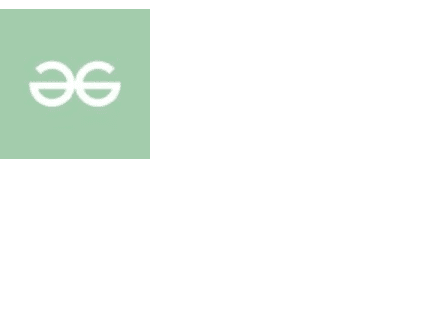

# 反应语义用户界面图像元素

> 原文:[https://www . geeksforgeeks . org/reactjs-semantic-ui-image-element/](https://www.geeksforgeeks.org/reactjs-semantic-ui-image-element/)

语义用户界面是一个现代框架，用于为网站开发无缝设计，它给用户一个轻量级的组件体验。它使用预定义的 CSS、JQuery 语言来整合到不同的框架中。

在本文中，我们将了解如何在 ReactJS Semantic UI 中使用图像元素。图像元素是事物的视觉表现。

**属性:**

*   **图像链接:** 图像可以使用图像链接格式化为另一个页面

**状态:**

*   **隐藏:**可以使用隐藏状态隐藏图像。
*   **禁用:**用于使图像禁用。

**语法:**

```
<image src='link'/>
```

**创建反应应用程序并安装模块:**

*   **步骤 1:** 使用以下命令创建一个 React 应用程序。

```
npx create-react-app foldername
```

*   **步骤 2:** 创建项目文件夹(即文件夹名)后，使用以下命令移动到该文件夹。

```
cd foldername
```

*   **第三步:**在给定的目录下安装语义 UI。

```
 npm install semantic-ui-react semantic-ui-css
```

**项目结构**:如下图。


**运行应用程序的步骤:**使用以下命令从项目的根目录运行应用程序。

```
npm start
```

**示例 1:** 在本例中，我们通过使用 ReactJS Semantic UI 图像元素在图像元素中使用禁用状态。

## App.js

```
import React from 'react'
import {Image} from 'semantic-ui-react'

const styleLink = document.createElement("link");
styleLink.rel = "stylesheet";
styleLink.href = 
"https://cdn.jsdelivr.net/npm/semantic-ui/dist/semantic.min.css";

document.head.appendChild(styleLink);

const Btt = () =>( 
<div>
    <br/>
    <Image src=
'https://media.geeksforgeeks.org/wp-content/uploads/20210604014825/QNHrwL2q-100x100.jpg' 
    size='small' disabled/>
</div>
)

export default Btt    
```

**输出:**



**示例 2:** 在本例中，我们通过使用 ReactJS Semantic UI 图像元素，在图像元素中使用图像链接属性。

## App.js

```
import React from 'react'
import {Image} from 'semantic-ui-react'

const styleLink = document.createElement("link");
styleLink.rel = "stylesheet";
styleLink.href = 
"https://cdn.jsdelivr.net/npm/semantic-ui/dist/semantic.min.css";

document.head.appendChild(styleLink);

const Btt = () =>( 
<div>
    <br/>
    <Image src=
'https://media.geeksforgeeks.org/wp-content/uploads/20210604014825/QNHrwL2q-100x100.jpg' 
    size='small' href='https://www.geeksforgeeks.org/' />
</div>
)

export default Btt    
```

**输出:**


**参考:**T2】https://react.semantic-ui.com/elements/image