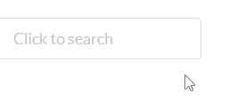
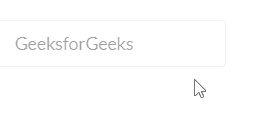

# 重新获取语义用户界面输入元素

> 原文:[https://www . geeksforgeeks . org/reactjs-semantic-ui-input-element/](https://www.geeksforgeeks.org/reactjs-semantic-ui-input-element/)

语义用户界面是一个现代框架，用于为网站开发无缝设计，它给用户一个轻量级的组件体验。它使用预定义的 CSS、JQuery 语言来整合到不同的框架中。

在本文中，我们将看到如何在 ReactJS 语义 UI 中使用输入元素。输入元素用于制作一个输入文本的字段。

**状态:**

*   **焦点:**输入字段看起来像是焦点。
*   **加载:**输入为加载。
*   **错误:**输入包含错误。
*   **禁用:**输入禁用。

**语法:**

```jsx
<input placeholder='search' />
```

**创建反应应用程序并安装模块:**

*   **步骤 1:** 使用以下命令创建一个 React 应用程序。

    ```jsx
    npx create-react-app foldername
    ```

*   **步骤 2:** 创建项目文件夹(即文件夹名)后，使用以下命令移动到该文件夹。

    ```jsx
    cd foldername
    ```

*   **第三步:**在给定的目录下安装语义 UI。

    ```jsx
     npm install semantic-ui-react semantic-ui-css
    ```

**项目结构**:如下图。


**示例 1:** 在本例中，我们将通过使用语义 UI Input 元素，使用一个带有占位符道具的简单输入组件。

## App.js

```jsx
import React from 'react'
import {Input} from 'semantic-ui-react'

const styleLink = document.createElement("link");
styleLink.rel = "stylesheet";
styleLink.href = 
"https://cdn.jsdelivr.net/npm/semantic-ui/dist/semantic.min.css";
document.head.appendChild(styleLink);

const Btt = () =>( 
<div>
    <br/>
    <Input placeholder='Click to search' />
</div>
)

export default Btt    
```

**运行应用程序的步骤:**从项目的根目录使用以下命令运行应用程序:

```jsx
npm start
```

**输出:**现在打开浏览器，转到***http://localhost:3000/***，会看到如下输出。



**示例 2:** 在本例中，我们将使用一个简单的输入组件，该组件将被禁用状态禁用，并通过使用语义用户界面输入元素使用占位符道具。

## App.js

```jsx
import React from 'react'
import {Input} from 'semantic-ui-react'

const styleLink = document.createElement("link");
styleLink.rel = "stylesheet";
styleLink.href = 
"https://cdn.jsdelivr.net/npm/semantic-ui/dist/semantic.min.css";
document.head.appendChild(styleLink);

const Btt = () =>( 
<div>
    <br/>
    <Input disabled placeholder='Click to search' />
</div>
)

export default Btt    
```

**运行应用程序的步骤:**从项目的根目录使用以下命令运行应用程序:

```jsx
npm start
```

**输出:**现在打开浏览器，转到***http://localhost:3000/***，会看到如下输出:



**参考:**T2】https://react.semantic-ui.com/elements/input