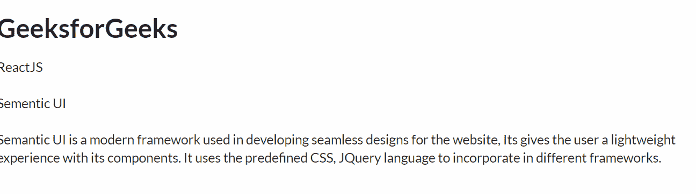

# 反应语义用户界面项目视图

> 原文:[https://www . geeksforgeeks . org/reactjs-semantic-ui-item-view/](https://www.geeksforgeeks.org/reactjs-semantic-ui-item-views/)

语义用户界面是一个现代框架，用于为网站开发无缝设计。它为用户提供了轻量级的组件体验。它使用预定义的 CSS、JQuery 语言来整合到不同的框架中。

在本文中，我们将了解如何在 ReactJS 语义用户界面中使用项目视图。**项目视图**用于向用户呈现一组项目。

**语法:**

```jsx
<Item />
```

**创建反应应用程序并安装模块:**

*   **步骤 1:** 使用以下命令创建一个反应应用程序。

    ```jsx
    npx create-react-app foldername
    ```

*   **步骤 2:** 创建项目文件夹(即文件夹名)后，使用以下命令移动到该文件夹。

    ```jsx
    cd foldername
    ```

*   **第三步:**在给定的目录下安装语义 UI。

    ```jsx
     npm install semantic-ui-react semantic-ui-css
    ```

**项目结构**:如下图。


**运行应用程序的步骤:**使用以下命令从项目的根目录运行应用程序。

```jsx
npm start
```

**示例:** 在本例中，我们将使用 ReactJS 语义 UI 分割线元素向用户显示项目集。这里我们有一个项目，其样本内容包含一个描述和一个项目元素的额外部分。

## App.js

```jsx
import React from 'react'
import { Item } from 'semantic-ui-react'

const styleLink = document.createElement("link");
styleLink.rel = "stylesheet";
styleLink.href = 
"https://cdn.jsdelivr.net/npm/semantic-ui/dist/semantic.min.css";
document.head.appendChild(styleLink);

const App = () => (
  <div>
    <br />
    <Item>
      <Item.Content>
        <Item.Header as='h1'>GeeksforGeeks</Item.Header>
        <Item.Meta>ReactJS</Item.Meta>
        <br />
        <Item.Description>
          Sementic UI
        </Item.Description>
        <br />
        <Item.Extra>
          Semantic UI is a modern framework used in 
          developing seamless designs for the website, 
          Its gives the user a lightweight experience
          with its components. It uses the predefined 
          CSS, JQuery language to incorporate in 
          different frameworks.</Item.Extra>
      </Item.Content>
    </Item>
  </div>
)

export default App
```

**输出:**



**参考:**T2】https://react.semantic-ui.com/views/item