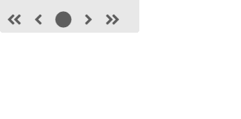
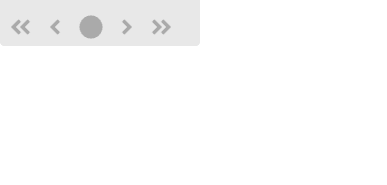

# 反应语义用户界面标签元素

> 原文:[https://www . geeksforgeeks . org/reactjs-semantic-ui-label-element/](https://www.geeksforgeeks.org/reactjs-semantic-ui-label-element/)

语义用户界面是一个现代框架，用于为网站开发无缝设计，它给用户一个轻量级的组件体验。它使用预定义的 CSS、JQuery 语言来整合到不同的框架中。

在本文中，我们将了解如何在 ReactJS 语义 UI 中使用标签元素。标签元素用于显示内容分类

**属性:**

*   **指向:**我们可以使用指向属性制作指向内容的标签。
*   **提示:**我们可以利用这个属性制作标签，在表单中提示错误。
*   **角:**我们可以利用这个属性使标签将自己定位在角上。
*   **标签:**该属性可以使标签作为标签出现。
*   **色带:**我们可以使用该属性使标签显示为色带。
*   **附:**我们可以制作附贴的标签。
*   **水平:**我们可以利用水平属性制作一个水平标签。
*   **浮动:**该属性可以使标签浮动在另一个元素上。

**语法:**

```
<label enabled/>
```

**创建反应应用程序并安装模块:**

*   **步骤 1:** 使用以下命令创建一个反应应用程序。

    ```
    npx create-react-app foldername
    ```

*   **步骤 2:** 创建项目文件夹(即文件夹名)后，使用以下命令移动到该文件夹。

    ```
    cd foldername
    ```

*   **第三步:**在给定的目录下安装语义 UI。

    ```
     npm install semantic-ui-react semantic-ui-css
    ```

**项目结构**:如下图。


**运行应用程序的步骤:**使用以下命令从项目的根目录运行应用程序。

```
npm start
```

**示例 1:** 在本例中，我们将使用标签和图标元素，通过使用 ReactJS 语义 UI Label 元素来显示基本标签。

## App.js

```
import React from 'react'
import {Icon,Label} from 'semantic-ui-react'

const styleLink = document.createElement("link");
styleLink.rel = "stylesheet";
styleLink.href = 
"https://cdn.jsdelivr.net/npm/semantic-ui/dist/semantic.min.css";
document.head.appendChild(styleLink);

const Btt = () =>( 
<Label>
    <br/>
    <Icon enabled name='angle double left' size='big' />
    <Icon enabled name='angle left' size='big' />
    <Icon enabled name='circle' size='big' />
    <Icon enabled name='angle right' size='big' />
    <Icon enabled name='angle double right' size='big' />
</Label>
)

export default Btt    
```

**输出:**



**示例 2:** 在本例中，我们将使用标签和图标元素，通过使用 ReactJS 语义 UI 标签元素来显示禁用的标签。

## App.js

```
import React from 'react'
import {Icon,Label} from 'semantic-ui-react'

const styleLink = document.createElement("link");
styleLink.rel = "stylesheet";
styleLink.href = 
"https://cdn.jsdelivr.net/npm/semantic-ui/dist/semantic.min.css";
document.head.appendChild(styleLink);

const Btt = () =>( 
<Label>
    <br/>
    <Icon disabled name='angle double left' size='big' />
    <Icon disabled name='angle left' size='big' />
    <Icon disabled name='circle' size='big' />
    <Icon disabled name='angle right' size='big' />
    <Icon disabled name='angle double right' size='big' />
</Label>
)

export default Btt    
```

**输出:**



**参考:**T2】https://react.semantic-ui.com/elements/label