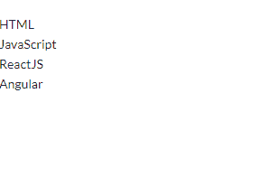
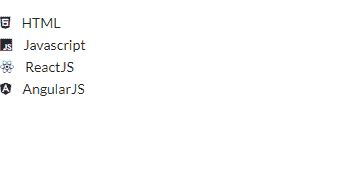

# 重新获取语义用户界面列表元素

> 原文:[https://www . geeksforgeeks . org/reactjs-semantic-ui-list-element/](https://www.geeksforgeeks.org/reactjs-semantic-ui-list-element/)

语义用户界面是一个现代框架，用于为网站开发无缝设计，它给用户一个轻量级的组件体验。它使用预定义的 CSS、JQuery 语言来整合到不同的框架中。

在本文中，我们将了解如何在 ReactJS 语义用户界面中使用 List 元素。列表元素是一个与内容相关的列表组

**属性:**

*   **项目符号:**使用此属性，列表项可以标记为带有项目符号。
*   **有序:** L 可以按照的顺序进行数字排序。
*   **链接:**列表可以针对导航链接进行特殊格式化。

**语法:**

```jsx
<list>
  <list.item>Content</list.item>
</list>
```

**创建反应应用程序并安装模块:**

*   **步骤 1:** 使用以下命令创建一个反应应用程序。

    ```jsx
    npx create-react-app foldername
    ```

*   **步骤 2:** 创建项目文件夹(即文件夹名)后，使用以下命令移动到该文件夹。

    ```jsx
    cd foldername
    ```

*   **第三步:**在给定的目录下安装语义 UI。

    ```jsx
     npm install semantic-ui-react semantic-ui-css
    ```

**项目结构**:如下图。


**运行应用程序的步骤:**使用以下命令从项目的根目录运行应用程序。

```jsx
npm start
```

**示例 1:** 在本例中，我们将使用基本列表元素，通过使用 ReactJS 语义 UI List 元素来显示一组相关内容。

## App.js

```jsx
import React from 'react'
import {List} from 'semantic-ui-react'

const styleLink = document.createElement("link");
styleLink.rel = "stylesheet";
styleLink.href = 
"https://cdn.jsdelivr.net/npm/semantic-ui/dist/semantic.min.css";
document.head.appendChild(styleLink);

const Btt = () =>( 
<List>
    <br/>
    <List.Item>HTML</List.Item>
    <List.Item>JavaScript</List.Item>
    <List.Item>ReactJS</List.Item>
    <List.Item>Angular</List.Item>
  </List>
)

export default Btt    
```

**输出:**



**示例 2:** 在本例中，我们将使用列表元素，通过使用 ReactJS 语义 UI List 元素，用图标显示一组相关内容。

## App.js

```jsx
import React from 'react'
import {List} from 'semantic-ui-react'

const styleLink = document.createElement("link");
styleLink.rel = "stylesheet";
styleLink.href = 
"https://cdn.jsdelivr.net/npm/semantic-ui/dist/semantic.min.css";
document.head.appendChild(styleLink);

const Btt = () =>( 
<List>
    <br/>
    <List.Item icon='html5' content='HTML' />
    <List.Item icon='js' content='Javascript' />
    <List.Item icon='react' content='ReactJS' />
    <List.Item icon='angular' content='AngularJS' />
  </List>
)

export default Btt    
```

**输出:**



**参考:**T2】https://react.semantic-ui.com/elements/list