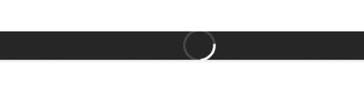
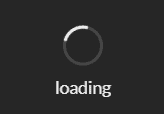

# 重新获取语义用户界面加载器元素

> 原文:[https://www . geeksforgeeks . org/reactjs-semantic-ui-loader-element/](https://www.geeksforgeeks.org/reactjs-semantic-ui-loader-element/)

语义用户界面是一个现代框架，用于为网站开发无缝设计，它给用户一个轻量级的组件体验。它使用预定义的 CSS、JQuery 语言来整合到不同的框架中。

在本文中，我们将了解如何在 ReactJS Semantic UI 中使用 Loader 元素。Loader 元素用于提醒用户等待活动完成

**属性:**

*   **文本加载器:**包含文本的加载器。

**状态:**

*   **不确定:**不确定打开任务需要多长时间。
*   **激活:**激活装载机。
*   **禁用:**禁用装载机。

**语法:**

```
<loader />
```

**创建反应应用程序并安装模块:**

*   **步骤 1:** 使用以下命令创建一个 React 应用程序。

    ```
    npx create-react-app foldername
    ```

*   **步骤 2:** 创建项目文件夹(即文件夹名)后，使用以下命令移动到该文件夹。

    ```
    cd foldername
    ```

*   **第三步:**在给定的目录下安装语义 UI。

    ```
     npm install semantic-ui-react semantic-ui-css
    ```

**项目结构**:如下图。


**示例 1:** 在本例中，我们将使用加载器、调光器和片段组件，其中调光器的道具处于活动状态，这将提醒用户使用 ReactJS 语义 UI Loader 元素等待活动完成。

## App.js

```
import React from 'react'
import {Loader, Dimmer, Segment} from 'semantic-ui-react'

const styleLink = document.createElement("link");
styleLink.rel = "stylesheet";
styleLink.href = 
"https://cdn.jsdelivr.net/npm/semantic-ui/dist/semantic.min.css";
document.head.appendChild(styleLink);

const Btt = () =>( 
<div>
    <br/>
<Segment>
    <Dimmer active>
      <Loader />
    </Dimmer>
</Segment>
</div>
)

export default Btt    
```

**运行应用程序的步骤:**使用以下命令从项目的根目录运行应用程序。

```
npm start
```

**输出:**



**示例 2:** 在本例中，我们将使用加载器、调光器和片段组件，其中调光器的道具处于活动状态，片段的状态将被加载，以使用 ReactJS 语义 UI Loader 元素加载文本

## App.js

```
import React from 'react'
import {Loader, Dimmer, Segment} from 'semantic-ui-react'

const styleLink = document.createElement("link");
styleLink.rel = "stylesheet";
styleLink.href = 
"https://cdn.jsdelivr.net/npm/semantic-ui/dist/semantic.min.css";
document.head.appendChild(styleLink);

const Btt = () =>( 
<div>
    <br/>
    <Dimmer active>
      <Loader content='loading'/>
    </Dimmer>
</div>
)

export default Btt    
```

**运行应用程序的步骤:**使用以下命令从项目的根目录运行应用程序。

```
npm start
```

**输出:**



**参考:**T2】https://react.semantic-ui.com/elements/loader