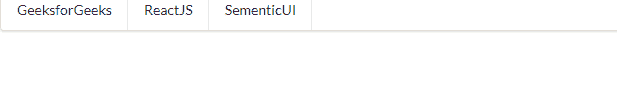
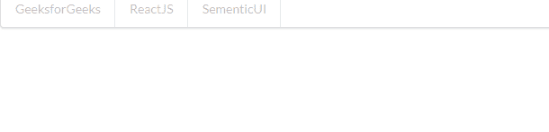

# 反应语义用户界面菜单集合

> 原文:[https://www . geeksforgeeks . org/reactjs-semantic-ui-menu-collections/](https://www.geeksforgeeks.org/reactjs-semantic-ui-menu-collections/)

语义用户界面是一个现代框架，用于为网站开发无缝设计，它给用户一个轻量级的组件体验。它使用预定义的 CSS、JQuery 语言来整合到不同的框架中。

在本文中，我们将了解如何在 ReactJS 语义用户界面中使用菜单集合。菜单集合用于制作包含一些信息的菜单。

**属性:**

*   **二级菜单:**我们可以通过使用该属性调整菜单外观来弱化内容。
*   **指向:**我们可以通过制作这个属性，制作指向附近内容的指向菜单。
*   **表格:**我们可以利用这个属性制作表格形式的菜单。
*   **文本:**我们可以使用这个属性为文本内容制作菜单。
*   **垂直菜单:**用于创建垂直菜单。
*   **分页:**用于制作分页菜单。

**状态:**

*   **悬停:**我们可以利用这个状态制作一个可以悬停的菜单。
*   **激活:**我们可以使用激活状态制作一个激活菜单。
*   **禁用:**使用该状态可以禁用菜单。

**语法:**

```
<menu>
  <menu.Item>
    Content
  </menu.Item>
</menu/>
```

**创建反应应用程序并安装模块:**

*   **步骤 1:** 使用以下命令创建一个反应应用程序。

    ```
    npx create-react-app foldername
    ```

*   **步骤 2:** 创建项目文件夹(即文件夹名)后，使用以下命令移动到该文件夹。

    ```
    cd foldername
    ```

*   **第三步:**在给定的目录下安装语义 UI。

    ```
     npm install semantic-ui-react semantic-ui-css
    ```

**项目结构**:如下图。


**运行应用程序的步骤:**使用以下命令从项目的根目录运行应用程序。

```
npm start
```

**示例 1:** 这是展示如何使用 ReactJS 语义 UI 菜单集合来使用菜单集合的基本示例。

## App.js

```
import React,{Component} from 'react'
import { Menu } from 'semantic-ui-react'

const styleLink = document.createElement("link");
styleLink.rel = "stylesheet";
styleLink.href = 
"https://cdn.jsdelivr.net/npm/semantic-ui/dist/semantic.min.css";
document.head.appendChild(styleLink);

export default class MenuExampleBasic extends Component {
  state = {}

  btt = ({ name }) => this.setState({ activeItem: name })

  render() {
    const { gfg1 } = this.state

    return (
      <Menu>
        <Menu.Item
          name='GeeksforGeeks'
          active={gfg1 === 'GeeksforGeeks'}
          onClick={this.btt}>
          GeeksforGeeks
        </Menu.Item>
        <Menu.Item
          name='ReactJS'
          active={gfg1 === 'ReactJS'}
          onClick={this.btt}>
          ReactJS
        </Menu.Item>
        <Menu.Item
          name='SementicUI'
          active={gfg1 === 'SementicUI'}
          onClick={this.btt}>
          SementicUI
        </Menu.Item>
      </Menu>
    )
  }
}
```

**输出:**



**示例 2:** 在本例中，我们使用 ReactJS 语义 UI 菜单集合来显示菜单集合中的禁用状态。

## App.js

```
import React,{Component} from 'react'
import { Menu } from 'semantic-ui-react'

const styleLink = document.createElement("link");
styleLink.rel = "stylesheet";
styleLink.href = 
"https://cdn.jsdelivr.net/npm/semantic-ui/dist/semantic.min.css";
document.head.appendChild(styleLink);

export default class MenuExampleBasic extends Component {
  state = {}

  btt = ({ name }) => this.setState({ activeItem: name })

  render() {
    const { gfg1 } = this.state

    return (
      <Menu>
        <Menu.Item disabled
          name='GeeksforGeeks'
          active={gfg1 === 'GeeksforGeeks'}
          onClick={this.btt}>
          GeeksforGeeks
        </Menu.Item>
        <Menu.Item disabled
          name='ReactJS'
          active={gfg1 === 'ReactJS'}
          onClick={this.btt}>
          ReactJS
        </Menu.Item>
        <Menu.Item disabled
          name='SementicUI'
          active={gfg1 === 'SementicUI'}
          onClick={this.btt}>
          SementicUI
        </Menu.Item>
      </Menu>
    )
  }
}
```

**输出:**



**参考:**T2】https://react.semantic-ui.com/collections/menu