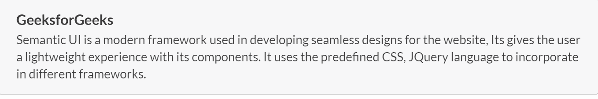
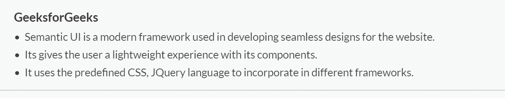

# 反应语义 UI 消息集合

> 原文:[https://www . geeksforgeeks . org/reactjs-semantic-ui-message-collection/](https://www.geeksforgeeks.org/reactjs-semantic-ui-message-collection/)

语义用户界面是一个现代框架，用于为网站开发无缝设计，它给用户一个轻量级的组件体验。它使用预定义的 CSS、JQuery 语言来整合到不同的框架中。

在本文中，我们将了解如何在 ReactJS Semantic UI 中使用消息集合。该消息用于显示解释附近内容的信息。

**类型:**

*   **列表消息:**带列表的消息。
*   **图标消息:**带图标的消息。
*   **可驳回区块:** 用户可以选择隐藏的消息。

**状态:**

*   **隐藏:**消息可以隐藏。
*   **可见:**消息本身可以可见。

**语法:**

```jsx
<Message content='content' />
```

**创建反应应用程序并安装模块:**

*   **步骤 1:** 使用以下命令创建一个 React 应用程序。

    ```jsx
    npx create-react-app foldername
    ```

*   **步骤 2:** 创建项目文件夹(即文件夹名)后，使用以下命令移动到该文件夹。

    ```jsx
    cd foldername
    ```

*   **第三步:**在给定的目录下安装语义 UI。

    ```jsx
     npm install semantic-ui-react semantic-ui-css
    ```

**项目结构**:如下图。


**运行应用程序的步骤:**使用以下命令从项目的根目录运行应用程序。

```jsx
npm start
```

**示例 1:** 在本例中，我们将看到如何使用 ReactJS 语义 UI 消息集合来显示基本消息。

## App.js

```jsx
import React from 'react'
import {Message} from 'semantic-ui-react'

const styleLink = document.createElement("link");
styleLink.rel = "stylesheet";
styleLink.href = 
"https://cdn.jsdelivr.net/npm/semantic-ui/dist/semantic.min.css";
document.head.appendChild(styleLink);

const btt = () => (
<Message>
    <Message.Header>GeeksforGeeks</Message.Header>
    <p>
      Semantic UI is a modern framework used in developing
      seamless designs for the website, Its gives the user 
      a lightweight experience with its components. It uses
      the predefined CSS, JQuery language to incorporate in 
      different frameworks.
    </p>

  </Message>
)

export default btt
```

**输出:**



**示例 2:** 在本例中，我们将使用带有类型列表的消息元素，通过使用 ReactJS 语义 UI 消息集合以列表的形式显示消息。

## App.js

```jsx
import React from 'react'
import {Message} from 'semantic-ui-react'

const styleLink = document.createElement("link");
styleLink.rel = "stylesheet";
styleLink.href = 
"https://cdn.jsdelivr.net/npm/semantic-ui/dist/semantic.min.css";
document.head.appendChild(styleLink);

const btt = () => (
<Message>
    <Message.Header>GeeksforGeeks</Message.Header>
    <Message.List>
      <Message.Item>
       Semantic UI is a modern framework used in
       developing seamless designs for the website.
      </Message.Item> 
      <Message.Item>
       Its gives the user a lightweight experience
       with its components.
      </Message.Item> 
      <Message.Item>
       It uses the predefined CSS, JQuery language 
       to incorporate in different frameworks.
      </Message.Item>
    </Message.List>
</Message>
)

export default btt
```

**输出:**



**参考:**T2】https://react.semantic-ui.com/collections/message