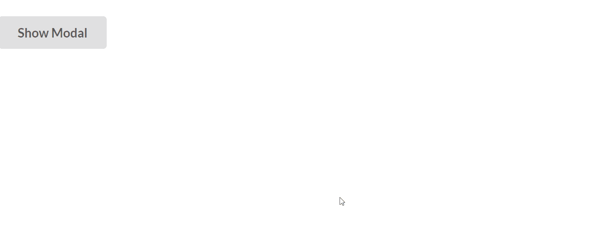
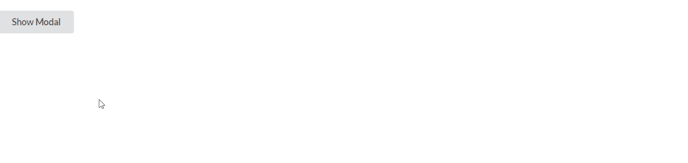

# 反应语义用户界面模态模块

> 原文:[https://www . geesforgeks . org/reactjs-semantic-ui-modal-module/](https://www.geeksforgeeks.org/reactjs-semantic-ui-modal-module/)

语义用户界面是一个现代框架，用于为网站开发无缝设计，它给用户一个轻量级的组件体验。它使用预定义的 CSS、JQuery 语言来整合到不同的框架中。

在本文中，我们将看到如何在 ReactJS 语义用户界面中使用模态模块。模态模块用于显示覆盖整个屏幕的内容。

**属性:**

*   **基本:**我们可以做一个基本的情态。
*   **速记:**我们可以做一个速记属性。

**语法:**

```
<Modal trigger={<Button>Content</Button>} />
```

**创建反应应用程序并安装模块:**

*   **步骤 1:** 使用以下命令创建一个 React 应用程序。

```
npx create-react-app foldername
```

*   **步骤 2:** 创建项目文件夹(即文件夹名)后，使用以下命令移动到该文件夹。

```
cd foldername
```

*   **第三步:**在给定的目录下安装语义 UI。

```
 npm install semantic-ui-react semantic-ui-css
```

**项目结构**:如下图。


**运行应用程序的步骤:**使用以下命令从项目的根目录运行应用程序。

```
npm start
```

**示例 1:** 这是展示如何使用 ReactJS 语义 UI 模态模块使用模态模块的基本示例。

## App.js

```
import React from 'react'
import { Button, Modal } from 'semantic-ui-react'

const styleLink = document.createElement("link");
styleLink.rel = "stylesheet";
styleLink.href = 
"https://cdn.jsdelivr.net/npm/semantic-ui/dist/semantic.min.css";

document.head.appendChild(styleLink);

function btt() {
    return (
        <div>
            <br />
            <Modal
                trigger={<Button>Show Modal</Button>}
                header='GeeksforGeeks'
                content='Semantic UI is a modern framework 
                used in developing seamless designs for the 
                website, Its gives the user a lightweight 
                experience with its components. It uses 
                the predefined CSS, JQuery language to 
                incorporate in different frameworks..'
                actions={['Cancel', 'OK']}
            />
        </div>
    )
}

export default btt
```

**输出:**



**示例 2:** 在本例中，我们使用 ReactJS 语义 UI 模态模块将对齐方式更改为页面顶部，而不是模态模块的中心。

## App.js

```
import React from 'react'
import { Button, Modal } from 'semantic-ui-react'

const styleLink = document.createElement("link");
styleLink.rel = "stylesheet";
styleLink.href = 
"https://cdn.jsdelivr.net/npm/semantic-ui/dist/semantic.min.css";

document.head.appendChild(styleLink);

function btt() {
    return (
        <div>
            <br />
            <Modal
                centered={false}
                trigger={<Button >Show Modal</Button>}
                header='GeeksforGeeks'
                content='Semantic UI is a modern framework 
                used in developing seamless designs for the 
                website, Its gives the user a lightweight 
                experience with its components. It uses the 
                predefined CSS, JQuery language to 
                incorporate in different frameworks..'
                actions={['Cancel', 'OK']}
            />
        </div>
    )
}

export default btt
```

**输出:**



**参考:**T2】https://react.semantic-ui.com/modules/modal