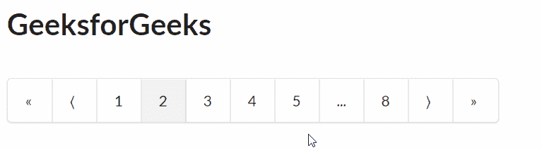
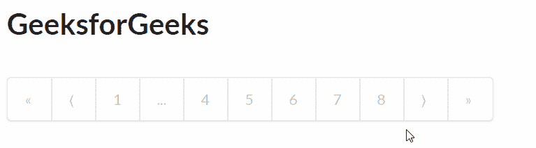

# 重新获取语义用户界面分页插件

> 原文:[https://www . geeksforgeeks . org/reactjs-semantic-ui-pagination-addons/](https://www.geeksforgeeks.org/reactjs-semantic-ui-pagination-addons/)

语义用户界面是一个现代框架，用于为网站开发无缝设计，它给用户一个轻量级的组件体验。它使用预定义的 CSS、JQuery 语言来整合到不同的框架中。

在本文中，我们将了解如何在 ReactJS 语义用户界面中使用分页插件。分页插件用于进行分页，我们可以在其中添加组件并在项目中显示它们。

**状态:**

*   **禁用:** 用于 禁用分页。

**语法:**

```jsx
<Pagination />
```

**创建反应应用程序并安装模块:**

*   **步骤 1:** 使用以下命令创建一个反应应用程序。

    ```jsx
    npx create-react-app foldername
    ```

*   **步骤 2:** 创建项目文件夹(即文件夹名)后，使用以下命令移动到该文件夹。

    ```jsx
    cd foldername
    ```

*   **第三步:**在给定的目录下安装语义 UI。

    ```jsx
    npm install semantic-ui-react semantic-ui-css
    ```

**项目结构**:如下图。


**运行应用程序的步骤:**使用以下命令从项目的根目录运行应用程序。

```jsx
npm start
```

**示例 1:** 这是展示如何使用 ReactJS 语义 UI 分页插件来使用分页插件的基本示例。

## App.js

```jsx
import React from 'react'
import { Pagination} from 'semantic-ui-react'

const styleLink = document.createElement("link");
styleLink.rel = "stylesheet";
styleLink.href = 
"https://cdn.jsdelivr.net/npm/semantic-ui/dist/semantic.min.css";
document.head.appendChild(styleLink);

const Btt = () => (
<div>

<div style={{
            display: 'block', width: 700, padding: 30, border: 5
    }}>
  <h1 >GeeksforGeeks</h1>
  <br />
  <Pagination defaultActivePage={2} totalPages={8} />

</div>
</div>
)
export default Btt
```

**输出:**



**示例 2:** 在本例中，我们使用 ReactJS 语义 UI 分页插件显示了分页插件中的禁用状态。

## App.js

```jsx
import React from 'react'
import { Pagination} from 'semantic-ui-react'

const styleLink = document.createElement("link");
styleLink.rel = "stylesheet";
styleLink.href = 
"https://cdn.jsdelivr.net/npm/semantic-ui/dist/semantic.min.css";
document.head.appendChild(styleLink);

const Btt = () => (
<div>

<div style={{
            display: 'block', width: 700, padding: 30, border: 5
    }}>
  <h1 >GeeksforGeeks</h1>
  <br />
  <Pagination defaultActivePage={2} totalPages={8} disabled/>

</div>
</div>
)
export default Btt
```

**输出:**



**参考:**T2】https://react.semantic-ui.com/addons/pagination