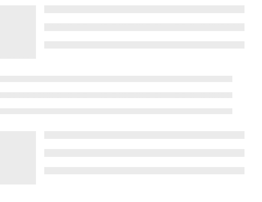

# 重新获取语义用户界面占位符元素

> 原文:[https://www . geeksforgeeks . org/reactjs-semantic-ui-placeholder-element/](https://www.geeksforgeeks.org/reactjs-semantic-ui-placeholder-element/)

语义用户界面是一个现代框架，用于为网站开发无缝设计。它为用户提供了轻量级的组件体验。它使用预定义的 CSS、JQuery 语言来整合到不同的框架中。

在本文中，我们将了解如何在 ReactJS 语义用户界面中使用 Placeholder 元素。**占位符**元素用于为一段时间后到来的内容留出空间。

**语法:**

```
<Placeholder/>
```

**创建反应应用程序并安装模块:**

*   **步骤 1:** 使用以下命令创建一个反应应用程序。

    ```
    npx create-react-app foldername
    ```

*   **步骤 2:** 创建项目文件夹(即文件夹名)后，使用以下命令移动到该文件夹。

    ```
    cd foldername
    ```

*   **第三步:**在给定的目录下安装语义 UI。

    ```
     npm install semantic-ui-react semantic-ui-css
    ```

**项目结构**:如下图。


**运行应用程序的步骤:**使用以下命令从项目的根目录运行应用程序。

```
npm start
```

**示例 1:** 在本例中，我们使用了默认大小占位符，没有流体和反转变化。我们已经一个接一个地显示了三个占位符，每个占位符都有很长的长度。

## App.js

```
import React from 'react'
import { Placeholder } from 'semantic-ui-react'

const styleLink = document.createElement("link");
styleLink.rel = "stylesheet";
styleLink.href = 
"https://cdn.jsdelivr.net/npm/semantic-ui/dist/semantic.min.css";
document.head.appendChild(styleLink);

const App = () => (
  <div>
    <br />
    <Placeholder>
      <Placeholder.Header image>
        <Placeholder.Line length='long' />
        <Placeholder.Line length='long' />
        <Placeholder.Line length='long' />
      </Placeholder.Header>

      <Placeholder.Paragraph>
        <Placeholder.Line length='long' />
        <Placeholder.Line length='long' />
        <Placeholder.Line length='long' />
      </Placeholder.Paragraph>

      <Placeholder.Header image>
        <Placeholder.Line length='long' />
        <Placeholder.Line length='long' />
        <Placeholder.Line length='long' />
      </Placeholder.Header>

    </Placeholder>
  </div>
)

export default App
```

**输出:**



**示例 2:** 在本例中，我们更改了占位符的大小，并使用了流体和反转变体。我们已经一个接一个地显示了三个占位符，每个占位符的长度都很短。

## App.js

```
import React from 'react'
import { Placeholder } from 'semantic-ui-react'

const styleLink = document.createElement("link");
styleLink.rel = "stylesheet";
styleLink.href = 
"https://cdn.jsdelivr.net/npm/semantic-ui/dist/semantic.min.css";
document.head.appendChild(styleLink);

const App = () => (
  <div>
    <br />
    <Placeholder inverted fluid>
      <Placeholder.Header image>
        <Placeholder.Line length='very short' />
        <Placeholder.Line length='very short' />
        <Placeholder.Line length='very short' />
      </Placeholder.Header>

      <Placeholder.Paragraph>
        <Placeholder.Line length='very short' />
        <Placeholder.Line length='very short' />
        <Placeholder.Line length='very short' />
      </Placeholder.Paragraph>

      <Placeholder.Header image>
        <Placeholder.Line length='very short' />
        <Placeholder.Line length='very short' />
        <Placeholder.Line length='very short' />
      </Placeholder.Header>

    </Placeholder>
  </div>
)

export default App
```

**输出:**


**参考:**T2】https://react.semantic-ui.com/elements/placeholder